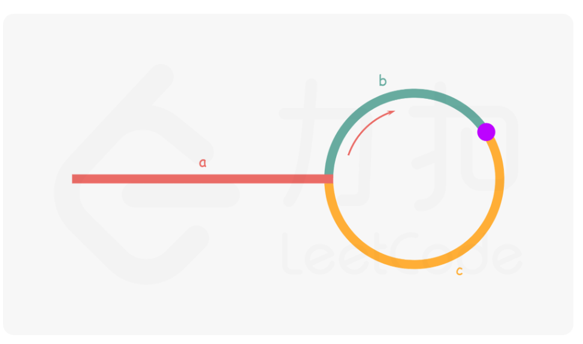

[142. 环形链表 II - 力扣（LeetCode）](https://leetcode.cn/problems/linked-list-cycle-ii/)

#链表 #双指针 #数学推导 #hash 

## 方法一：hash表
时间O(n) 空间O(n)
```cpp
/**
 * Definition for singly-linked list.
 * struct ListNode {
 *     int val;
 *     ListNode *next;
 *     ListNode(int x) : val(x), next(NULL) {}
 * };
 */
class Solution {
public:
    ListNode *detectCycle(ListNode *head) 
    {
        //hash表中重复计数就是成环
        unordered_set<ListNode*> visited;
        while(head!=nullptr)
        {
            if(visited.count(head)) return head;

            visited.insert(head);
            head = head->next;
        }
        return nullptr;
    }
};
```

## 方法二：快慢指针
时间O(n) 空间O(1)

思路与算法

我们使用两个指针，fast 与 slow。它们起始都位于链表的头部。随后，slow 指针每次向后移动一个位置，而 fast 指针向后移动两个位置。如果链表中存在环，则 fast 指针最终将再次与 slow 指针在环中相遇。

如下图所示，设链表中环外部分的长度为 a。slow 指针进入环后，又走了 b 的距离与 fast 相遇。此时，fast 指针已经走完了环的 n 圈，因此它走过的总距离为 

$a+n(b+c)+b=a+(n+1)b+nc$



根据题意，任意时刻，fast 指针走过的距离都为 slow 指针的 2 倍。因此，我们有

$a+(n+1)b+nc=2(a+b)⟹a=c+(n−1)(b+c)$

有了 $a=c+(n−1)(b+c)$  的等量关系，我们会发现：从相遇点到入环点的距离加上 n−1 圈的环长，恰好等于从链表头部到入环点的距离。

因此，当发现 slow 与 fast 相遇时，我们再额外使用一个指针 ptr。
起始，它指向链表头部；随后，它和 slow 每次向后移动一个位置。
最终，它们会在入环点相遇。
AC：
```cpp
/**
 * Definition for singly-linked list.
 * struct ListNode {
 *     int val;
 *     ListNode *next;
 *     ListNode(int x) : val(x), next(NULL) {}
 * };
 */
class Solution {
public:
    ListNode *detectCycle(ListNode *head) 
    {
        ListNode* slow = head, *fast = head;
        while(fast != nullptr)
        {
            slow = slow->next;
            if(fast->next == nullptr) return nullptr;

            fast = fast->next->next;
            if(fast == slow)
            {
                ListNode *ptr = head;
                while(ptr != slow)
                {
                    ptr = ptr->next;
                    slow = slow->next;
                }

                return ptr;
            }


        }
        return nullptr;
    }
};
```
