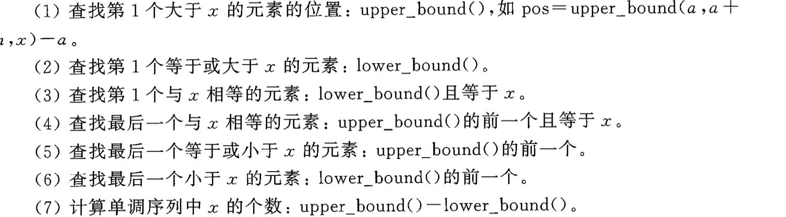

二分答案的条件：
- 单调性
- 有界性

## 整数二分
### 求最小值的最大值

```cpp
int binary_search(int q[], int l, int r)
{
	while(l<r)
	{
		int mid = (l+r)>>1;
		if(check(mid)) l = mid;
		else r = mid-1;
	}
	return 1;
}
```

### 求最大值的最小值

```cpp
int binary_search(int q[], int l, int r)
{
	while(l<r)
	{
		int mid = (l+r)>>1;
		if(check(mid)) r = mid;
		else l = mid+1;
	}
	return 1;
}
```

## 浮点数二分

```cpp
while( (r-l) > 1e-8)
{
	double mid = (l+r) /2;
	if(mid * mid * mid >= x) r = mid;
	else l = mid;
}
```


## 特殊情况

在算法和数据结构中，二分查找（Binary Search）是一种高效的查找算法，通常用于在有序数组（单调数组）中查找特定元素。然而，二分查找的应用并不仅限于单调数组。实际上，**“能二分的不一定是单调的”**，这句话的意思是，二分查找的适用范围比单调数组更广泛，只要满足某些条件，即使数组不是单调的，也可以使用二分查找。

### 1\. **二分查找的基本原理**

二分查找的核心思想是通过不断将搜索范围减半来快速定位目标值。每次比较数组中间的元素与目标值，根据比较结果缩小搜索范围，直到找到目标值或搜索范围为空。

### 2\. **单调数组与二分查找**

对于单调数组（单调递增或单调递减），二分查找的适用性是显而易见的。例如：

- **单调递增数组**：`[1, 3, 5, 7, 9]`
- **单调递减数组**：`[9, 7, 5, 3, 1]`

在单调数组中，二分查找的时间复杂度为 **O(log n)**，非常高效。

### 3\. **非单调数组中的二分查找**

即使数组不是单调的，只要满足以下条件之一，仍然可以使用二分查找：

#### **(1) 旋转数组（部分有序）**

旋转数组是一个典型的例子。例如，数组 `[4, 5, 6, 7, 0, 1, 2]` 是一个旋转数组，它由单调递增数组 `[0, 1, 2, 4, 5, 6, 7]` 旋转得到。

在这个数组中，虽然整体不是单调的，但仍然可以使用二分查找来查找目标值。关键在于利用数组的“部分有序”性质。例如，对于目标值 `5`，可以通过以下步骤进行二分查找：

1. **初始范围**：`[4, 5, 6, 7, 0, 1, 2]`
2. **中间值**：`7`
3. **判断**：由于 `7` > `4`，说明左半部分是有序的。目标值 `5` 在 `[4, 5, 6, 7]` 范围内。
4. **缩小范围**：在 `[4, 5, 6, 7]` 中继续查找。
5. **重复步骤**：最终找到目标值 `5`。

#### **(2) 有“决策单调性”的问题**

有些问题虽然数组本身不是单调的，但可以通过某种决策函数来判断目标值的范围。例如，**“寻找峰值”** 问题：

给定一个数组，数组中的每个元素都不相同，且数组两端的元素可以视为负无穷。目标是找到一个峰值（即比左右相邻元素都大的元素）。例如，数组 `[1, 2, 3, 1]` 中的峰值是 `3`。

虽然数组本身不是单调的，但可以通过二分查找来解决。关键在于利用决策函数：

- 如果中间元素大于其右侧元素，则峰值在左侧（包括中间元素）。
- 如果中间元素小于其右侧元素，则峰值在右侧。

通过这种方式，每次可以将搜索范围减半，最终找到峰值。

### 4\. **为什么能二分的不一定是单调的**

二分查找的核心在于 **“决策单调性”**，而不是数组本身的单调性。只要能够通过某种决策函数将搜索范围不断减半，就可以使用二分查找。这种决策函数可以基于数组的性质（如部分有序）、问题的约束条件等。

例如，在旋转数组中，虽然数组整体不是单调的，但每次可以通过判断中间值与边界值的关系，决定搜索范围的移动方向。这种决策过程本质上是一种“单调性”，但并不依赖于数组本身的单调性。


## STL中的二分函数

`STL`的`lower_bound`和`bin_search`函数的功能是一样的。

##### `lower_bound`

- **定义**：`lower_bound` 函数用于在已排序的范围内查找第一个不小于给定值的元素的位置。
    
- **返回值**：返回一个迭代器，指向第一个不小于给定值的元素。如果所有元素都小于给定值，则返回范围的结束迭代器。
    
- **时间复杂度**：O(log n)，其中 n 是范围内的元素数量。
    
- **用法示例**：
    
    cpp复制
    
    ```cpp
    std::vector<int> v = {1, 2, 4, 4, 5, 6, 7};
    auto it = std::lower_bound(v.begin(), v.end(), 4);
    // it 指向 v 中的第一个 4
    ```
    

##### `upper_bound`

- **定义**：`upper_bound` 函数用于在已排序的范围内查找第一个大于给定值的元素的位置。
    
- **返回值**：返回一个迭代器，指向第一个大于给定值的元素。如果所有元素都小于或等于给定值，则返回范围的结束迭代器。
    
- **时间复杂度**：O(log n)，其中 n 是范围内的元素数量。
    
- **用法示例**：
    
    cpp复制
    
    ```cpp
    std::vector<int> v = {1, 2, 4, 4, 5, 6, 7};
    auto it = std::upper_bound(v.begin(), v.end(), 4);
    // it 指向 v 中的第一个 5
    ```


下面介绍不同情况下，`lower_boud`和`upper_bound`的区别:




