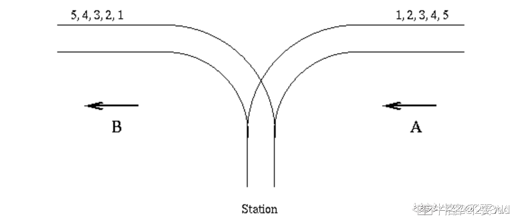
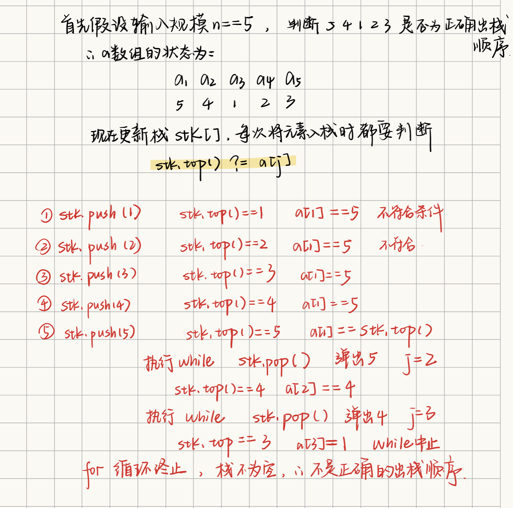

链接：[https://ac.nowcoder.com/acm/problem/14326](https://ac.nowcoder.com/acm/problem/14326)
## 题目描述

There is a famous railway station in PopPush City. Country there is incredibly hilly. The station was built in last century. Unfortunately, funds were extremely limited that time. It was possible to establish only a surface track. Moreover, it turned out that the station could be only a dead-end one (see picture) and due to lack of available space it could have only one track.

波普什市有一个著名的火车站。那里的乡村真是山峦起伏不定。这个车站建于上个世纪。不幸的是，当时的资金极为有限。只可能建立一条地面轨道。而且，事实证明，空间站可能只是一个死胡同(见图)，而且由于缺乏可用的空间，它只能有一条轨道。




The local tradition is that every train arriving from the direction A continues in the direction B with coaches reorganized in some way. Assume that the train arriving from the direction A has N <= 1000 coaches numbered in increasing order 1, 2, ..., N. The chief for train reorganizations must know whether it is possible to marshal coaches continuing in the direction B so that their order will be a1, a2, ..., aN. Help him and write a program that decides whether it is possible to get the required order of coaches. You can assume that single coaches can be disconnected from the train before they enter the station and that they can move themselves until they are on the track in the direction B. You can also suppose that at any time there can be located as many coaches as necessary in the station. But once a coach has entered the station it cannot return to the track in the direction A and also once it has left the station in the direction B it cannot return back to the station.  

当地的传统是，从A方向到达的每一列火车都会继续沿着B方向行驶，教练也会以某种方式重新组织起来。假设从A方向到达的列车N<=1000节客车编号为1，2.列车重组主管必须知道是否有可能组织教练继续向B方向前进，以便他们的订单是A1，a2，.一张。帮助他并编写一个程序来决定它是否是有可能获得所需的教练订单。你可以假设，在进入车站之前，单车径可以与列车断开连接，并且它们可以移动到B方向的轨道上。你还可以假设，在任何时候，车站内都可以找到尽可能多的客车。==但是，一旦一辆长途汽车进入车站，它就不能返回A方向的轨道，而且一旦它离开了B方向的车站，它就不能返回车站。==

  
Input  
The input consists of blocks of lines. Each block except the last describes one train and possibly more requirements for its reorganization. In the first line of the block there is the integer N described above. In each of the next lines of the block there is a permutation of 1, 2, ..., N. The last line of the block contains just 0.                                
  
The last block consists of just one line containing 0.  

## 输入描述:

The input consists of blocks of lines. Each block except the last describes one train and possibly more requirements for its reorganization. In the first line of the block there is the integer N described above. In each of the next lines of the block there is a permutation of 1, 2, ..., N. The last line of the block contains just 0.  
The last block consists of just one line containing 0.

输入由行块组成。除最后一列外，每个区块都描述了一列火车，并可能对其重组提出更多要求。在块的第一行中，有上面描述的整数N。在该块的下一行中，有一个


## 输出描述:

The output contains the lines corresponding to the lines with permutations in the input. A line of the output contains Yes if it is possible to marshal the coaches in the order required on the corresponding line of the input. Otherwise it contains No. In addition, there is one empty line after the lines corresponding to one block of the input. There is no line in the output corresponding to the last ``null'' block of the input.


> [!NOTE] 
> 输入正整数数字串，判断能否将一个顺序数字串通过入栈出栈操作得到该数字串。
> 输入：首先输入数据长度n，则之后的数据均为包含从1到n的所有数字的顺序随机的数字串。若输入一个元素仅为0的空串，则本次输入结束，重新设置数字串长度，若长度为0，则程序结束。
> 输出：在每次输入数字串后，判断能否将一个顺序数字串通过入栈出栈操作得到该数字串，可以的话输出"Yes"，不可以则输出"No"。如果是空串则输出换行。
 
## 示例

输入
```
5
1 2 3 4 5
5 4 1 2 3
0
6
6 5 4 3 2 1
0
0
```

输出
```
Yes
No

Yes

```

## 题解

#模拟 #栈 #出栈顺序  #验证出栈序列

```cpp
#include
using namespace std;

long long a[1000010], b[1000010];

int main(void)
{
    int n;
    cin >> n;
    while (n)
    {
        int flag = n;
        while (flag)
        {
            for (int i = 1; i <= flag; i++)
            {
                cin >> a[i];
                if (a[i] == 0)//如果输入一个元素仅为0的空串
                {
                    flag = 0;//那么直接跳出while并且结束循环
                    cout << endl;
                    break;
                }
            }
            if (!flag)
                break;
            
            stack<long long> st;
            for (int i = 1, j = 1; i <= flag; i++)
            {
                st.push(i);//因为入栈顺序就是12345...自然递增
                while (!st.empty() && st.top() == a[j])
                {
                    st.pop();
                    j++;
                }
            }
            if (st.empty())
                cout << "Yes\n";
            else
                cout << "No\n";
        }
        cin >> flag;
        n = flag;
    }
}
```

核心代码：
```cpp
          for (int i = 1, j = 1; i <= flag; i++)
            {
                st.push(i);
                while (!st.empty() && st.top() == a[j])
                {
                    st.pop();
                    j++;
                }
            }
```



