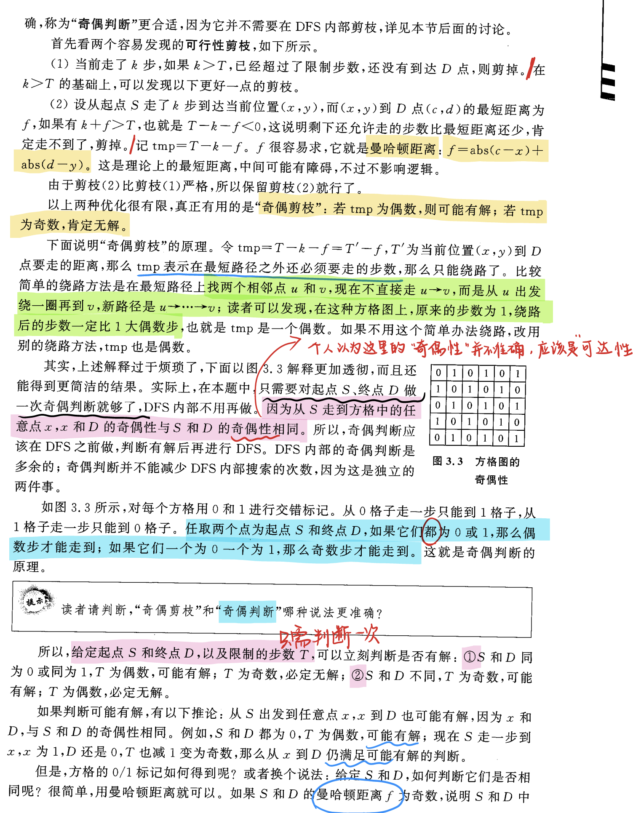

[Problem - 1010](https://acm.hdu.edu.cn/showproblem.php?pid=1010)

#搜索 #可行性剪枝 #奇偶剪枝

Problem Description

```
The doggie found a bone in an ancient maze, which fascinated him a lot. However, when he picked it up, the maze began to shake, and the doggie could feel the ground sinking. He realized that the bone was a trap, and he tried desperately to get out of this maze.  
  
The maze was a rectangle with sizes N by M. There was a door in the maze. At the beginning, the door was closed and it would open at the T-th second for a short period of time (less than 1 second). Therefore the doggie had to arrive at the door on exactly the T-th second. In every second, he could move one block to one of the upper, lower, left and right neighboring blocks. Once he entered a block, the ground of this block would start to sink and disappear in the next second. He could not stay at one block for more than one second, nor could he move into a visited block. Can the poor doggie survive? Please help him.  
```

Input

```
The input consists of multiple test cases. The first line of each test case contains three integers N, M, and T (1 < N, M < 7; 0 < T < 50), which denote the sizes of the maze and the time at which the door will open, respectively. The next N lines give the maze layout, with each line containing M characters. A character is one of the following:  
  
'X': a block of wall, which the doggie cannot enter;  
'S': the start point of the doggie;  
'D': the Door; or  
'.': an empty block.  
  
The input is terminated with three 0's. This test case is not to be processed.  

```
  

Output

```
For each test case, print in one line "YES" if the doggie can survive, or "NO" otherwise.  
```


Sample Input

```

4 4 5
S.X.
..X.
..XD
....
3 4 5
S.X.
..X.
...D
0 0 0
```


Sample Output

```
NO
YES
```

## 题解

题意：
```
这只小狗在一个古老的迷宫里发现了一根骨头，这让他非常着迷。然而，当他捡起它时，迷宫开始晃动，小狗能感觉到地面在下沉。他意识到那块骨头是一个陷阱，他拼命想走出这个迷宫。  
  
迷宫是一个尺寸为 N x M 的矩形。迷宫里有一扇门。一开始，门是关着的，它会在第 T 秒打开一小段时间（不到 1 秒）。因此，这只小狗必须在第 T 秒到达门口。在每一秒内，他可以将一个块移动到上、下、左、右相邻块中的一个。一旦他进入一个方块，这个方块的地面就会开始下沉，并在下一秒消失。他不能在一个区块上停留超过一秒钟，也不能进入一个被访问过的区块。可怜的小狗能活下来吗？请帮助他。


输入包含多个测试用例。每个测试用例的第一行包含三个整数N、M和T（1 < N, M < 7; 0 < T < 50），分别表示迷宫的大小和门开启的时间。
接下来的N行给出了迷宫的布局，每行包含M个字符。字符可以是以下之一： 

'X'：表示墙体，狗狗不能进入； 
'S'：表示狗狗的起点； 
'D'：表示门的位置； 
'.'：表示空地。 

输入以三个0结束。这个测试用例不应被处理。”
```

`BFS`? 还是`DFS` ?
`BFS`非常适合求解最短路问题，但是注意，这里要求的是长度为`T`的路径，这并不等价于最短路。小狗如果提前到达终点，一秒后门不开，地板开始陷落，小狗依然不能获救。所以这里并不适合`BFS`。
于是就要使用`DFS`寻找所有路径，并找出长度为`T`的路径。





AC代码：


```cpp
#include <iostream>
#include <cstring>
#include <cmath>

using namespace std;
const int N = 8;

char map[N][N], visit[N][N];
int n, m, t;
bool flag; //如果找到，为true
int a, b, c, d; //坐标S(a, b) D(c, d)

//int dirt[4][2] = {{0, 1}, {0, -1}, {1, 0}, {-1, 0}};
int dx[4] = {1, 0, -1, 0};
int dy[4] = {0, 1, 0, -1};

#define CHECK(xx, yy) (xx >= 0 && xx < n && yy >= 0 && yy < m)

void dfs(int x, int y, int times)  //到达点(x, y) 耗时times
{
    if(flag) return; //逐层退出
    
    if(map[x][y] == 'D') //达到终点
    {
        if(times == t) flag = true;
        return;
    }
    
    //if(times > t) return;
    int tmp = t - times - abs(c - x) - abs(d - y); //多绕的路一定要是偶数才有解
    if(tmp < 0) return;
    //if(tmp & 1) return; 奇偶剪枝
    
    int xx, yy;
    for(int i=0; i<4; i++)
    {
        xx = x + dx[i], yy = y + dy[i];
        if(CHECK(xx, yy) && visit[xx][yy] == false && map[xx][yy] != 'X')
        {
            visit[xx][yy] = true;
            dfs(xx, yy, times+1);
            visit[xx][yy] = false;
        }
    }
    
    return;
}

int main()
{
    while(scanf("%d %d %d", &n, &m, &t))
    {
        if(n == 0 && m == 0 && t == 0) break;
        
        for(int i=0; i<n; i++)
        {
            for(int j=0; j<m; j++)
            {
                cin>>map[i][j];
                if(map[i][j] == 'S') a = i, b = j;
                if(map[i][j] == 'D') c = i, d = j;
            }
        }
        
        int tmp = t - abs(a - c) - abs(b - d); //奇偶判断
        if(tmp & 1 || tmp < 0) //为奇数 || 要求的步数比理论最小距离还小
        {
            printf("NO\n");
            continue;
        }
        
        flag = false;
        memset(visit, 0, sizeof(visit));
        
        visit[a][b] = 1;
        dfs(a, b, 0);
        
        if(flag) printf("YES\n");
        else printf("NO\n");
    }
    
    return 0;
}
```

