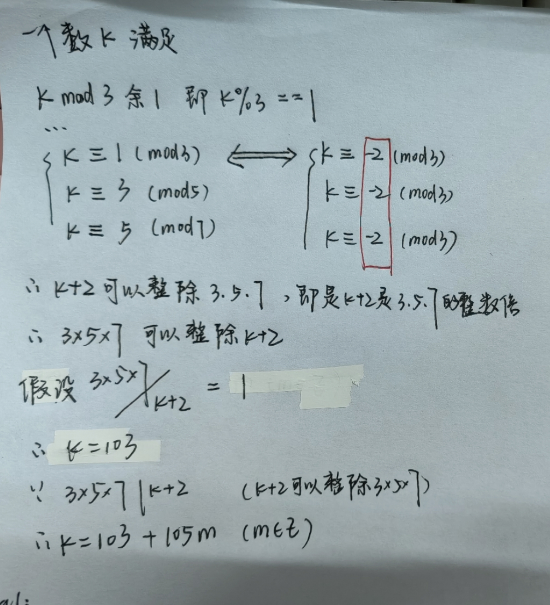
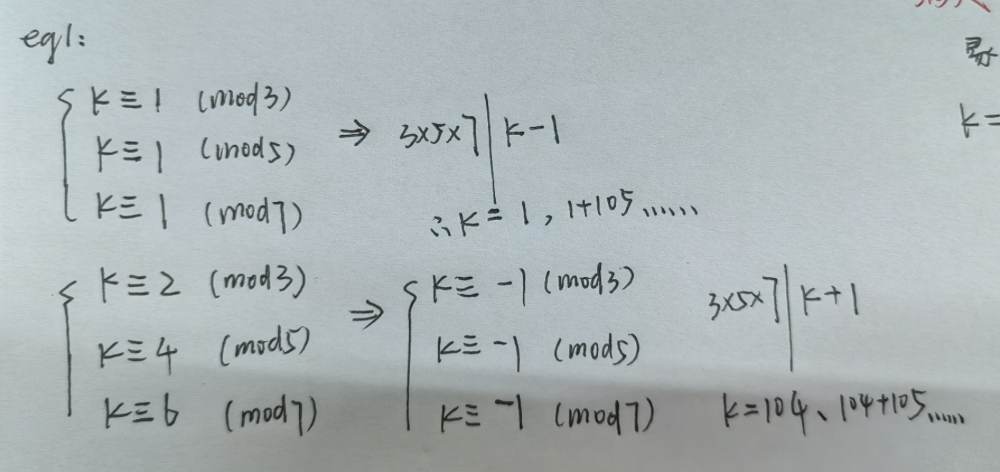
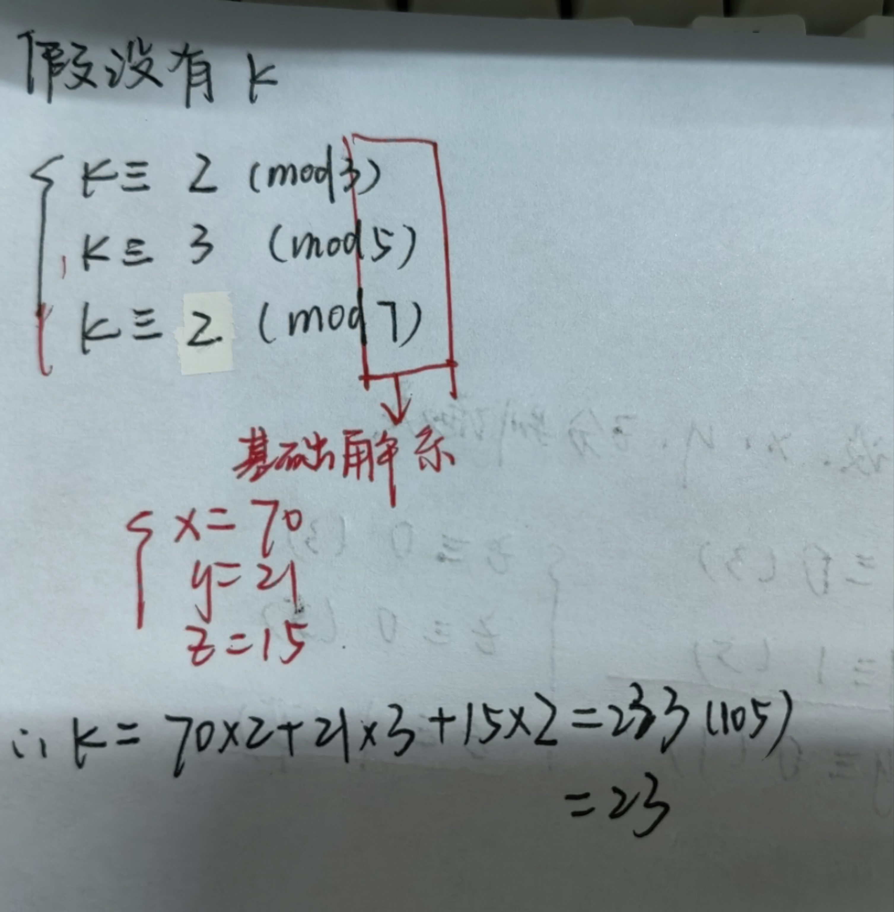
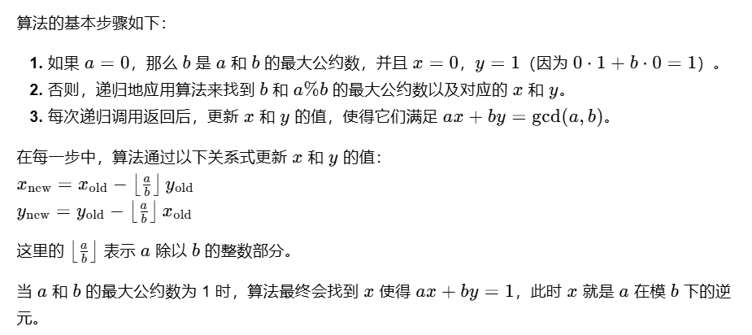
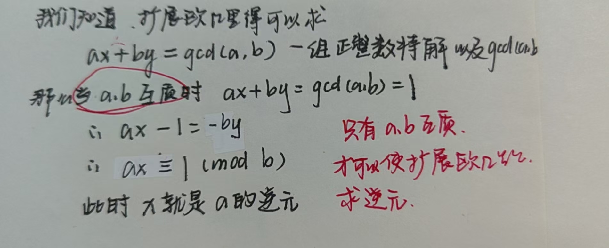
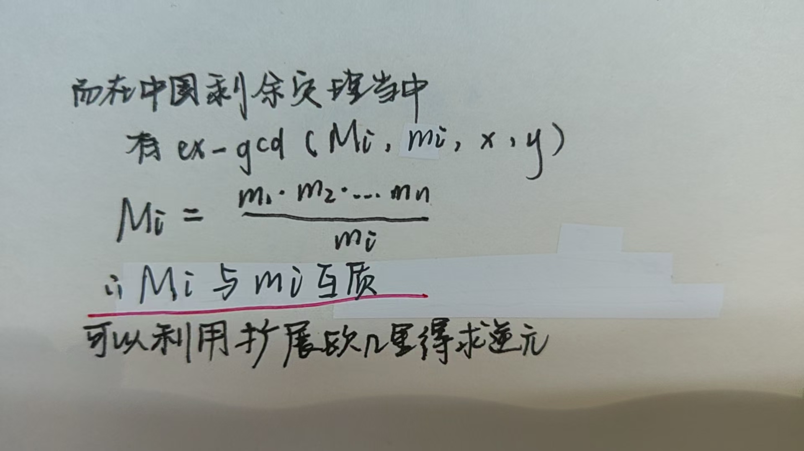

## 例题：

[1298. 曹冲养猪 - AcWing题库](https://www.acwing.com/problem/content/description/1300/)

一个很典型的中国剩余定理，但是里面的数据比较大可能会造成溢出
比如这段代码，不溢出的数据都能处理，一旦溢出就无法处理。
```cpp
#include<iostream>

using namespace std;
typedef unsigned long long ll;
const int N = 30;
int n;
int a[N], m[N];
ll k[N];
ll mula = 1;

ll base_getk(int i)//求解基础解系
{
    ll s = 0, t = 0;
    ll pre = mula/a[i];
    
    for(t=1; t<1e18+10 ;t++)//*********
    {
        ll left = pre*t - 1;
        if(left % a[i] == 0)
        {
            s = left/a[i];
            break;
        }
    }
    
    //cout<<(pre*t)<<" ******"<<endl;
    return (pre*t);
}

int main()
{
    cin>>n;
    
    for(int i=1; i<=n; i++)
    {
        scanf("%d%d", a+i, m+i);
        mula *= a[i];
    }
    //cout<<mula<<" ____"<<endl;
    
    //bool flag = 0;
    for(int i=1; i<=n; i++)
    {
        k[i] = base_getk(i);
    }
    
    ll res = 0;
    for(int i=1; i<=n; i++)
    {
        res += m[i]*k[i];
        
        //cout<<res<<endl;
        res %= mula;
    }
        
    cout<<res;
    
    return 0;
}
```

上述代码无法解决以下样例, 会溢出。除非采用__int128.
```
3
99991 99990
99989 99988
99971 99970

正确输出：
999510067897128

错误输出：
854957599444831

```

但是非常神奇的是，如果针对这个数据，我将`ll base_getk(int i)//求解基础解系` 这个函数里面的返回值改成`return s;` 就能够通过上述样例，但是其他样例都无法通过。

==我也不知道究竟是不是数据溢出的问题，我先来学习一下其他更为巧妙的方法==





做一些补充：






[1298. 曹冲养猪 - AcWing题库](https://www.acwing.com/problem/content/description/1300/)
终于AC了，真是非常不容易呢
```cpp
#include<iostream>

using namespace std;
typedef long long LL;
const int N = 15;

//a[i]是模数，b[i]是余数
LL a[N], b[N];
LL n;
LL m[N];
LL mul = 1;

//写法一、写法二均已通过测试

//1. 写法一
LL ex_gcd(LL a, LL b, LL &x, LL &y)
{
    //递归出口
    if(b == 0)
    {
        x = 1;
        y = 0;
        return a;//逐层返回最大公因数（辗转相除法）
    }

    LL ans = ex_gcd(b, a%b, x, y);
    //此时的x, y是来自下一层的解
    LL tmp = x;
    x = y;//x1 = y2;
    y = tmp - a/b *y;//y1 = x2 + a/b *y2;

    return ans;//返回的是gcd(a, b)
}

//2. 写法二
// LL ex_gcd(LL a, LL b, LL &x, LL &y)  // 扩展欧几里得算法, 求x, y，使得ax + by = gcd(a, b)
// {
//     if (!b)
//     {
//         x = 1; y = 0;
//         return a;
//     }
//     LL d = ex_gcd(b, a % b, y, x);
//     y -= (a / b) * x;
//     return d;
// }

int main()
{
    cin>>n;

    for(int i=1; i<=n; i++)
    {
        cin>>a[i]>>b[i];
        mul *= a[i];
        //cout<<mul<<"******"<<endl;
    }

    LL res = 0;
    for(int i=1; i<=n; i++)
    {
        m[i] = mul / a[i];

        LL ti, y;
        ex_gcd(m[i], a[i], ti, y);
        //cout<< ex_gcd(m[i], a[i], ti, y)<<"_______"<<endl;;

        res = (res + (__int128)b[i] * m[i] * ti) % mul;
        //b[i] * m[i] * ti会溢出long long

    }

    //循环外输出
    cout<<(res%mul + mul )%mul<<endl;

    return 0;
}
```


