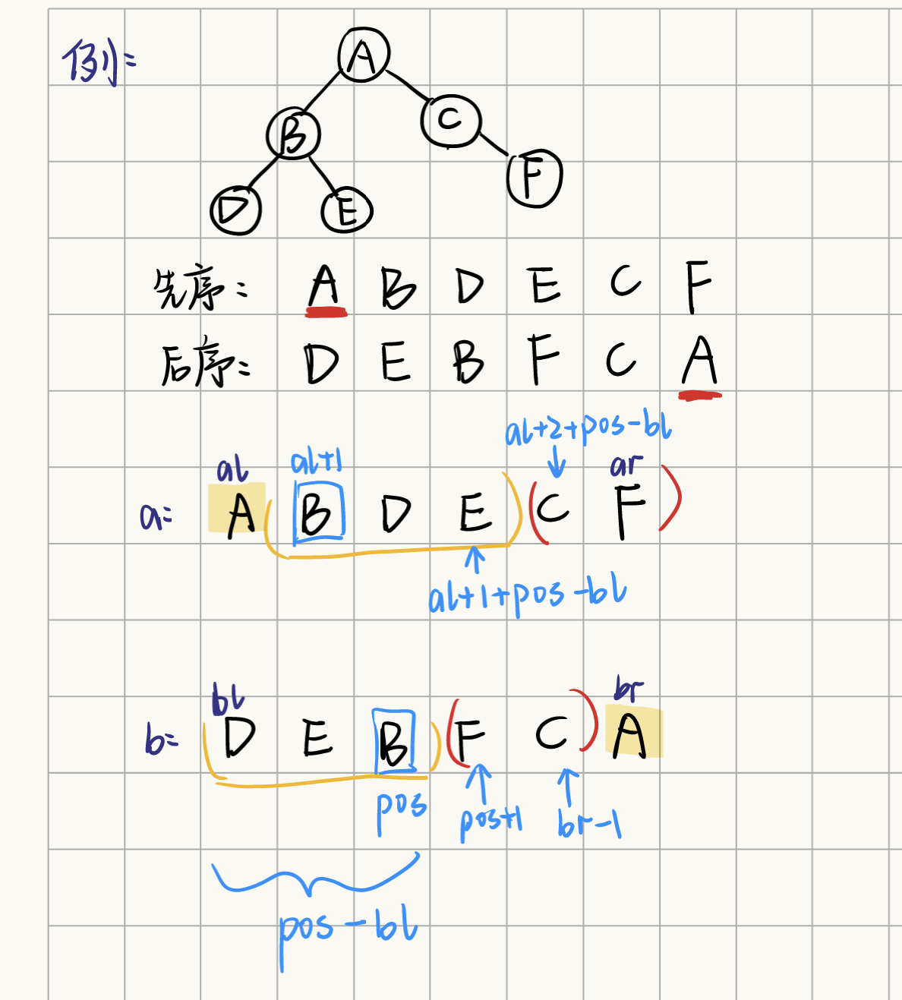

链接：[https://ac.nowcoder.com/acm/problem/204382](https://ac.nowcoder.com/acm/problem/204382)
## 题目描述

给定一棵有n个结点的二叉树的先序遍历与后序遍历序列，求其中序遍历序列。  
==若某节点只有一个子结点，则此处将其看作左儿子结点==


> [!NOTE] 
> 在给定两个遍历序列，求另一种遍历序列中：  
①给定先序序列和中序序列，可以唯一确定树，后序遍历唯一；  
②给定后序序列和中序序列，可以唯一确定树，先序遍历唯一；  
③给定先序序列和后序序列，不能唯一确定树；

==当题目中表明，只有一个结点则看做左子节点，那就可以唯一确定树了。==


## 题解

#二叉树 #递归 #树的遍历 




```cpp
class Solution {
public:
    /**
     * 代码中的类名、方法名、参数名已经指定，请勿修改，直接返回方法规定的值即可
     *
     * 
     * @param n int 二叉树节点数量
     * @param pre intvector 前序序列
     * @param suf intvector 后序序列
     * @return intvector
     */
    vector<int> res;
    void dfs(vector<int> &a, int al, int ar, vector<int> &b, int bl, int br)
    {
        if(al > ar || bl > br) return;//前序,后序遍历的数组不为空
        else if(al == ar)//题目多了一个条件【若某节点只有一个子结点，则此处将其看作左儿子结点】。所以可以求出唯一的一个中序遍历。
        {
            res.push_back(a[al]);
            return;
        }
        
        int pos;//在后序遍历中找左子树结束的位置
        for(pos = bl; pos<=br ;pos++)
        {
            if(b[pos] == a[al+1])
                break;
        }
        //递归左子树
        //pos-bl 求的是左子树子串的长度
        dfs(a, al+1, al+1+(pos-bl), b, bl, pos);
        //将根节点放入res
        res.push_back(a[al]);
        //递归右子树al+2+(pos-bl) == al+1+(pos-bl)+1
        dfs(a, al+2+(pos-bl), ar, b, pos+1, br-1);
    }     
              
    vector<int> solve(int n, vector<int>& pre, vector<int>& suf) 
    {
        dfs(pre, 0, n-1, suf, 0, n-1);
        return res;
    }
};
```