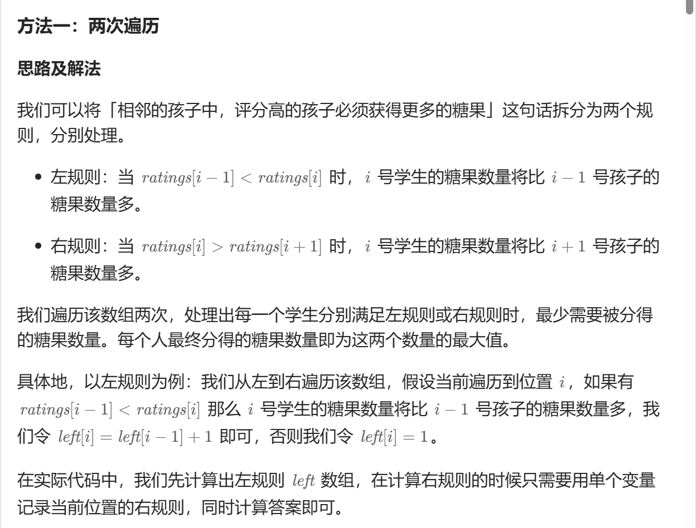
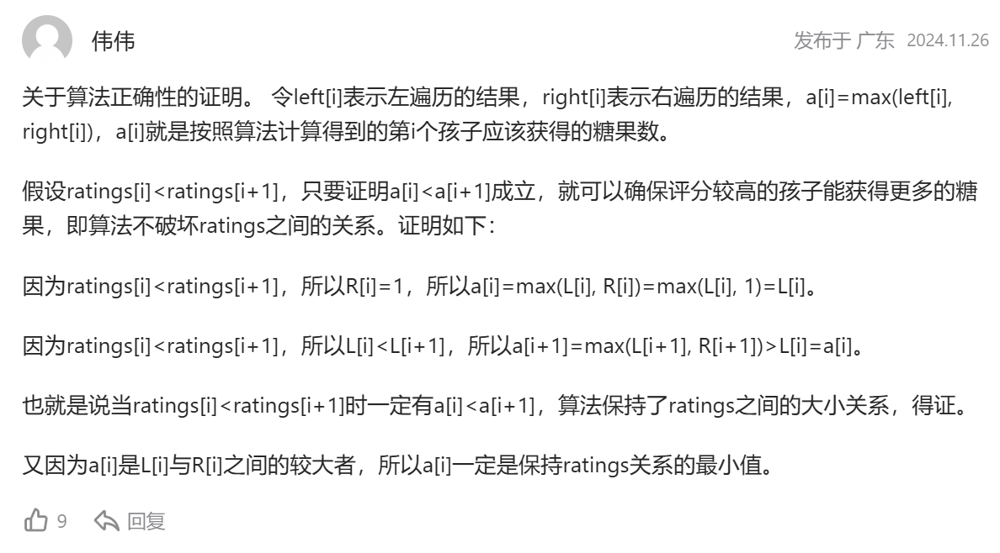
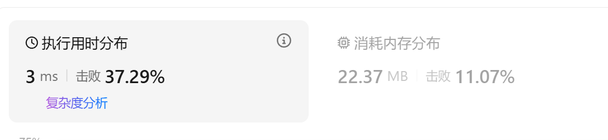
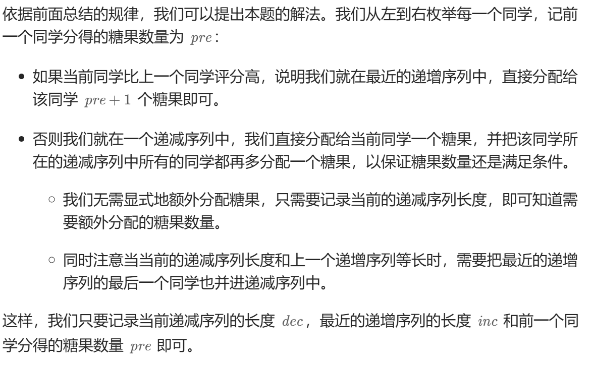
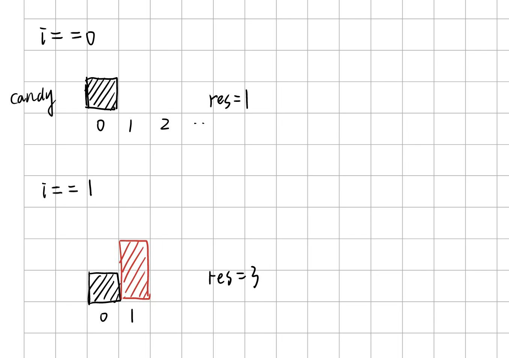
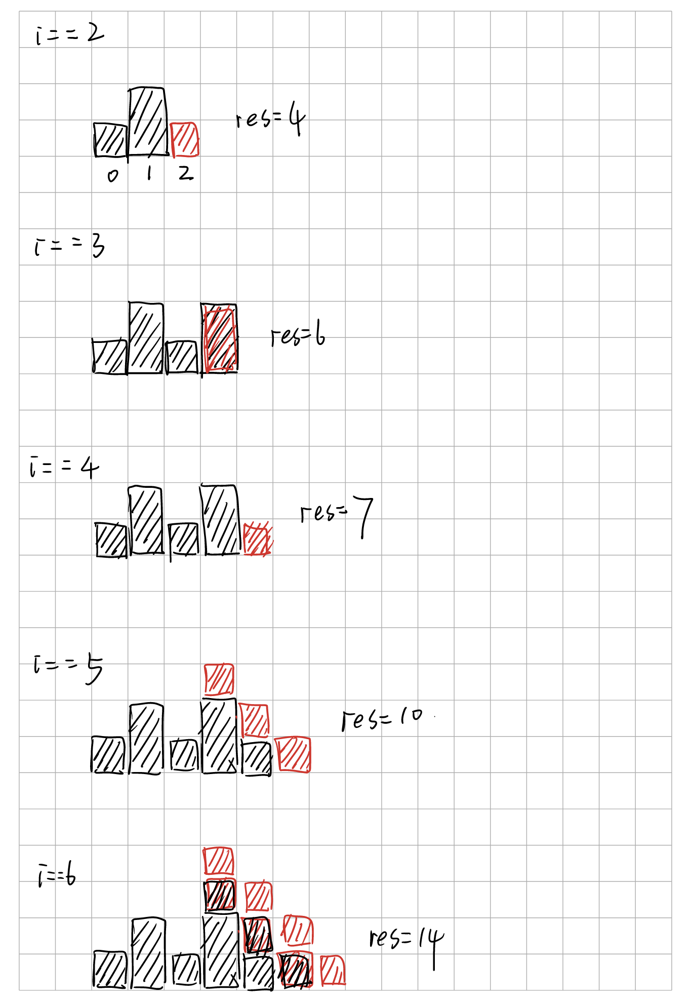

[135. 分发糖果 - 力扣（LeetCode）](https://leetcode.cn/problems/candy/description/?envType=study-plan-v2&envId=top-interview-150)

#贪心 #单调序列
## 法一

左右规则两次遍历





AC代码：

O(n)复杂度



```cpp
class Solution {
public:
    int candy(vector<int>& ratings) 
    {
        //左规则，当ratings[i-1] < ratings[i],i号糖果的数量要更多，否则置为1
        //右规则，当ratings[i] > ratings[i+1],i号糖果的数量要更多，否则置为1

        //从左到右遍历
        int size = ratings.size();
        vector<int> num(size);

        num[0] = 1;
        for(int i=1; i<size; i++)
        {
            if(ratings[i-1] < ratings[i])
                num[i] = num[i-1] + 1;
            else
                num[i] = 1;
        }
        
        //右往左
        int tmpl;
        int tmpr = 1;
        num[size-1] = (num[size-1] > 1)? num[size-1] : 1;
        int res = num[size-1];
        for(int i=size-2; i>=0; i--)
        {
            tmpl = 1;

            if(ratings[i] > ratings[i+1])
            {
                tmpl = tmpr + 1;
            }
            
            num[i] = (num[i] > tmpl)? num[i] : tmpl;
            tmpr = num[i];
            res += num[i];
        }

        return res;

    }
};
```


## 法二


这个方法只需要一次遍历就能直接求解，时间性能非常优秀。

主要是利用了单调递增或者单调递减序列信息。


设计一个样例模拟一下：
```cpp
rating = 
	[2, 4, 4, 7, 5, 4, 3, 6, 9, 10, 4,  2,  1 ]
i:  [0, 1, 2, 3, 4, 5, 6, 7, 8, 9,  10, 11, 12]

------------------------------------

i=1 
pre=2, inc=2, dec=0 
res=3 

i=2  //ratings[i] == ratings[i-1] 从新计算单增序列参数
pre=1, inc=1, dec=0 
res=4 

i=3 
pre=2, inc=2, dec=0 
res=6 

i=4 
pre=1, inc=2, dec=1 
res=7 

i=5  //inc == dec   dec++
pre=1, inc=2, dec=3 
res=10 

i=6 
pre=1, inc=2, dec=4 
res=14 

i=7 
pre=2, inc=2, dec=0 
res=16 

i=8 
pre=3, inc=3, dec=0 
res=19 

i=9 
pre=4, inc=4, dec=0 
res=23 

i=10 
pre=1, inc=4, dec=1 
res=24 

i=11 
pre=1, inc=4, dec=2 
res=26 

i=12 
pre=1, inc=4, dec=3 
res=29

```




AC代码：


```cpp
class Solution {
public:
    int candy(vector<int>& ratings) 
    {
        int size = ratings.size();
        int res = 1;
        int inc = 1, dec = 0, pre = 1;

        for(int i=1; i<size; i++)
        {
            if(ratings[i] >= ratings[i-1])
            {
                dec = 0;
                pre = (ratings[i] == ratings[i-1])? 1: pre+1;
                res += pre;
                inc = pre;
            }
            else
            {
                dec++;
                if(dec == inc) //递增序列和递减序列长度相等的时候
                //表示来到递减序列的最后一个元素
                {
                    dec++;
                }
                res += dec;
                pre = 1; //递减之后可能就递增
            }
        }
        return res;
    }
};
```