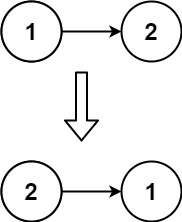
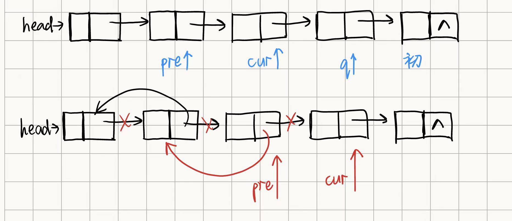
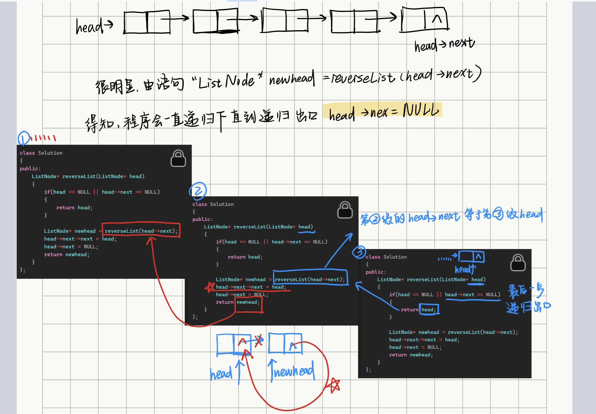

[206. 反转链表 - 力扣（LeetCode）](https://leetcode.cn/problems/reverse-linked-list/description/)

给你单链表的头节点 `head` ，请你反转链表，并返回反转后的链表。

**示例1**


**输入：** `head = [1,2,3,4,5]` 
**输出：** `[5,4,3,2,1]` 


**示例2**


**输入：** `head = [1,2]`
**输出：** `[2,1]`

**示例3**

**输入：** `head = []`
**输出：** `[]` 

**提示：**

- 链表中节点的数目范围是 `[0, 5000]`
- `-5000 <= Node.val <= 5000`

**进阶：** 链表可以选用迭代或递归方式完成反转。你能否用两种方法解决这道题？

## 题解

#迭代 #链表操作 #递归 


##### 方法一：迭代

假设链表为 `1→2→3→∅` ，我们想要把它改成 `∅←1←2←3`。

在遍历链表时，将当前节点的 next 指针改为指向前一个节点。由于节点没有引用其前一个节点，因此必须事先存储其前一个节点。在更改引用之前，还需要存储后一个节点。最后返回新的头引用。



```cpp
/**

 * Definition for singly-linked list.

 * struct ListNode {

 *     int val;

 *     ListNode *next;

 *     ListNode() : val(0), next(nullptr) {}

 *     ListNode(int x) : val(x), next(nullptr) {}

 *     ListNode(int x, ListNode *next) : val(x), next(next) {}

 * };

 */

class Solution
{
public:
    ListNode* reverseList(ListNode* head)
    {
        ListNode* pre = NULL;
        ListNode* curr = head;

        while(curr != NULL)
        {
            ListNode* q = curr->next;
            curr->next = pre;
            pre = curr;
            curr = q;
        }
        return pre;
    }
};
```

**复杂度分析**

- 时间复杂度：O(n)，其中 n 是链表的长度。需要遍历链表一次。

- 空间复杂度：O(1)。


##### 方法二：递归

递归版本稍微复杂一些，其关键在于反向工作。假设链表的其余部分已经被反转，现在应该如何反转它前面的部分？

假设链表为：  
$$
n_1→…→n_{k−1}→n_k→n_{k+1}→…→n_m→∅
$$
若从节点 $n_{k+1}​$ 到 $n_m$​ 已经被反转，而我们正处于 $n_k$  。

$$
n_1→…→n_{k−1}→n_k→n_{k+1}←…←n_m
$$

我们希望 $n_{k+1}$ 的下一个节点指向 $n_k$  。

所以，$n_k.\textit{next}.\textit{next} = n_k$  。

需要注意的是 $n_1$​ 的下一个节点必须指向 $\varnothing$。如果忽略了这一点，链表中可能会产生环。

_使用默认应用打开可以查看里面的具体递归回溯的过程_


```cpp
class Solution
{
public:
    ListNode* reverseList(ListNode* head)
    {
        if(head == NULL || head->next == NULL)
        {
            return head;
        }

        ListNode* newhead = reverseList(head->next);
        head->next->next = head;
        head->next = NULL;
        return newhead;
    }
};
```

**复杂度分析**

时间复杂度：O(n)，其中 n 是链表的长度。需要对链表的每个节点进行反转操作。

空间复杂度：O(n)，其中 n 是链表的长度。空间复杂度主要取决于递归调用的栈空间，最多为 n 层。


