[234. 回文链表 - 力扣（LeetCode）](https://leetcode.cn/problems/palindrome-linked-list/)

给你一个单链表的头节点 `head` ，请你判断该链表是否为回文链表

如果是，返回 `true` ；否则，返回 `false` 。

**示例 1：**

**输入：** `head = [1,2,2,1]`
**输出：** `true` 

**示例 2：**

**输入：** `head = [1,2]`
**输出：** `false` 

**提示：**

- 链表中节点数目在范围`[1, 105]` 内
- `0 <= Node.val <= 9`

## 题解

#链表 #递归 #模拟 #卡空间 

#### 方法一：将值复制到数组中后用双指针法

**思路**

如果你还不太熟悉链表，下面有关于列表的概要讲述。

有两种常用的列表实现，分别为数组列表和链表。如果我们想在列表中存储值，它们是如何实现的呢？

- 数组列表底层是使用数组存储值，我们可以通过索引在 O(1) 的时间访问列表任何位置的值，这是由基于内存寻址的方式。
- 链表存储的是称为节点的对象，每个节点保存一个值和指向下一个节点的指针。访问某个特定索引的节点需要 O(n) 的时间，因为要通过指针获取到下一个位置的节点。

确定数组列表是否回文很简单，我们可以使用双指针法来比较两端的元素，并向中间移动。一个指针从起点向中间移动，另一个指针从终点向中间移动。这需要 O(n) 的时间，因为访问每个元素的时间是 O(1)，而有 n 个元素要访问。

然而同样的方法在链表上操作并不简单，因为不论是正向访问还是反向访问都不是 O(1)O(1)O(1)。而将链表的值复制到数组列表中是 O(n)，因此最简单的方法就是将链表的值复制到数组列表中，再使用双指针法判断。

**算法**

一共为两个步骤：

1. 复制链表值到数组列表中。
2. 使用双指针法判断是否为回文。

第一步，我们需要遍历链表将值复制到数组列表中。我们用 `currentNode` 指向当前节点。每次迭代向数组添加 `currentNode.val`，并更新 `currentNode = currentNode.next`，当 `currentNode = null` 时停止循环。

执行第二步的最佳方法取决于你使用的语言。在 Python 中，很容易构造一个列表的反向副本，也很容易比较两个列表。而在其他语言中，就没有那么简单。因此最好使用双指针法来检查是否为回文。我们在起点放置一个指针，在结尾放置一个指针，每一次迭代判断两个指针指向的元素是否相同，若不同，返回 `false`；相同则将两个指针向内移动，并继续判断，直到两个指针相遇。

在编码的过程中，注意我们比较的是节点值的大小，而不是节点本身。正确的比较方式是：`node_1.val == node_2.val`，而 `node_1 == node_2` 是错误的。

```cpp
class Solution 
{
public:
    bool isPalindrome(ListNode* head) 
    {
        vector<int> vals;
        while (head != nullptr) 
        {
            vals.emplace_back(head->val);
            head = head->next;
        }
        for (int i = 0, j = (int)vals.size() - 1; i < j; ++i, --j) {
            if (vals[i] != vals[j]) 
            {
                return false;
            }
        }
        return true;
    }
};
```

**复杂度分析**

- 时间复杂度：O(n)，其中 n 指的是链表的元素个数。
    - 第一步： 遍历链表并将值复制到数组中，O(n)。
    - 第二步：双指针判断是否为回文，执行了 O(n/2) 次的判断，即 O(n)。
    - 总的时间复杂度：O(2n)=O(n)O(2n) = O(n)O(2n)=O(n)。
- 空间复杂度：O(n)，其中 nnn 指的是链表的元素个数，我们使用了一个数组列表存放链表的元素值。

#### 方法二：递归

**思路**

为了想出使用空间复杂度为 O(1) 的算法，你可能想过使用递归来解决，但是这仍然需要 O(n) 的空间复杂度。

递归为我们提供了一种优雅的方式来方向遍历节点。
```cpp
function print_values_in_reverse(ListNode head)
    if head is NOT null
        print_values_in_reverse(head.next)
        print head.val
```
如果使用递归反向迭代节点，同时使用递归函数外的变量向前迭代，就可以判断链表是否为回文。

**算法**  
`currentNode` 指针是先到尾节点，由于递归的特性再从后往前进行比较。`frontPointer` 是递归函数外的指针。若 `currentNode.val != frontPointer.val` 则返回 `false`。反之，`frontPointer` 向前移动并返回 `true`。

算法的正确性在于递归处理节点的顺序是相反的（回顾上面打印的算法），而我们在函数外又记录了一个变量，因此从本质上，我们同时在正向和逆向迭代匹配。

```cpp
class Solution {
    ListNode* frontPointer;
public:
    bool recursivelyCheck(ListNode* currentNode) {
        if (currentNode != nullptr) {
            if (!recursivelyCheck(currentNode->next)) {
                return false;
            }
            if (currentNode->val != frontPointer->val) {
                return false;
            }
            frontPointer = frontPointer->next;
        }
        return true;
    }

    bool isPalindrome(ListNode* head) {
        frontPointer = head;
        return recursivelyCheck(head);
    }
};
```

下面展示了算法的工作原理。我们定义递归函数名字为 `recursively_check`，每个节点都被赋予了标识符（如 `$1`）以便更好地解释它们。计算机在递归的过程中将使用堆栈的空间，这就是为什么递归并不是 O(1) 的空间复杂度。


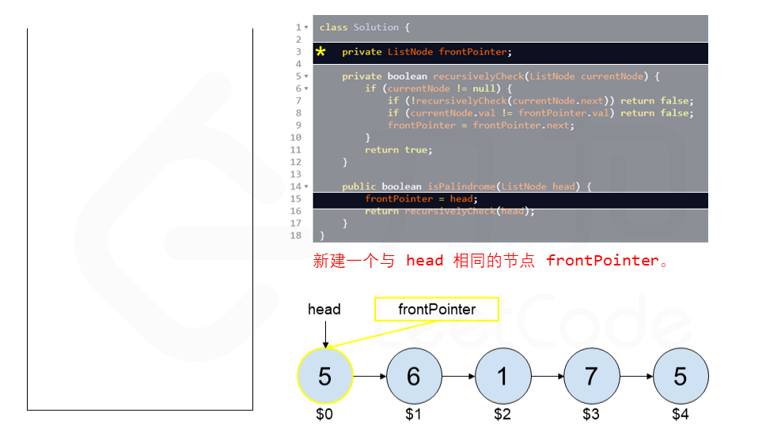
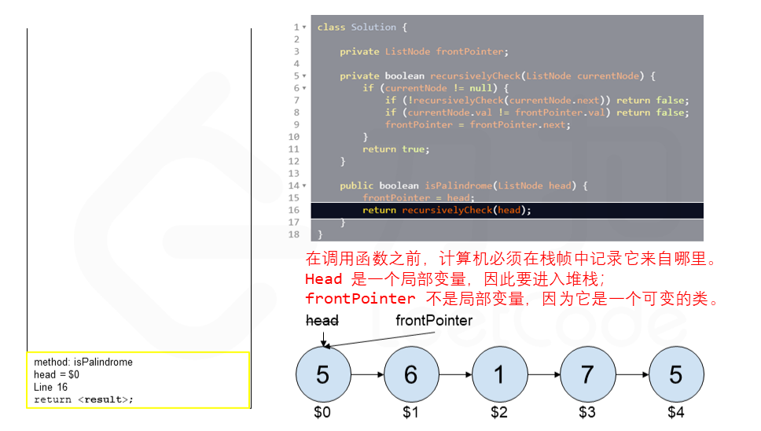
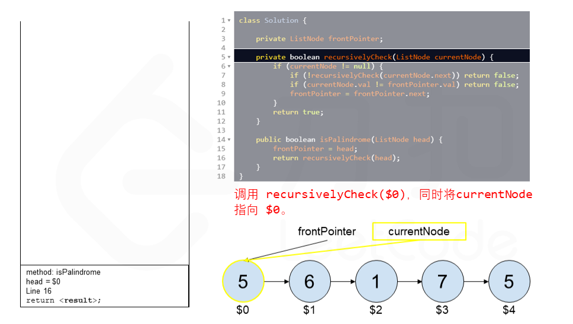
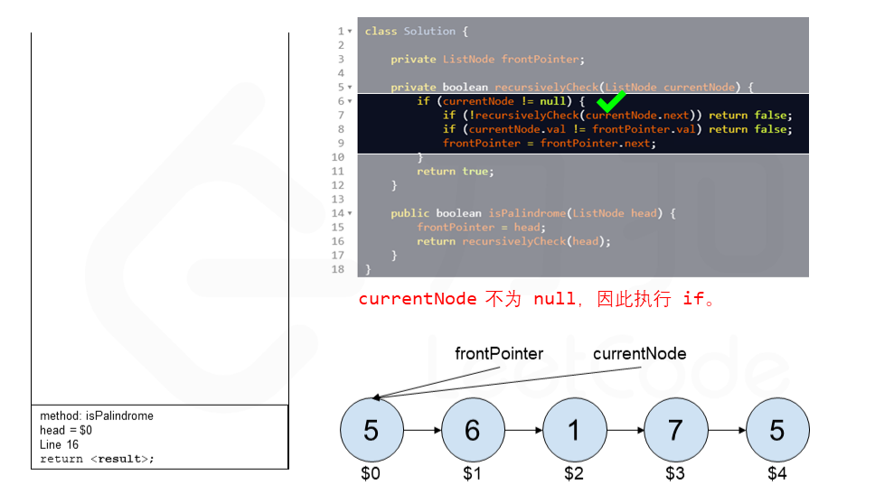
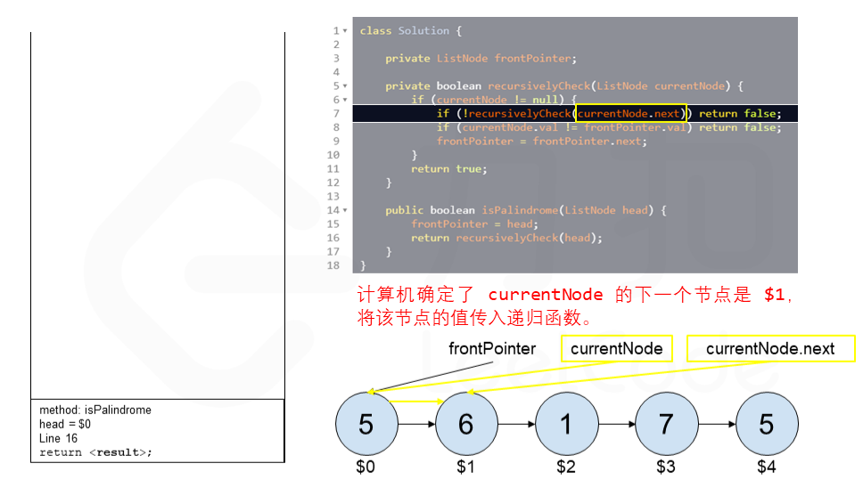
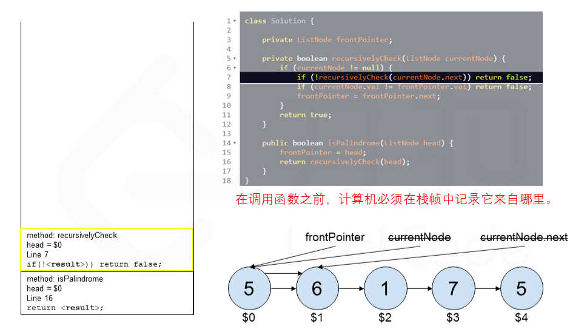
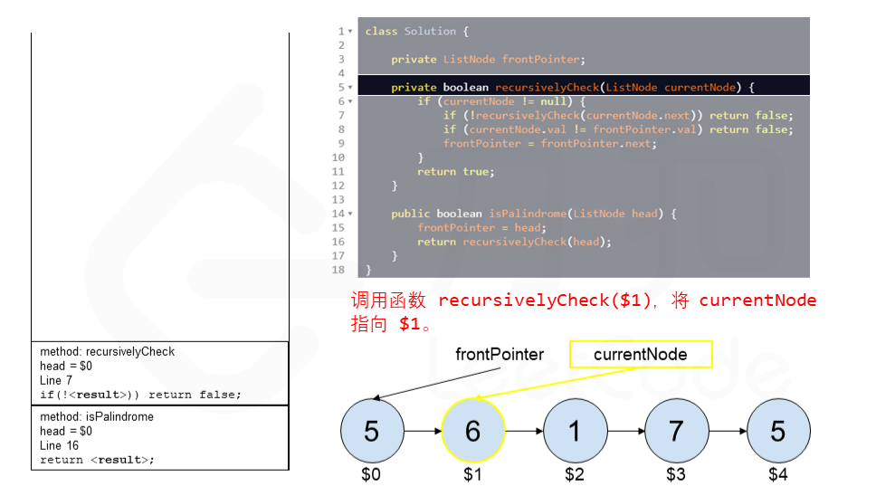
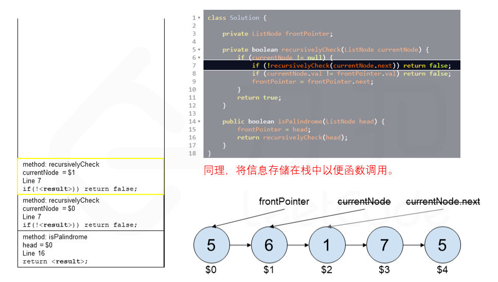
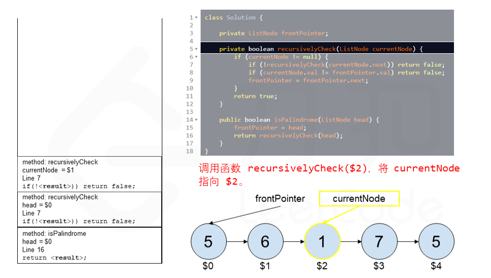
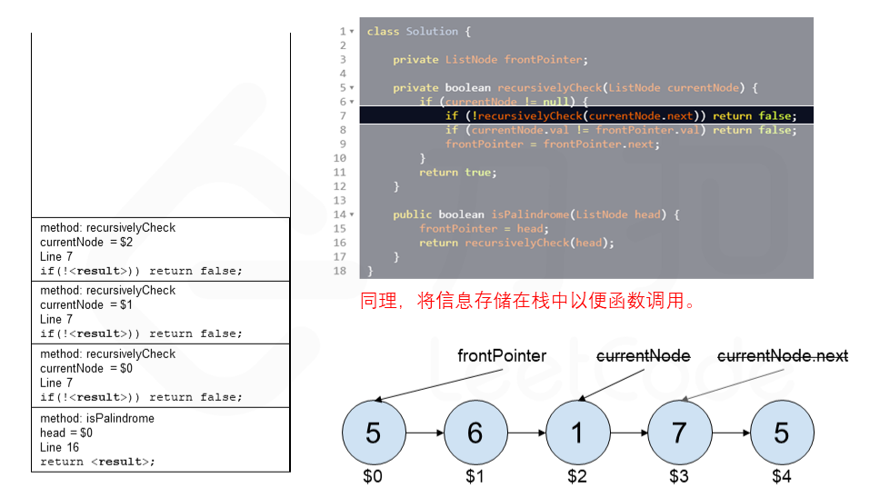

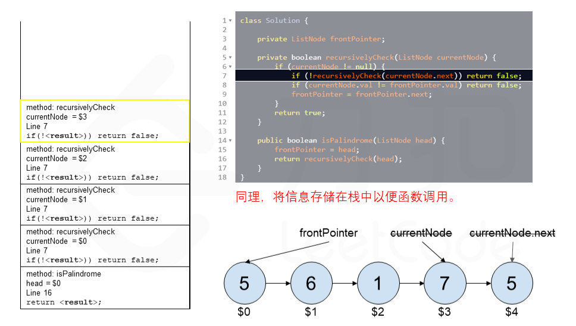

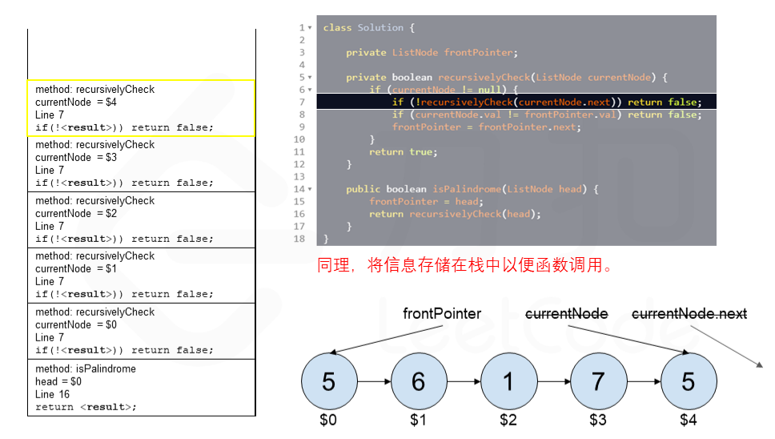


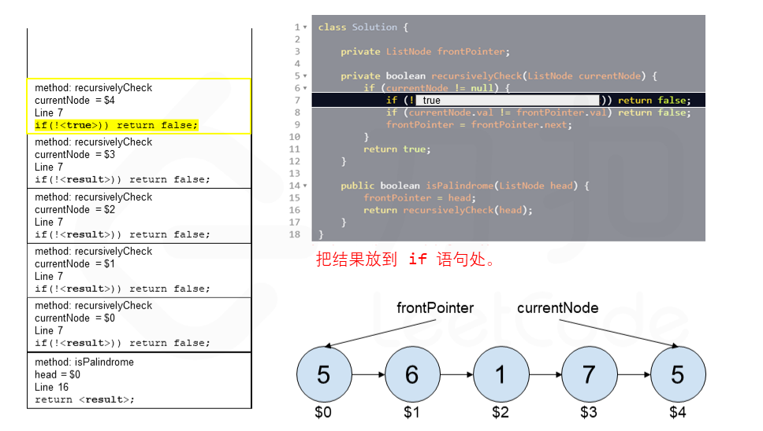

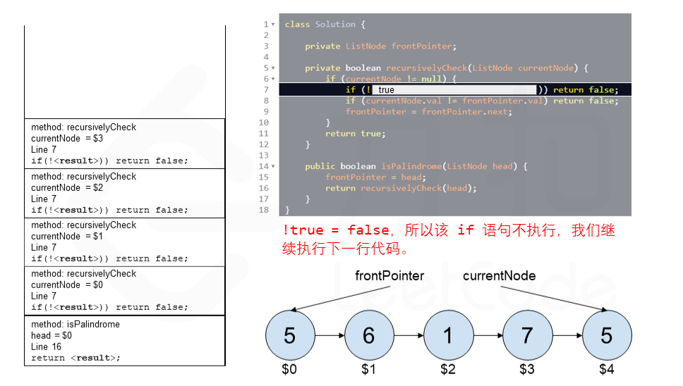
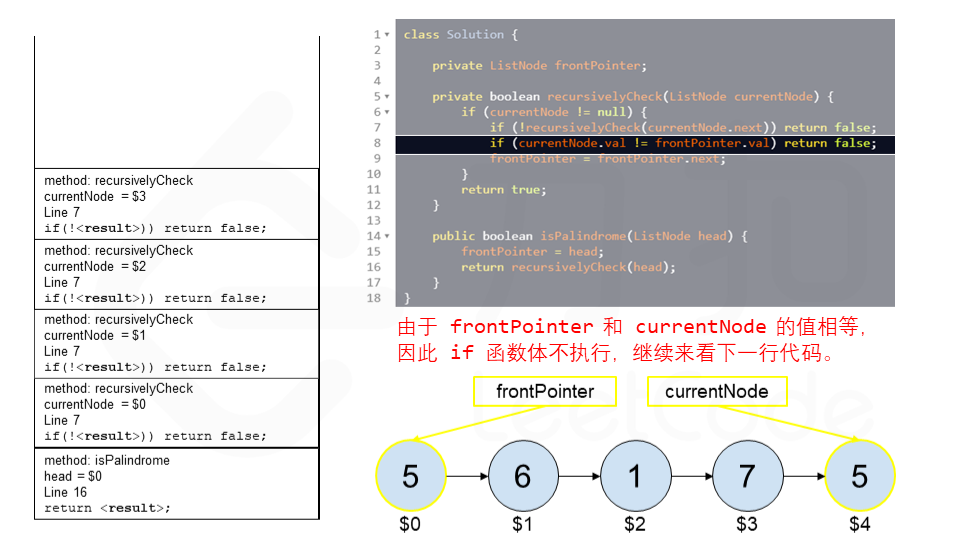


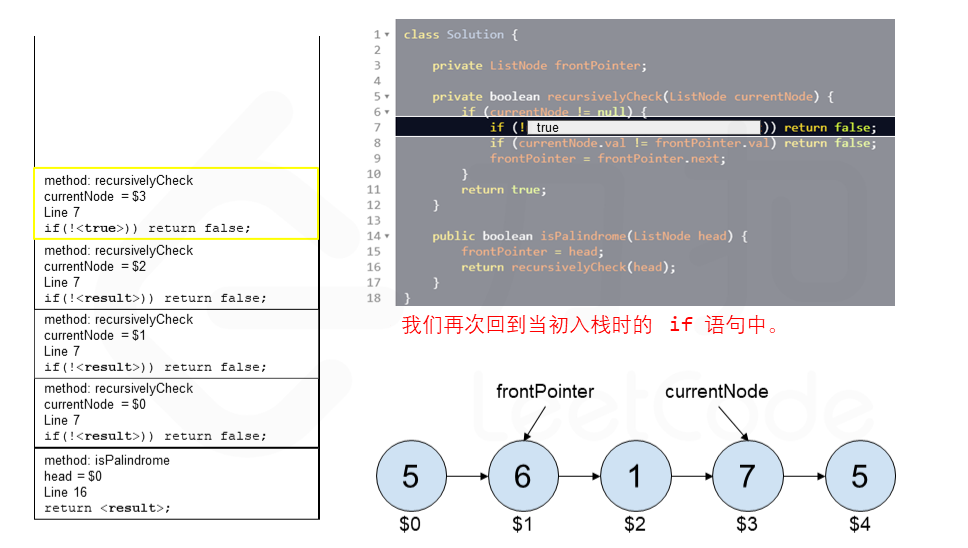


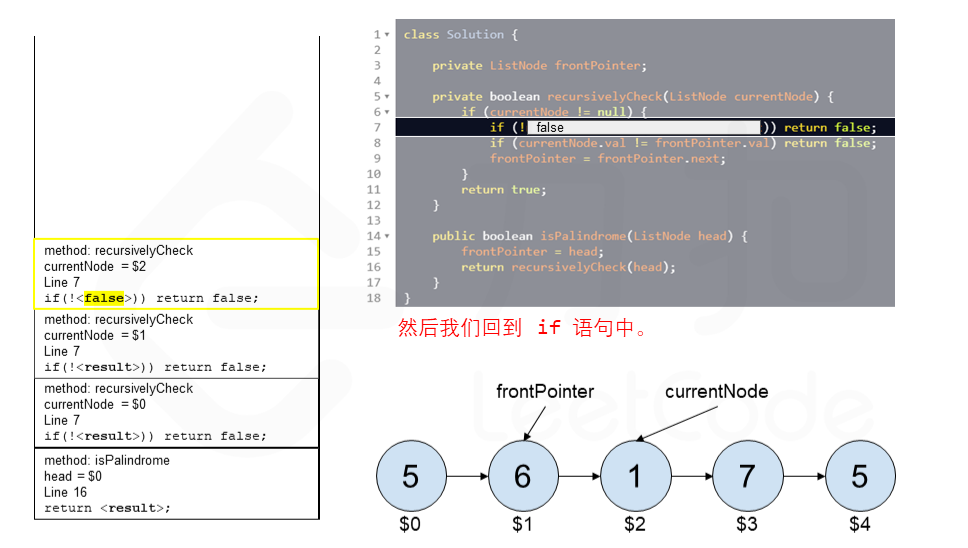
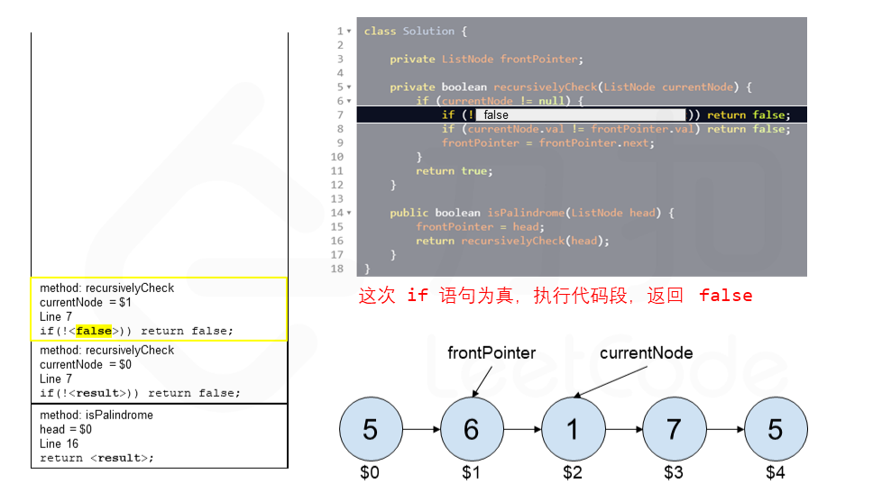


**复杂度分析**

- 时间复杂度：O(n)，其中 n 指的是链表的大小。
- 空间复杂度：O(n)，其中 n 指的是链表的大小。我们要理解计算机如何运行递归函数，在一个函数中调用一个函数时，计算机需要在进入被调用函数之前跟踪它在当前函数中的位置（以及任何局部变量的值），通过运行时存放在堆栈中来实现（堆栈帧）。在堆栈中存放好了数据后就可以进入被调用的函数。在完成被调用函数之后，他会弹出堆栈顶部元素，以恢复在进行函数调用之前所在的函数。在进行回文检查之前，递归函数将在堆栈中创建 nnn 个堆栈帧，计算机会逐个弹出进行处理。所以在使用递归时空间复杂度要考虑堆栈的使用情况。

这种方法不仅使用了 O(n) 的空间，且比第一种方法更差，因为在许多语言中，堆栈帧的开销很大（如 Python），并且最大的运行时堆栈深度为 1000（可以增加，但是有可能导致底层解释程序内存出错）。为每个节点创建堆栈帧极大的限制了算法能够处理的最大链表大小。


#### 方法三：快慢指针

**思路**

避免使用 O(n)O(n)O(n) 额外空间的方法就是改变输入。

我们可以将链表的后半部分反转（修改链表结构），然后将前半部分和后半部分进行比较。比较完成后我们应该将链表恢复原样。虽然不需要恢复也能通过测试用例，但是使用该函数的人通常不希望链表结构被更改。

该方法虽然可以将空间复杂度降到 O(1)O(1)O(1)，但是在并发环境下，该方法也有缺点。在并发环境下，函数运行时需要锁定其他线程或进程对链表的访问，因为在函数执行过程中链表会被修改。

**算法**

整个流程可以分为以下五个步骤：
1. 找到前半部分链表的尾节点。
2. 反转后半部分链表。
3. 判断是否回文。
4. 恢复链表。
5. 返回结果。

执行步骤一，我们可以计算链表节点的数量，然后遍历链表找到前半部分的尾节点。

我们也可以使用**快慢指针**在一次遍历中找到：慢指针一次走一步，快指针一次走两步，快慢指针同时出发。当快指针移动到链表的末尾时，慢指针恰好到链表的中间。通过慢指针将链表分为两部分。

若链表有奇数个节点，则中间的节点应该看作是前半部分。

步骤二可以使用「[206. 反转链表](https://leetcode-cn.com/problems/reverse-linked-list/)」问题中的解决方法来反转链表的后半部分。

步骤三比较两个部分的值，当后半部分到达末尾则比较完成，可以忽略计数情况中的中间节点。

步骤四与步骤二使用的函数相同，再反转一次恢复链表本身。

**代码**

```cpp
class Solution {
public:
    bool isPalindrome(ListNode* head) {
        if (head == nullptr) {
            return true;
        }

        // 找到前半部分链表的尾节点并反转后半部分链表
        ListNode* firstHalfEnd = endOfFirstHalf(head);
        ListNode* secondHalfStart = reverseList(firstHalfEnd->next);

        // 判断是否回文
        ListNode* p1 = head;
        ListNode* p2 = secondHalfStart;
        bool result = true;
        while (result && p2 != nullptr) {
            if (p1->val != p2->val) {
                result = false;
            }
            p1 = p1->next;
            p2 = p2->next;
        }        

        // 还原链表并返回结果
        firstHalfEnd->next = reverseList(secondHalfStart);
        return result;
    }

    ListNode* reverseList(ListNode* head) {
        ListNode* prev = nullptr;
        ListNode* curr = head;
        while (curr != nullptr) {
            ListNode* nextTemp = curr->next;
            curr->next = prev;
            prev = curr;
            curr = nextTemp;
        }
        return prev;
    }

    ListNode* endOfFirstHalf(ListNode* head) {
        ListNode* fast = head;
        ListNode* slow = head;
        while (fast->next != nullptr && fast->next->next != nullptr) {
            fast = fast->next->next;
            slow = slow->next;
        }
        return slow;
    }
};
```

**复杂度分析**

- 时间复杂度：O(n)，其中 n 指的是链表的大小。
    
- 空间复杂度：O(1)。我们只会修改原本链表中节点的指向，而在堆栈上的堆栈帧不超过 O(1)。


