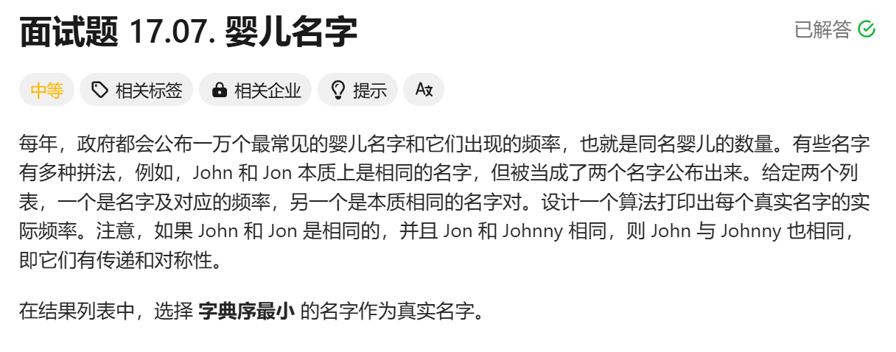
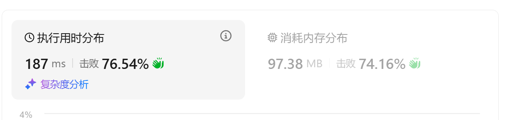

[面试题 17.07. 婴儿名字 - 力扣（LeetCode）](https://leetcode.cn/problems/baby-names-lcci/description/)



## 题解

#并查集 #字符串 #哈希 

AC代码：


```cpp
class Solution 
{
private:
    unordered_map<string, int> namecnt;
    unordered_map<string, string> parents; //p[a] = b: b是a的父节点， 后续会路径压缩变成祖宗节点

    const string& findRoot(const string& name)
    {
        if(parents.count(name) == 0)
            return parents[name] = name;

        if(parents[name] != name)
        {
            parents[name] = findRoot(parents[name]);
            return parents[name]; //路径压缩
        }

        return parents[name];
    }
    
    void join(const string& first, const string& second)
    {
        const string& r1 = findRoot(first);
        const string& r2 = findRoot(second);

        //字典序小的做根节点
        if(r1 < r2) parents[r2] = r1;
        else parents[r1] = r2;
    }


public:
    vector<string> trulyMostPopular(vector<string>& names, vector<string>& synonyms) 
    {
        //由于synonyma里面出现的名字可能不会在names里面出现
        //所以先根据syn初始化并查集
        for(auto &namepair:synonyms)
        {
            auto comma_pos = namepair.find(',');
            string first = namepair.substr(1, comma_pos-1);
            string second = namepair.substr(comma_pos+1, namepair.size()-2-comma_pos);
            join(first, second);
        }

        //先把names转成map
        for(auto &it:names)
        {
            auto l_pos = it.find('(');
            string key = it.substr(0, l_pos);
            string val = it.substr(l_pos+1, it.size()-2);
            int cnt = stoi(val);
            namecnt[findRoot(key)] += cnt;
        }

        vector<string> res;
        for(auto &[name, cnt] : namecnt)
        {
            res.emplace_back(name + "(" + to_string(cnt) + ")");
        }
        return res;
    }
};
```

新学到了一种遍历哈希表的方法`for(auto &[name, cnt] : namecnt)`