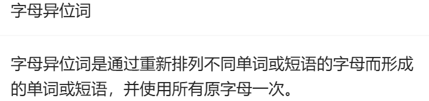

#hash #哈希 #字符串 #滑动窗口 


[[hashtable]]

## [242. 有效的字母异位词 - 力扣（LeetCode）](https://leetcode.cn/problems/valid-anagram/description/)



AC代码：
```cpp
class Solution 
{
public:
    bool isAnagram(string s, string t) 
    {
        int record[26] = {0};
        for (int i = 0; i < s.size(); i++) 
        {
            record[s[i] - 'a']++;
        }
        for (int i = 0; i < t.size(); i++) 
        {
            record[t[i] - 'a']--;
        }
        for (int i = 0; i < 26; i++) 
        {
            if (record[i] != 0) 
            {
                return false;
            }
        }
        // record数组所有元素都为零0，说明字符串s和t是字母异位词
        return true;
    }
};
```


## [LCR 033. 字母异位词分组 - 力扣（LeetCode）](https://leetcode.cn/problems/sfvd7V/description/)

### 排序

互为异位词排序后的结果一样，可以将每个词排序后的结果当作关键信息，用这个关键信息分类，使用`map`存储。


AC代码：
```cpp
class Solution {
public:
    vector<vector<string>> groupAnagrams(vector<string>& strs) 
    {
        unordered_map<string, vector<string>> mp;
        for(auto str : strs)
        {
            string key = str;
            sort(key.begin(), key.end());
            mp[key].emplace_back(str);
        }

        //只是取出mp的value作为答案
        vector<vector<string>> ans;
        for(auto it : mp)
        {
            ans.emplace_back(it.second);
        }

        return ans;
    }
};
```


### 计数


```cpp
// 自定义对 array<int, 26> 类型的哈希函数
auto arrayHash = [fn = hash<int>{}] (const array<int, 26>& arr) -> size_t
{
	return accumulate(arr.begin(), arr.end(), 0u, [&](size_t acc, int num)
	{
		return (acc << 1) ^ fn(num);
	});
};
```
#### 1. 捕获列表和哈希函数定义

```cpp
auto arrayHash = [fn = hash<int>{}] (const array<int, 26>& arr) -> size_t
```

- **捕获列表**：`[fn = hash<int>{}]`，这里定义了一个lambda表达式，并且捕获了一个`hash<int>`对象`fn`。`hash<int>`是C++标准库中用于计算`int`类型数据哈希值的函数对象。捕获列表中的`fn = hash<int>{}{}`表示创建一个`hash<int>`对象并将其命名为`fn`。
    
- **参数列表**：`(const array<int, 26>& arr)`，表示这个lambda表达式接受一个`const array<int, 26>&`类型的参数`arr`，即一个包含26个`int`类型元素的数组的常量引用。
    
- **返回类型**：`-> size_t`，表示这个lambda表达式的返回类型是`size_t`，即哈希值的类型。
    
#### 2. 哈希计算逻辑

```cpp
{
    return accumulate(arr.begin(), arr.end(), 0u, [&](size_t acc, int num) 
    {
        return (acc << 1) ^ fn(num);
    });
}
```

- **`accumulate`函数**：`accumulate`是C++标准库中的一个算法，用于对范围内的元素进行累加操作。这里使用`accumulate`函数对`arr`数组中的所有元素进行哈希计算。
    
    - `arr.begin()`和`arr.end()`：分别表示数组`arr`的起始迭代器和结束迭代器，用于指定`accumulate`函数操作的范围。
        
    - `0u`：表示累加的初始值，类型为`unsigned int`，值为0。这里使用`0u`是为了确保初始值的类型与累加结果的类型一致，避免类型转换问题。
        
    - **lambda表达式**：`[&](size_t acc, int num) { return (acc << 1) ^ fn(num); }`，这是一个捕获当前作用域的lambda表达式，用于定义累加操作的具体逻辑。
        
        - `acc`：表示累加器，类型为`size_t`，初始值为0u。
            
        - `num`：表示当前遍历到的数组元素，类型为`int`。
            
        - **哈希计算**：`return (acc << 1) ^ fn(num);`，表示将当前累加器`acc`左移1位，然后与当前元素`num`的哈希值进行异或操作。左移1位是为了增加哈希值的范围，异或操作是为了将多个元素的哈希值混合在一起，生成最终的哈希值。
            

#### 3. 总结

这段代码定义了一个自定义的哈希函数`arrayHash`，用于对`array<int, 26>`类型的数据进行哈希计算。具体步骤如下：

1. 创建一个`hash<int>`对象`fn`，用于计算`int`类型数据的哈希值。
    
2. 使用`accumulate`函数对数组`arr`中的所有元素进行累加操作。
    
3. 在累加过程中，将当前累加器`acc`左移1位，然后与当前元素`num`的哈希值进行异或操作，生成最终的哈希值。
    
4. 返回最终的哈希值，类型为`size_t`。
    

这个自定义哈希函数可以用于需要对`array<int, 26>`类型数据进行哈希计算的场景，例如在哈希表中使用。

#### 官方题解

语法有些华丽，但是算法思想还是简单的。
```cpp
class Solution {

public:

    vector<vector<string>> groupAnagrams(vector<string>& strs)

    {

        // 自定义对 array<int, 26> 类型的哈希函数

        auto arrayHash = [fn = hash<int>{}] (const array<int, 26>& arr) -> size_t

        {

            return accumulate(arr.begin(), arr.end(), 0u, [&](size_t acc, int num)

            {

                return (acc << 1) ^ fn(num);

            });

        };

  

        unordered_map<array<int, 26>, vector<string>, decltype(arrayHash)> mp(0, arrayHash);

        for (string& str: strs)

        {

            array<int, 26> counts{};

            int length = str.length();

            for (int i = 0; i < length; ++i)

            {

                counts[str[i] - 'a'] ++;

            }

            mp[counts].emplace_back(str);

        }

        vector<vector<string>> ans;

        for (auto it = mp.begin(); it != mp.end(); ++it)

        {

            ans.emplace_back(it->second);

        }

        return ans;

    }

};
```


我自己的AC代码，更清晰易懂：
```cpp
class Solution 
{
public:
    vector<vector<string>> groupAnagrams(vector<string>& strs) 
    {
        unordered_map<string, vector<string>> mp;
        for(auto str : strs)
        {
            string temp(26, '0');
            for(auto c : str)
            {
                temp[c - 'a']++;
            }

            mp[temp].emplace_back(str);
        }

        //只是取出mp的value作为答案
        vector<vector<string>> ans;
        for(auto it : mp)
        {
            ans.emplace_back(it.second);
        }

        return ans;
    }
};
```


### 相比之下，排序方法更优。


## [LCR 015. 找到字符串中所有字母异位词 - 力扣（LeetCode）](https://leetcode.cn/problems/VabMRr/description/)

我最开始写的代码，超出了时间限制，逻辑是对的，但是算法不够优化：
```cpp
class Solution {
public:
    vector<int> findAnagrams(string s, string p) 
    {
        int lenp = p.size();
        string pkey = p;
        sort(pkey.begin(), pkey.end());

        vector<int> ans;
        int pos = 0;
        for(auto c : s)
        {
            if(p.find(c) != std::string::npos) //p中存在字符串c
            {
                string subs = s.substr(pos, lenp);
                string subskey = subs;
                sort(subskey.begin(), subskey.end());
                if(subskey == pkey) ans.push_back(pos);
            }

            pos++;
        }

        return ans;
    }
};
```


以下三种方法中，方法三是最优的。

### 方法一：使用滑动窗口优化

思路：
根据题目要求，我们需要在字符串 s 寻找字符串 p 的变位词。因为字符串 p 的变位词的长度一定与字符串 p 的长度相同，所以我们可以在字符串 s 中构造一个长度为与字符串 p 的长度相同的滑动窗口，并在滑动中维护窗口中每种字母的数量；当窗口中每种字母的数量与字符串 p 中每种字母的数量相同时，则说明当前窗口为字符串 p 的变位词。

算法：
在算法的实现中，我们可以使用数组来存储字符串 p 和滑动窗口中每种字母的数量。

细节：
当字符串 s 的长度小于字符串 p 的长度时，字符串 s 中一定不存在字符串 p 的变位词。但是因为字符串 s 中无法构造长度与字符串 p 的长度相同的窗口，所以这种情况需要单独处理。

AC代码：

```cpp
class Solution {
public:
    vector<int> findAnagrams(string s, string p) 
    {
        vector<int> ans;

        int lens = s.size();
        int lenp = p.size();

        if(lens < lenp) return ans;

        //初始化窗口
        vector<int> sWin(26); //维护窗口内每个字符的数量
        vector<int> pCnt(26);
        for(int i=0; i<lenp; i++)
        {
            pCnt[p[i] - 'a']++;
            sWin[s[i] - 'a']++;
        }

        if(sWin == pCnt) ans.push_back(0);

        for(int i=0; i<lens-lenp; i++)
        {
            sWin[s[i] - 'a']--;
            sWin[s[i + lenp] - 'a']++;

            if(sWin == pCnt) ans.push_back(i+1);
        }

        return ans;

    }
};
```


### 方法二：优化方法一

实际上看上去有理有据，比方法一更慢

思路和算法:
在方法一的基础上，我们不再分别统计滑动窗口和字符串 p 中每种字母的数量，而是统计滑动窗口和字符串 p 中每种字母数量的差；并引入变量 differ 来记录当前窗口与字符串 p 中数量不同的字母的个数，并在滑动窗口的过程中维护它。
在判断滑动窗口中每种字母的数量与字符串 p 中每种字母的数量是否相同时，只需要判断 differ 是否为零即可。

贴上官方的代码：
可以看到，比方法一要慢。

```cpp
class Solution {
public:
    vector<int> findAnagrams(string s, string p) {
        int sLen = s.size(), pLen = p.size();

        if (sLen < pLen) {
            return vector<int>();
        }

        vector<int> ans;
        vector<int> count(26);
        for (int i = 0; i < pLen; ++i) {
            ++count[s[i] - 'a'];
            --count[p[i] - 'a'];
        }

        int differ = 0;
        for (int j = 0; j < 26; ++j) {
            if (count[j] != 0) {
                ++differ;
            }
        }

        if (differ == 0) {
            ans.emplace_back(0);
        }

        for (int i = 0; i < sLen - pLen; ++i) {
            if (count[s[i] - 'a'] == 1) {  // 窗口中字母 s[i] 的数量与字符串 p 中的数量从不同变得相同
                --differ;
            } else if (count[s[i] - 'a'] == 0) {  // 窗口中字母 s[i] 的数量与字符串 p 中的数量从相同变得不同
                ++differ;
            }
            --count[s[i] - 'a'];

            if (count[s[i + pLen] - 'a'] == -1) {  // 窗口中字母 s[i+pLen] 的数量与字符串 p 中的数量从不同变得相同
                --differ;
            } else if (count[s[i + pLen] - 'a'] == 0) {  // 窗口中字母 s[i+pLen] 的数量与字符串 p 中的数量从相同变得不同
                ++differ;
            }
            ++count[s[i + pLen] - 'a'];
            
            if (differ == 0) {
                ans.emplace_back(i + 1);
            }
        }

        return ans;
    }
};
```


### 方法三：双指针

目前最优方案。

1. **初始化**：
    
    - `int n = p.size(), m = s.size();`：分别获取字符串 `p` 和 `s` 的长度。
        
    - `if (n > m) return {};`：如果 `p` 的长度大于 `s` 的长度，直接返回空结果，因为 `s` 中不可能存在 `p` 的变位词。
        
    - `vector<int> cnt(26);`：定义一个大小为26的整数数组 `cnt`，用于记录每个字符的计数。初始值为0。
        
    - `vector<int> res;`：定义一个结果数组 `res`，用于存储所有符合条件的子串的起始位置。
        
2. **初始化 `cnt`**：
    
    - `for (char c : p) { --cnt[c - 'a']; }`：遍历字符串 `p`，将每个字符 `c` 对应的计数减1。这样，`cnt` 数组中的每个元素初始值为 `-n`，其中 `n` 是 `p` 的长度。
        
3. **双指针遍历 `s`**：
    
    - `int left = 0;`：定义左指针 `left`，初始值为0。
        
    - `for (int right = 0; right < m; right++) {`：定义右指针 `right`，从0开始遍历字符串 `s`。
        
        - `int x = s[right] - 'a';`：计算当前字符 `s[right]` 对应的索引 `x`。
            
        - `++cnt[x];`：将 `cnt[x]` 的值加1，表示当前字符 `s[right]` 出现了一次。
            
        - `while (cnt[x] > 0) {`：如果 `cnt[x]` 大于0，说明当前窗口中的字符 `s[right]` 多余了，需要移动左指针 `left`，直到 `cnt[x]` 小于或等于0。
            
            - `--cnt[s[left] - 'a'];`：将左指针 `left` 对应的字符计数减1。
                
            - `++left;`：移动左指针 `left`。
                
        - `if (right - left + 1 == n) res.push_back(left);`：如果当前窗口的长度等于 `p` 的长度 `n`，说明当前窗口是一个变位词，将左指针 `left` 的位置加入结果数组 `res`。
            
4. **返回结果**：
    
    - `return res;`：返回结果数组 `res`，其中包含所有符合条件的子串的起始位置。
        

##### 详细解释

- **初始化 `cnt`**：
    
    - `cnt` 数组的每个元素初始值为0。
        
    - 遍历 `p`，将每个字符 `c` 对应的计数减1。例如，如果 `p` 为 `"abc"`，则 `cnt` 数组变为 `[-1, -1, -1, 0, 0, ..., 0]`。
        
- **双指针遍历 `s`**：
    
    - `right` 指针从0开始遍历 `s`，每次将当前字符 `s[right]` 对应的计数加1。
        
    - 如果 `cnt[x]` 大于0，说明当前窗口中的字符 `s[right]` 多余了，需要移动左指针 `left`，直到 `cnt[x]` 小于或等于0。
        
    - 如果当前窗口的长度等于 `p` 的长度 `n`，说明当前窗口是一个变位词，将左指针 `left` 的位置加入结果数组 `res`。
        

##### 示例

假设 `s = "cbaebabacd"`，`p = "abc"`：

1. **初始化 `cnt`**：
    
    - `p = "abc"`，`cnt` 数组变为 `[-1, -1, -1, 0, 0, ..., 0]`。
        
2. **双指针遍历 `s`**：
    
    - `right = 0`，`s[0] = 'c'`，`cnt[2]++`，`cnt` 变为 `[-1, -1, 0, 0, 0, ..., 0]`。
        
    - `right = 1`，`s[1] = 'b'`，`cnt[1]++`，`cnt` 变为 `[-1, 0, 0, 0, 0, ..., 0]`。
        
    - `right = 2`，`s[2] = 'a'`，`cnt[0]++`，`cnt` 变为 `[0, 0, 0, 0, 0, ..., 0]`。
        
        - `right - left + 1 == 3`，当前窗口长度等于 `p` 的长度，将 `left` 的位置0加入结果数组 `res`。
            
    - `right = 3`，`s[3] = 'e'`，`cnt[4]++`，`cnt` 变为 `[0, 0, 0, 0, 1, 0, ..., 0]`。
        
        - `cnt[4] > 0`，移动左指针 `left`，`s[0] = 'c'`，`cnt[2]--`，`cnt` 变为 `[0, 0, -1, 0, 1, 0, ..., 0]`，`left++`。
            
        - `s[1] = 'b'`，`cnt[1]--`，`cnt` 变为 `[0, -1, -1, 0, 1, 0, ..., 0]`，`left++`。
            
        - `s[2] = 'a'`，`cnt[0]--`，`cnt` 变为 `[-1, -1, -1, 0, 1, 0, ..., 0]`，`left++`。
            
    - `right = 4`，`s[4] = 'b'`，`cnt[1]++`，`cnt` 变为 `[-1, 0, -1, 0, 1, 0, ..., 0]`。
        
        - `cnt[1] > 0`，移动左指针 `left`，`s[3] = 'e'`，`cnt[4]--`，`cnt` 变为 `[-1, 0, -1, 0, 0, 0, ..., 0]`，`left++`。
            
    - `right = 5`，`s[5] = 'a'`，`cnt[0]++`，`cnt` 变为 `[0, 0, -1, 0, 0, 0, ..., 0]`。
        
        - `right - left + 1 == 3`，当前窗口长度等于 `p` 的长度，将 `left` 的位置2加入结果数组 `res`。
            
    - 依此类推，最终结果数组 `res` 为 `[0, 6]`。
        

```
怎么证明这个算法的正确性，为什么满足right - left + 1 == lenp就表示找到了一个变位词，如果cnt所有元素的和不为-n怎么办呢？
```
`cnt`的变化只有`加1`或者`减1`两种变化，也就是说，每次`right`右移，窗口内`cnt`的元素总和就会增加一，窗口长度也会增加一；`left`右移，窗口内`cnt`的元素总和就会减少一，窗口长度也会减少一。可见，`cnt`的总和总是与窗口内字母的长度`right - left + 1`有关

根据代码：
```cpp
while(cnt[c] > 0)  //left~right内字符c出现的多余了
{
	cnt[s[left] - 'a']--;  //left指针移动
	left++;
}
```

得知，跳出while的时候，一定有`cnt[c] == 0`.
并且可以推断`Sum(cnt[]) //cnt所有元素的总和`
一定满足`Sum(cnt[]) <= 0`，因为保证了每个`cnt`元素都是小于等于`0`的。
现在就两种情况分析：
- `Sum(cnt[]) < 0`，说明某些元素小于`0`，表示在`p`中出现的某些字符的次数要高于当前窗口内的对应的字符出现的次数。
- `Sum(cnt[]) == 0`，由于每一个元素都小于等于`0`，所以一定有每个元素都为`0`。表示在`p`中出现的某些字符的次数要等于当前窗口内的对应的字符出现的次数。符合异位词的定义。

AC代码如下：


```cpp
class Solution {
public:
    vector<int> findAnagrams(string s, string p) 
    {
        int lenp = p.size();
        int lens = s.size();

        vector<int> ans;
        if(lens < lenp) return ans;

        vector<int> cnt(26); 
        for(auto c : p)
        {
            cnt[c - 'a']--;
        }

        int left = 0;
        for(int right = 0; right < lens; right++)
        {
            int c = s[right] - 'a';
            ++cnt[c];  //left~right内字符c出现
            while(cnt[c] > 0)  //left~right内字符c出现的多余了
            {
                cnt[s[left] - 'a']--;  //left指针移动
                left++;
            }
            if(right - left + 1 == lenp) ans.push_back(left);
        }

        return ans;
    }
};
```