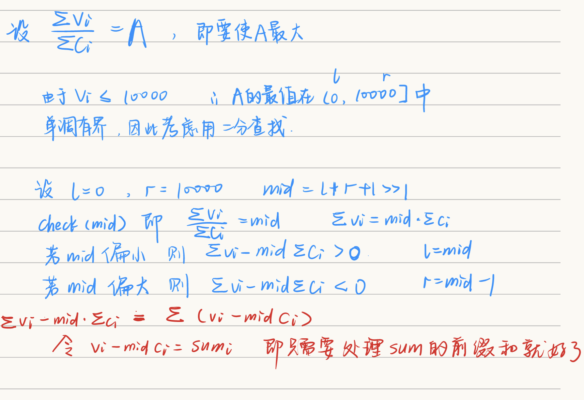

链接：[https://ac.nowcoder.com/acm/contest/66433/E](https://ac.nowcoder.com/acm/contest/66433/E)
## 题目描述

小咪是一个土豪手办狂魔，这次他去了一家店，发现了好多好多（n个）手办，但他是一个很怪的人，每次只想买k个手办，而且他要让他花的每一分钱都物超所值，即：买下来的东西的总价值/总花费=max。请你来看看，他会买哪些东西吧。

## 输入描述:

多组数据。

第一行一个整数 T，为数据组数。

接下来有 T 组数据。

对于每组数据，第一行两个正整数n，k，如题。

接下来 n 行，每行有两个正整数ci，vi。分别为手办的花费和它对于小咪的价值。

## 输出描述:

对于每组数据，输出一个数，即能得到的总价值/总花费的最大值。精确至整数。

## 示例

输入
```
1
5 1
1 2
2 3
3 4
4 5
5 6
```

输出
```
2
```

备注

$$
\displaylines{
1≤T≤10\\
1≤n≤104\\
1≤k≤n\\
1≤c_i,v_i≤104\\
}
$$

## 题解

#二分 #浮点二分 #二分答案 



```cpp
#include<iostream>
#include<algorithm>

using namespace std;
const int N = 1e4+10;
int c[N], v[N];
double v_midc[N];
int n, k;

bool comp(double a, double b)
{
    return a>b;
}

int check(double x)
{
    for(int i=1; i<=n; i++)
        v_midc[i] = v[i] - c[i]*x;
    sort(v_midc+1, v_midc+n+1, comp);
    
    double sum = 0.0;
    for(int i=1; i<=k; i++)
        sum += v_midc[i];
        
    if(sum > 0) return 1;
    else return 0;
}

int main()
{
    int T;
    cin>>T;
    
    while(T--)
    {
        scanf("%d%d", &n, &k);
        
        for(int i=1; i<=n; i++) scanf("%d%d", c+i, v+i);
        
        double l = 0, r = N;
        while(r-l > 1e-8)
        {
            double mid = (l+r)/2;
            if(check(mid)) l = mid;
            else r = mid;
        }
        cout<<(int)r<<endl;
    }
    
    return 0;
}
```