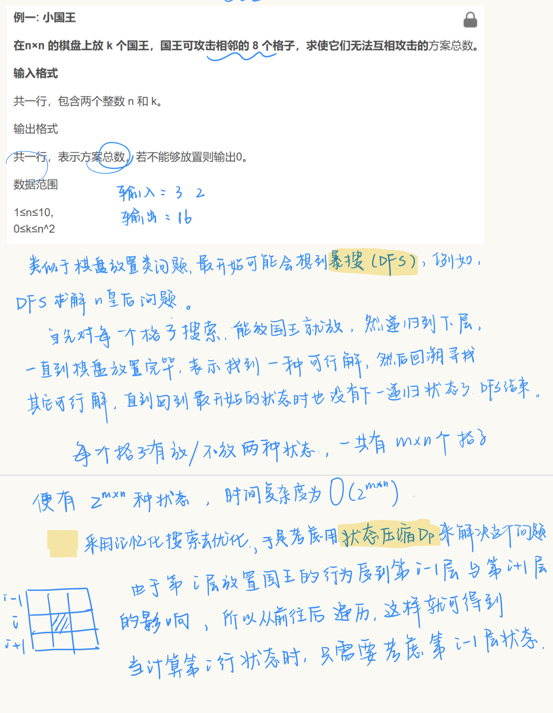
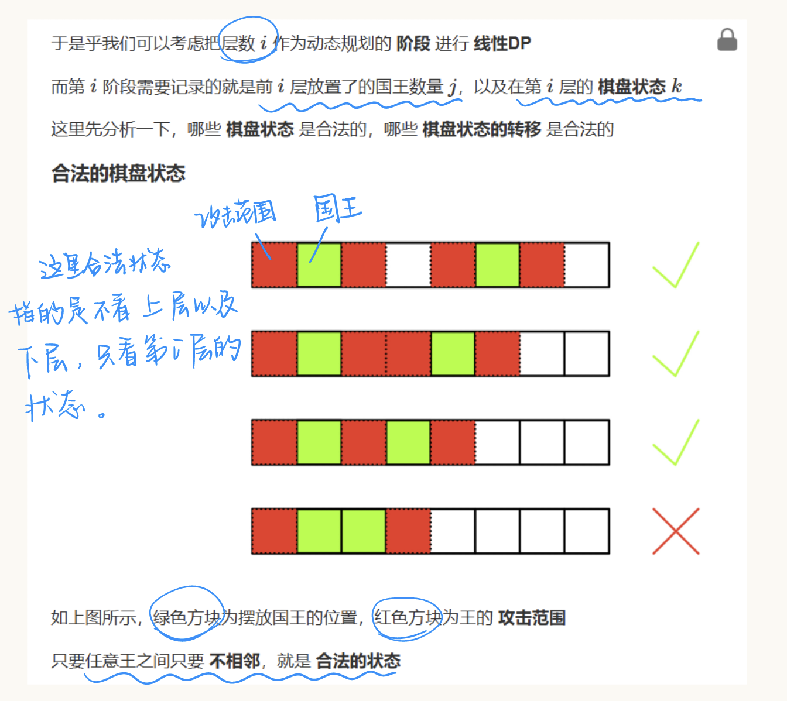
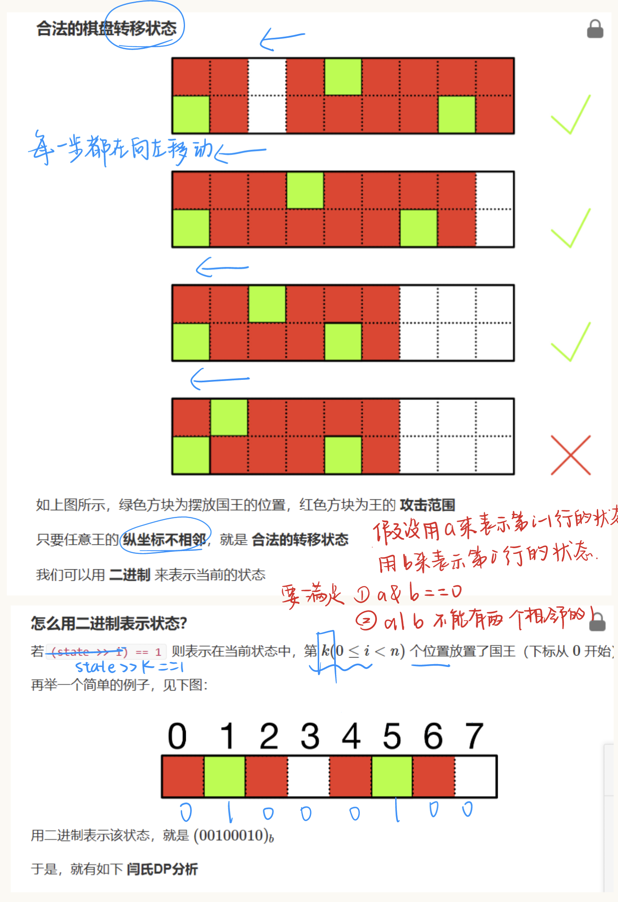
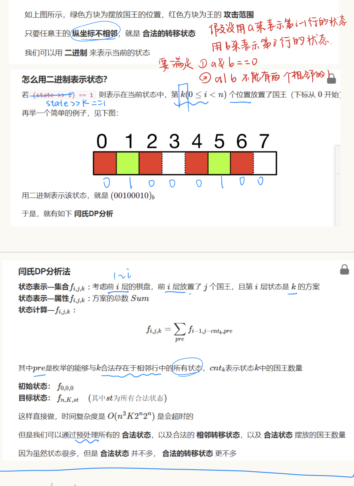
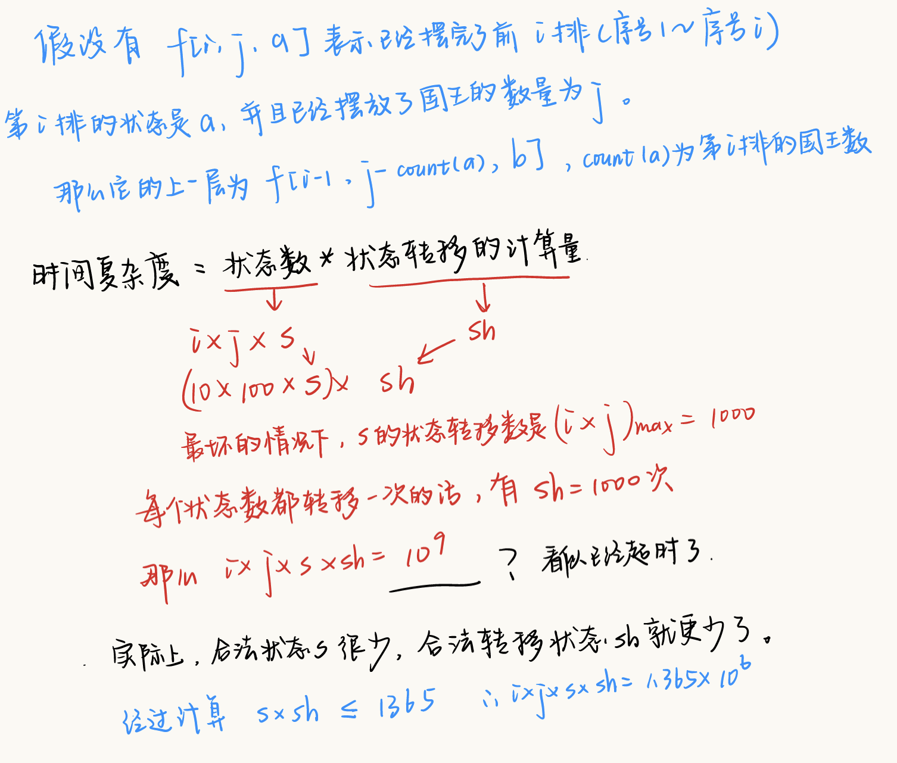

[1064. 小国王 - AcWing题库](https://www.acwing.com/problem/content/description/1066/)

## 题解

#状态压缩dp #dp 







千万注意这一题会爆int需要longlong 类型的数据。
```cpp
#include<iostream>
#include<vector>

using namespace std;
typedef long long LL;
const int N = 12, K = 110, ST = 1 << 10;
LL f[N][K][ST];
vector<int> legal_state;
vector<int> head[ST];
int cnt[ST];
int n, k;
bool check(int st)
{
    for (int i = 0; i < n; i++)
    {
        if ((st >> i) & 1 && (st >> (i + 1)) & 1)
            return false;
    }
    return true;
}

int count(int st)
{
    int ans = 0;
    while (st != 0)
    {
        if (st & 1) ans++;
        st = st >> 1;
    }
    return ans;
}

int main()
{
    cin >> n >> k;

    int max = 1 << n;
    for (int st = 0; st < max; st++)
    {
        if (check(st) == true)
        {
            legal_state.push_back(st);
            cnt[st] = count(st);
        }
    }

    for (auto& cur : legal_state)
        for (auto& to : legal_state)
            if (!(cur & to) && check(cur | to))
                head[cur].push_back(to);

    f[0][0][0] = 1;
    for(int i=1; i<=n+1; i++)
        for(int j=0; j<=k; j++)
            for(auto& now:legal_state)
                for(auto& pre: head[now])
                    if ((j - cnt[now]) >= 0)
                    {
                        f[i][j][now] += f[i - 1][j - cnt[now)[pre];
                    }

    //cout << check(9) << endl;

    cout << f[n + 1][k][0];

    return 0;
}

```

其实这一题的空间复杂度还是太大了，其实还可以采用滚动数组去优化，减少很多空间。

**滚动数组优化原理**
如果在dp的过程当中某一个状态的转移只需要前一个或者固定前几个的状态进行迭代，而与其他关系无关，就会认为此时可以采用滚动数组去进行优化。

AC代码如下：
```cpp
#include<iostream>
#include<vector>

using namespace std;
typedef long long LL;
const int N = 12, K = 110, ST = 1 << 10;
LL f[2][K][ST];
vector<int> legal_state;
vector<int> head[ST];
int cnt[ST];
int n, k;
bool check(int st)
{
    for (int i = 0; i < n; i++)
    {
        if ((st >> i) & 1 && (st >> (i + 1)) & 1)
            return false;
    }
    return true;
}

int count(int st)
{
    int ans = 0;
    while (st != 0)
    {
        if (st & 1) ans++;
        st = st >> 1;
    }
    return ans;
}

int main()
{
    cin >> n >> k;

    int max = 1 << n;
    for (int st = 0; st < max; st++)
    {
        if (check(st) == true)
        {
            legal_state.push_back(st);
            cnt[st] = count(st);
        }
    }

    for (auto& cur : legal_state)
        for (auto& to : legal_state)
            if (!(cur & to) && check(cur | to))
                head[cur].push_back(to);

    f[0][0][0] = 1;
    for(int i=1; i<=n+1; i++)
        for(int j=0; j<=k; j++)
            for(auto& now:legal_state)
            {
                f[i&1][j][now] = 0;//清空操作 //向i行状态填写数据的时候，应该是上一行的状态是有效的
                for(auto& pre: head[now])
                {
                    //由于只需要上一状态和这一状态，因此也只需要两个下标即0和1
                    //当 i & 1 == 0 表示i是滴偶数行，反之 i 为奇数行
                    //f[i&1][j][now] = 0;//清空操作 放在这里是错误的
                    //因为每次枚举前面的状态的时候都会把喔当前应该保留的数据清空，
                    if ((j - cnt[now]) >= 0)
                    {
                        f[i&1][j][now] += f[(i - 1)&1][j - cnt[now)[pre];
                    }
                }
            }

    //cout << check(9) << endl;

    cout << f[(n + 1)&1][k][0];

    return 0;
}
```