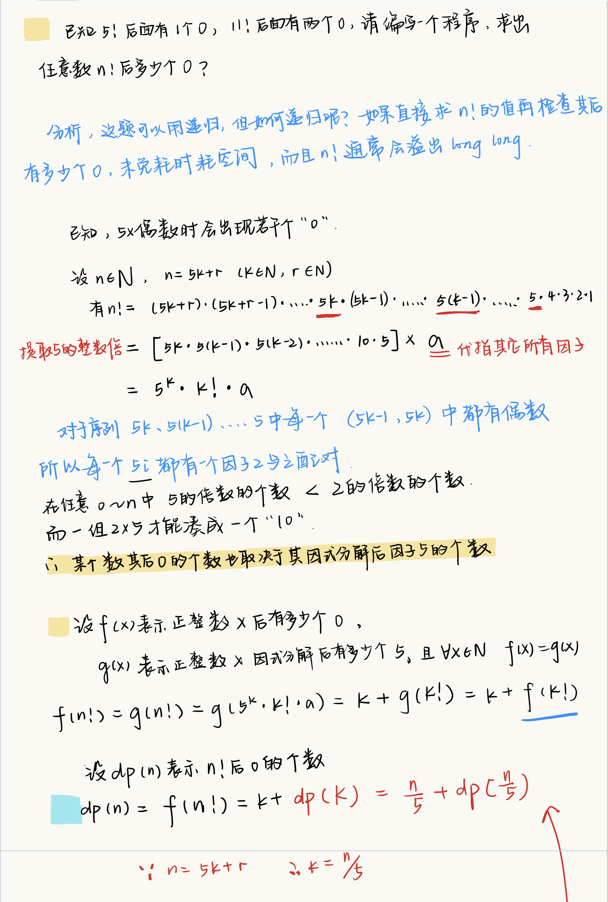

[2 · 尾部的零 - LintCode](https://www.lintcode.com/problem/2/description)

描述

给定一个整数 `n`，计算出`n!`中尾部零的个数。

1≤n≤10181≤n≤1018

你算法的时间复杂度应为 O(logn)O(logn)

样例

**样例 1：**

输入：

```
n = 5
```

输出：

```
1
```

解释：

5! = 120，尾部的0有1个。

**样例 2：**

输入：

```
n = 11
```

输出：

```
2
```

解释：

11! = 39916800，尾部的0有2个。

## 题解

#数学公式推导 #递推




```cpp
class Solution {

public:

    /**

     * @param n: A long integer

     * @return: An integer, denote the number of trailing zeros in n!

     */

    long long trailingZeros(long long n)

    {

        // write your code here

        long long k = n/5;

  

        if(n > 0 && n < 5) return 0;

        else

            return k + trailingZeros(k);

    }

};
```