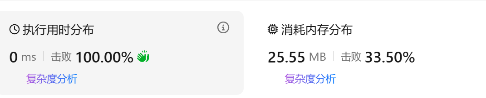

[42. 接雨水 - 力扣（LeetCode）](https://leetcode.cn/problems/trapping-rain-water/description/?envType=study-plan-v2&envId=top-interview-150)

## 题意

给定 `n` 个非负整数表示每个宽度为 `1` 的柱子的高度图，计算按此排列的柱子，下雨之后能接多少雨水。

**示例 1：**


**输入：** `height = [0,1,0,2,1,0,1,3,2,1,2,1]`
**输出：** `6`
**解释：** 上面是由数组 `[0,1,0,2,1,0,1,3,2,1,2,1]` 表示的高度图，在这种情况下，可以接 `6` 个单位的雨水（蓝色部分表示雨水）。 

**示例 2：**

**输入：** `height = [4,2,0,3,2,5]`
**输出：** `9`


## 题解

#动态规划 #双指针 #栈 #单调栈

这道题目和[[分发糖果]]特别类似。每一个位置接雨水的量既与左边有关，由于右边有关。

直观上看这道题目，就是：


简单来说就是每一个元素都在左边找一个最大值，右边找一个最大值，然后计算可以盛多少水，在减去方块占有的`height[]`。
但是这样的时间复杂度太高了，并且上述方法有意个漏洞，就是如果`i == 7, height[i] == 3`，此时ans应该 `+= 0`，但是根据上述算法描述，`min(left_max, right_max) - height[i]` 是一个负数，这是不合理的。

### 方法一：动态规划


AC代码如下:
time: O(n).
```cpp
class Solution 
{
public:
    int trap(vector<int>& height) 
    {
        int n = height.size();
        vector<int> dpl(n);
        vector<int> dpr(n); 

        //dpl[i]表示[0, i]的下标范围内的最大值height
        dpl[0] = height[0];
        for(int i=1; i<=(n-1); i++)
        {
            dpl[i] = max(dpl[i-1], height[i]);
        }

        dpr[n-1] = height[n-1];
        for(int i=n-2; i>=0; i--)
        {
            dpr[i] = max(dpr[i+1], height[i]);
        }

        int ans = 0;
        for(int i=0; i<n; i++)
        {
            ans += min(dpl[i], dpr[i]) - height[i];
        }

        return ans;
    }
};
```

### 方法二：单调栈

从左往右遍历，如果`hieght`单减(非严格)，那么接不到任何雨水，如果`height`突然单减后开始上升，就可能接到雨水。

单调栈内存储的是`height[]`的下标。满足栈内对应的`height[]`单调递减。

假设准备入栈的元素下标是`i` ，栈顶下标是`top`， `top`下面的一个元素是`left`。
- `height[top] > height[i]`，仍然满足单减性质，此时还加不了雨水，直接`i`入栈。
- `height[top] < height[i]`，那么，`left`和`i`之间能够盛水的量为`(i-left - 1)*(min(height[left], height[i]) - height[top])` `（宽*高）`计算之后把`top`弹出栈，此时`left`变为新的`top`，再次判断``height[top] ? height[i]`` 之间的大小，然后根据情况计算。直到`height[top] > height[i]` 不再继续判断，结束操作。
- `height[top] == height[i]` 假设这个等于的情况归类为`height[top] < height[i]`的情况，计算的时候出现`(min(height[left], height[i]) - height[top])` 增加的水量为`0`，这也确实是对的，但是计算相对麻烦。倒不如直接把它归类为`height[top] > height[i]` ，直接入栈，后面再慢慢计算。

所以代码结构应该是：
```cpp
for(i:[0, n])
{
	while(栈不为空 && height[top] < height[i])
	{
		//计算
	}
	//栈为空或者height[top] >= height[i]
	入栈元素`i`
}
```

官方解释如下：


样例模拟：


AC代码：


```cpp
class Solution {
public:
    int trap(vector<int>& height) 
    {
        int n = height.size();
        stack<int> stk; //小压大
        int ans = 0;

        for(int i = 0; i < n; i++)
        {
            while(!stk.empty() && height[stk.top()] < height[i])
            {
                int top = stk.top();
                stk.pop();
                //注意栈可能为空的情况
                if(stk.empty()) break;

                int left = stk.top();

                int Width = i - left - 1;
                int Height = min(height[left], height[i])-height[top];

                ans += Width * Height;
            }
            
            stk.push(i);
        }
        return ans;
    }
};
```


### 方法三：对方法一的空间复杂度的优化


AC代码：

```cpp
class Solution {
public:
    int trap(vector<int>& height) 
    {
        int n = height.size();
        int ans = 0;
        int left = 0, right = height.size() - 1;
        int leftMax = 0, rightMax = 0;

        while(left < right)
        {
            leftMax = max(leftMax, height[left]);
            rightMax = max(rightMax, height[right]);

            if(height[left] < height[right]) //如果 height[left]<height[right]，则必有 leftMax<rightMax
            {
                ans += leftMax - height[left];
                ++left;
            }
            else
            {
                ans += rightMax - height[right];
                --right;
            }
        }
        
        return ans;
    }
};
```

