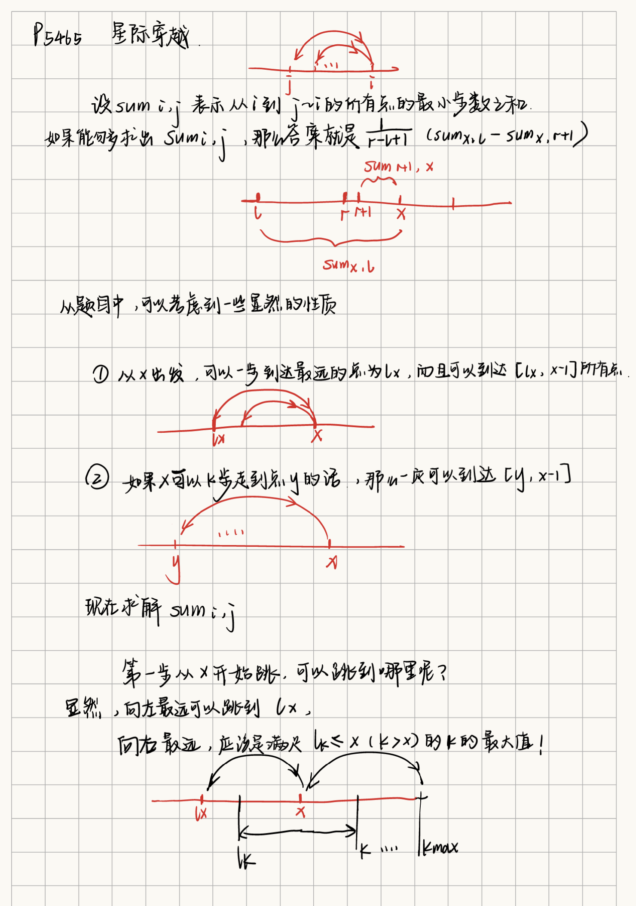
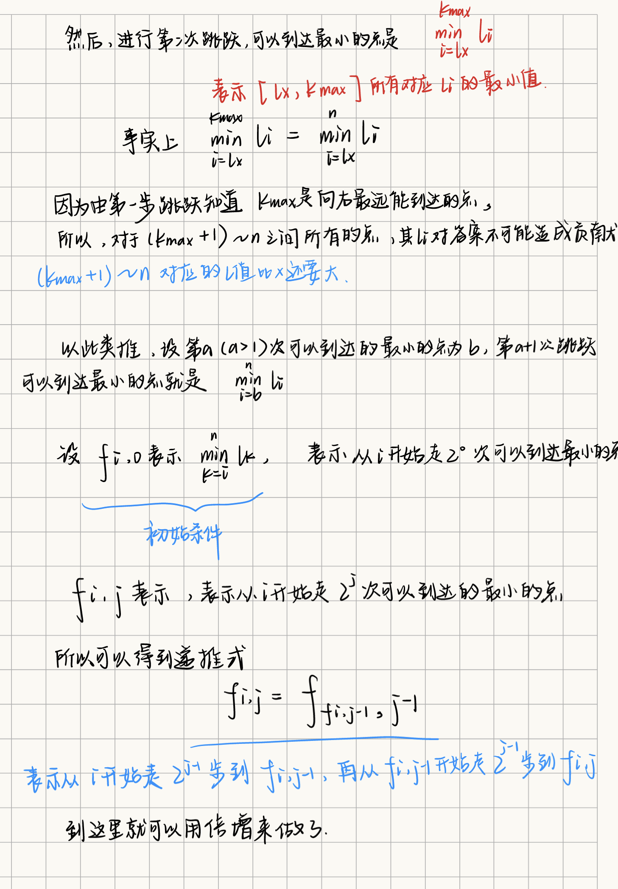
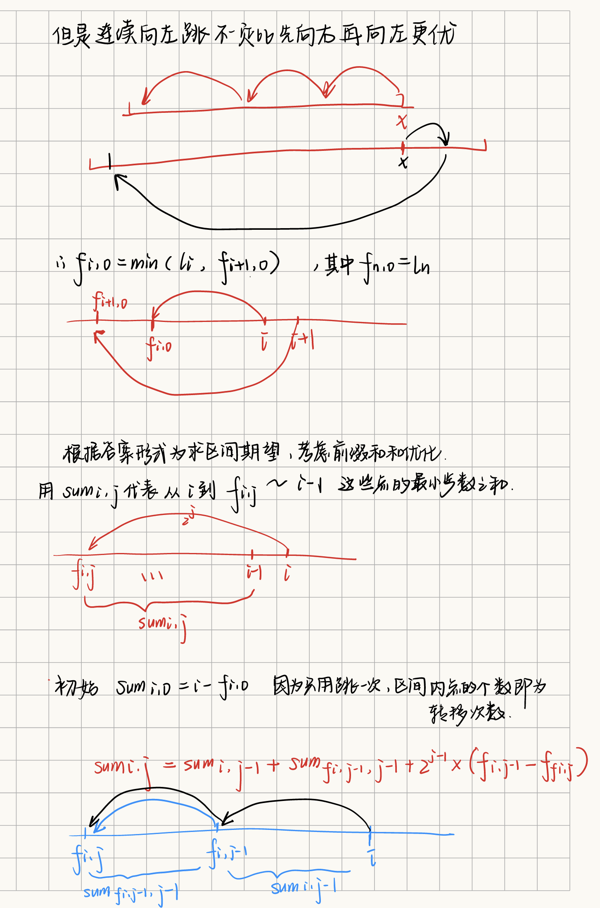
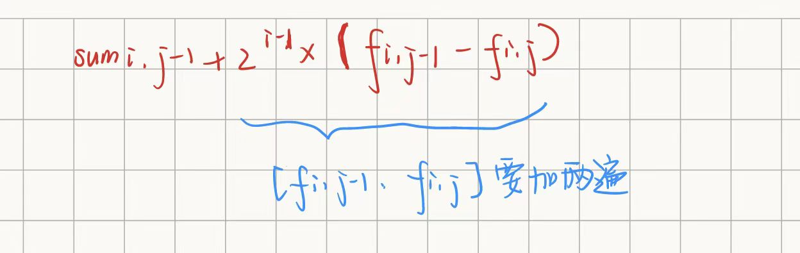

[P5465 [PKUSC2018] 星际穿越 - 洛谷 | 计算机科学教育新生态 (luogu.com.cn)](https://www.luogu.com.cn/problem/P5465)

# `[PKUSC2018] 星际穿越` 

## 题目描述

有 $n$ 个星球，它们的编号是 1 到 $n$，它们坐落在同一个星系内，这个星系可以抽象为一条数轴，每个星球都是数轴上的一个点，特别地，编号为 $i$ 的星球的坐标是 $i$。

一开始，由于科技上的原因，这 $n$ 个星球的居民之间无法进行交流，因此他们也不知道彼此的存在。现在，这些星球独立发展出了星际穿越与星际交流的工具。对于第 $i$ 个星球，他通过发射强力信号，成功地与编号在 $[l_i,i-1]$ 的所有星球取得了联系(编号为 1 的星球没有发出任何信号)，取得联系的两个星球会建立 **双向** 的传送门，对于建立了传送门的两个星球 $u,v$，$u$ 上的居民可以花费 1 单位时间传送到 $v$，$v$ 上的居民也可以花费 1 单位时间传送到 $u$ ，我们用 $dist(x,y)$ 表示从编号为 $x$ 的星球出发，通过一系列星球间的传送门，传送到编号为 $y$ 的星球最少需要花费的时间。

现在有 $q$ 个星际商人，第 $i$ 个商人初始所在的位置是 $x_i$, 他的目的地是 $[l_i,r_i]$ 中的其中一个星球，保证 $l_i<r_i<x_i$ 。他会在这些星球中等概率挑选一个星球 $y$ (每个星球都有一样的概率被选中作为目的地)，然后通过一系列星球的传送门，**花费最少的时间**到达星球 $y$ 。商人想知道他花费的期望时间是多少？也就是计算 $\frac{1}{r_i-l_i+1}{\sum_{y=l_i}^{r_i}{dist(x_i,y)}}$ 。

## 输入格式

第一行一个正整数 $n$ ，表示星球的个数。

第二行 $n-1$ 个正整数，第 $i$ 个正整数为  $l_{i+1}$ ，表示编号在 $[l_{i+1},i]$ 区间内所有星球已经与编号为 $i+1$ 的星球取得了联系，并且可以通过花费 1 单位进行彼此的传输。保证 $l_{i+1}\leq i$

第三行一个正整数 $q$ ，表示询问组数。

接下来 $q$ 行，每行三个数字 $l_i,r_i,x_i$ ，表示在 $[l_i,r_i]$ 这个区间中等概率选择一个星球 $y$，$dist(x_i,y)$ 的期望。保证 $l_i<r_i<x_i$

## 输出格式

对于每组询问，注意到答案必然是一个有理数，因此以 $p/q$ 的格式输出这个有理数，要求 $\gcd(p,q)=1$ 。

如果答案为整数 $m$ ，输出 $m/1$ 。

## 样例 #1

### 样例输入 #1

```
7
1 1 2 1 4 6
5
3 4 6
1 5 7
1 2 4
1 2 6
1 3 5
```

### 样例输出 #1

```
3/2
13/5
3/2
2/1
1/1
```

## 提示

样例对应的无向图如下：

对于 $20\%$ 的数据，满足 $n \leq 100$。

对于另 $25\%$ 的数据，满足 $n\leq 2000$

对于另 $25\%$ 的数据，满足 $n\leq 5000$

对于 $100\%$ 的数据，满足 $n,q\leq 3\times 10^5$

## 题解

#ST算法 #倍增法 #数学模型  #dp






AC代码
```cpp
#include<iostream>
#include<cstring>

using namespace std;
const int N = 3e5+7;

int l[N];
int f[N][22], sum[N][22];
int n, m;

int gcd(int a, int b)
{
    return b>0 ? gcd(b, a%b):a;
}

void Init()
{
    f[n][0] = l[n], sum[n][0] = n-l[n];
    
    for(int i=n-1; i>=2; i--)
    {
        f[i][0] = min(f[i+1][0], l[i]);
        sum[i][0] = i - f[i][0];
    }
    
    for(int i=1; i<22; i++)
    {
        for(int j=(1<<i); j<=n; j++)
        {
            f[j][i] = f[f[j][i-1)[i-1];
            sum[j][i]=sum[j][i-1]+sum[f[j][i-1)[i-1]+(1<<(i-1))*(f[j][i-1]-f[j][i]);
        }
    }
    return ;
}

int dist(int x,int y)//目标点，当前位置
{
    if(x>=l[y]) return y-x;//特判一步就能走到的
    int sp=1,ans=y-l[y];//先跳一步
    y=l[y];
    for(int i=20;i>=0;i--)
    {
        if(f[y][i]>=x)//还没跳到
        {
            ans+=sp*(y-f[y][i])+sum[y][i];//前缀和，有些数会被加 sp 遍，sum 存的仅为走一步之和
            sp+=(1<<i);//走的这些都得加上
            y=f[y][i];//跳过来
        }
    }
    //下一次跳跳过了就停止转移，那么可能是刚好这一步跳到了，也可能还差一点
    if(y>x)//差一点，补上（类似倍增求 LCA ）
    {
        ans+=(sp+1)*(y-x);
    }
    return ans;
}

int main()
{
    cin>>n;
    for(int i=2; i<=n; i++) scanf("%d", &l[i]);
    
    Init();
    
    cin>>m;
    while(m--)
    {
        int l, r, x;
        scanf("%d%d%d", &l, &r, &x);
        
        int d = dist(l, x) - dist(r+1, x);
        int g = gcd(d, r - l +1);
        printf("%d/%d\n", d/g, (r-l+1)/g);
    }
    
    return 0;
}
```

