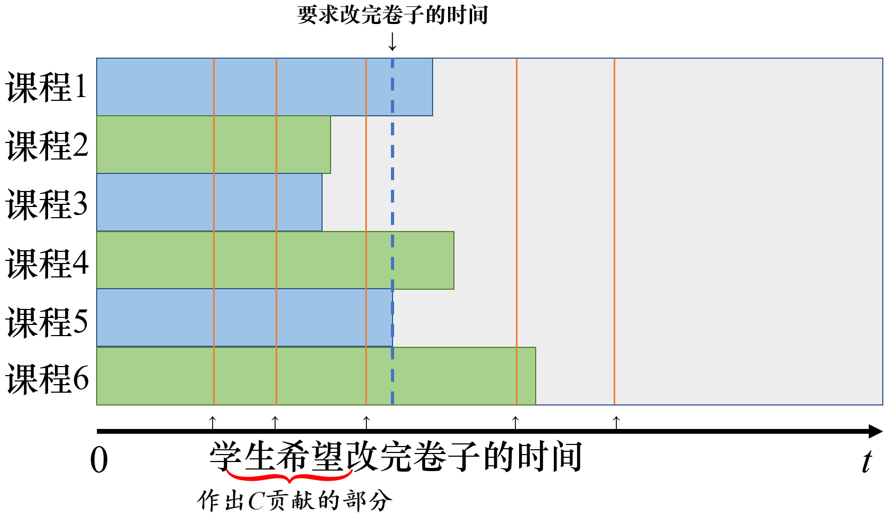

[P3745 [六省联考 2017] 期末考试 - 洛谷 | 计算机科学教育新生态 (luogu.com.cn)](https://www.luogu.com.cn/problem/P3745)

# [六省联考 2017] 期末考试

## 题目描述

有 $n$ 位同学，每位同学都参加了全部的 $m$ 门课程的期末考试，都在焦急的等待成绩的公布。

第 $i$ 位同学希望在第 $t_i$ 天或之前得知**所有**课程的成绩。如果在第 $t_i$ 天，有至少一门课程的成绩没有公布，他就会等待最后公布成绩的课程公布成绩，每等待一天就会产生 $C$ 不愉快度。

对于第 $i$ 门课程，按照原本的计划，会在第 $b_i$ 天公布成绩。

有如下两种操作可以调整公布成绩的时间:
1. 将负责课程 $X$ 的部分老师调整到课程 $Y$，调整之后公布课程 $X$ 成绩的时间推迟一天，公布课程 $Y$ 成绩的时间提前一天；每次操作产生 $A$ 不愉快度。
2. 增加一部分老师负责学科 $Z$，这将导致学科 $Z$ 的出成绩时间提前一天；每次操作产生 $B$ 不愉快度。

上面两种操作中的参数 $X, Y, Z$ 均可任意指定，每种操作均可以执行多次，每次执行时都可以重新指定参数。

现在希望你通过合理的操作，使得最后总的不愉快度之和最小，输出最小的不愉快度之和即可。

## 输入格式

第一行三个非负整数 $A, B, C$，描述三种不愉快度，详见【题目描述】；  
第二行两个正整数 $n, m$，分别表示学生的数量和课程的数量；  
第三行 $n$ 个正整数 $t_i$，表示每个学生希望的公布成绩的时间；  
第四行 $m$ 个正整数 $b_i$，表示按照原本的计划，每门课程公布成绩的时间。

## 输出格式

输出一行一个整数，表示最小的不愉快度之和。

## 样例 #1

### 样例输入 #1

```
100 100 2
4 5
5 1 2 3
1 1 2 3 3
```

### 样例输出 #1

```
6
```

## 样例 #2

### 样例输入 #2

```
3 5 4
5 6
1 1 4 7 8
2 3 3 1 8 2
```

### 样例输出 #2

```
33
```

## 提示

### 样例解释 1

由于调整操作产生的不愉快度太大，所以在本例中最好的方案是不进行调整；全部的 $5$ 门课程中，最慢的在第 $3$ 天出成绩；  
同学 $1$ 希望在第 $5$ 天或之前出成绩，所以不会产生不愉快度；  
同学 $2$ 希望在第 $1$ 天或之前出成绩，产生的不愉快度为 $(3 - 1) \times 2 = 4$；  
同学 $3$ 希望在第 $2$ 天或之前出成绩，产生的不愉快度为 $(3 - 2) \times 2 = 2$；  
同学 $4$ 希望在第 $3$ 天或之前出成绩，所以不会产生不愉快度；  
不愉快度之和为 $4 + 2 = 6$。

### 数据范围

| Case # | $n, m, t_i, b_i$ | $A, B, C$ |
|:-:|:-:|:-:|
| 1, 2 | $1 \leq n, m, t_i, b_i \leq 2000$ | $A = 10^9; B = 10^9; 0 \leq C \leq 10^2$ |
| 3, 4 | $1 \leq n, m, t_i, b_i \leq 2000$ | $0 \leq A; C \leq 10^2; B = 10^9$ |
| 5, 6, 7, 8 | $1 \leq n, m, t_i, b_i \leq 2000$ | $0 \leq B \leq A \leq 10^2; 0 \leq C \leq 10^2$ |
| 9 - 12 | $1 \leq n, m, t_i, b_i \leq 2000$ | $0 \leq A, B, C \leq 10^2$ |
| 13, 14 | $1 \leq n, m, t_i, b_i \leq 10^5$ | $0 \leq A, B \leq 10^5; C = 10^{16}$ |
| 15 - 20 | $1 \leq n, m, t_i, b_i \leq 10^5$ | $0 \leq A, B, C \leq 10^5$ |


## 题解

#三分 #整数三分  #贪心

算法时间复杂度 `O(nlgn)` 

思路：
**首先，证明三分法的可行性。** 此时要证不愉快度是单峰的。
假设我们现在有最优解 x=t，那么对于 x+a(a>0) 来说，一定有 ans (x + a) ​>ans x​ 。

.png)

理由是随着改卷结束时间的增加，出现在虚线以左的橙线会在个数和距离上都不断增加，尽管由A,B产生的不愉快度会减小，但只是杯水车薪，况且这个减小的幅度也会越来越小，最后趋近于0。可能会有人担心这个不愉快度减小得比C部分增加得快，如果存在某解比最优解更优，它一定与最优解相邻，既然相邻就会一定被三分过程更新到。
对于x−a同理，A,B产生贡献增加的幅度会越来越大，而 C 产生的贡献幅度会越来越小。因此三分的正确性可以保证。

**然后分情况计算**  
首先分析一下本题的模型。可以想象成一个木桶效应，即“**短板**”的来源。

如图，即使最快改完卷子的课程用时为0，它也需要等待最慢改完卷子的课程。因此在改卷的人力定下来之后，**全部课程**改卷结束的时间是**唯一**的。既然不愉快度是由人力决定的，人力的改变也决定了完成的时间。

因此我们尝试确定一个结束时间，这样再贪心地分配人力，就可以求出以这个时间结束的最小不愉快度。
.png)

虚线此时是**要求改完卷子的时间**，那么在虚线右边的时间就需要通过调度老师或者增加老师来弥补。
首先判断是否有 `A≤B` ，如果是，则采用调度老师的方法，也就是虚线左边的空隙都可以拿来填补虚线右边的时间条，剩下的（若 A>B，则剩下的就还是原来那么多）需要拿其他老师过哦来弥补，也就是B×天数来弥补。
如果 `A>B` 那么 直接采用增加老师的方法来加快改卷的速度。


再根据学生的需要，把虚线左边的橙色线条到虚线的距离和都统计出来，乘上C，就是我们把结束时间定在虚线位置的不愉快度。

注意要特判

$$
C_i​=10^{16}
$$

的情况，这种情况就算全部补充老师也比让学生不满意优，因此直接贪心决策怎样调度老师。

假设`t[i]` 数组已经完成排序，那么`t[1]` 数组时最小的期望时间，要是现在恰好有`C=1e16` ，那么如果存在`b[j]` 使得`b[j] > t[1]` ，那么此时就无论如何也无法让学生满意，直接按照贪心决策怎样调度老师；如果很巧的是`b[j]_max < t[1]` 那么现在再好不过了，也是按照贪心决策。
所以，这两种情况可以合并为一种情况，也就是
```cpp
if( C >= 1e16) 
{
	cout<<calc1[t[1)<<endl; 
	//由于让学生满意的代价很大，所以就让所有学生都满意
	//让最没耐性t[1]的满意，计算最少需要多少老师产生相应的不满意度
	return 0;
}
```

AC代码：
```cpp
#include<iostream>
#include<algorithm>

using namespace std;
typedef unsigned long long ll;//数据增强了
const int N = 1e5+10;

ll A,B,C,n,m;
ll t[N], b[N];

ll calc1(ll p)//模拟最后一门改完卷子的时间是t
{
    ll x = 0, y = 0;
    
    for(int i=1; i<=m; i++)
        if(b[i] > p) x += b[i]-p;
        else y += p-b[i];
    
    if(A <= B)//如果第一种方法更好
        return min(x, y) * A + (x - min(x, y)) * B;
    else return x*B;
}

ll calc2(ll p)
{
    ll ans = 0;
    for(int i=1; i<=n; i++)
    {
        if(t[i] <= p) ans += (p - t[i])*C;
    }
    return ans;
}

int main()
{
    cin>>A>>B>>C>>n>>m;
    
    for(int i=1; i<=n; i++) cin>>t[i];
    for(int i=1; i<=m; i++) cin>>b[i];
    
    sort(t+1, t+1+n);
    sort(b+1, b+1+m);
    
    ll l = 1,  r = N; // 枚举天数
    ll mid1, mid2;
    ll c1, c2;
    while( r - l > 2)
    {
        mid1 = l + (r-l)/3;
        mid2 = r - (r-l)/3;
        
        c1 = calc1(mid1) + calc2(mid1);
        c2 = calc1(mid2) + calc2(mid2);
        
        if(c1 <= c2) r = mid2;
        else l = mid1;
    }
    
    ll res=1e16, c;
    for(int i=l; i<=r; i++)
    {
        c = calc1(i) + calc2(i);
        res = min(res, c);
    }
    
    cout<<res;
    
    return 0;
}
```


