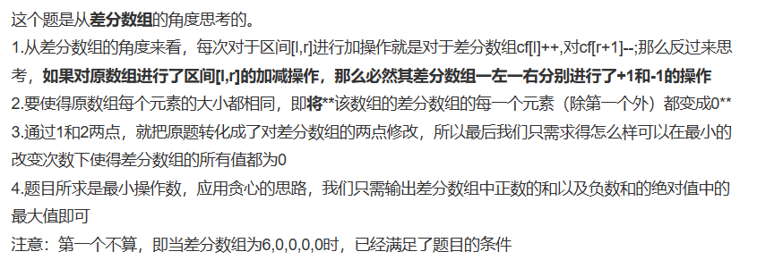

链接：[https://ac.nowcoder.com/acm/contest/66433/G](https://ac.nowcoder.com/acm/contest/66433/G)
## 题目描述

港口有n堆货物，他们的重量分别为w1,w2,...wn，每堆货物的重量不一定相同。吊车师傅每次操作可以使任意第i堆到第j堆的货物都增加一个重量或者减少一个重量。请问吊车师傅最少需要执行几次操作可以使n堆货物重量都相同。

## 输入描述:

第一行输入正整数n。  

第二行输入n个整数，第i个整数表示wi。

数据范围：  

0 < n < 100000；  
0 <= wi <= 1000000000;  

## 输出描述:

第一行输出最少操作次数。

## 题解

#差分 



```cpp
#include<iostream>

using namespace std;
const int N = 1e5+10;
long long a[N];
long long b[N];
int n;

int main()
{
    cin>>n;
    
    for(int i=1; i<=n; i++)
        scanf("%lld", a+i);
    
    for(int i=1; i<=n; i++)
        b[i] = a[i] - a[i-1];//构造差分数组
    
    long long x = 0, y = 0;
    for(int i=2; i<=n; i++)//从 第二个 开始
    {
        if(b[i] > 0) x += b[i]; //正数之和
        else if(b[i] < 0) y += b[i]; //负数之和
        else continue;
    }
    
    x = abs(x), y = abs(y);
    long long res = max(x, y);
    
    cout<<res;
        
    return 0;
}
```