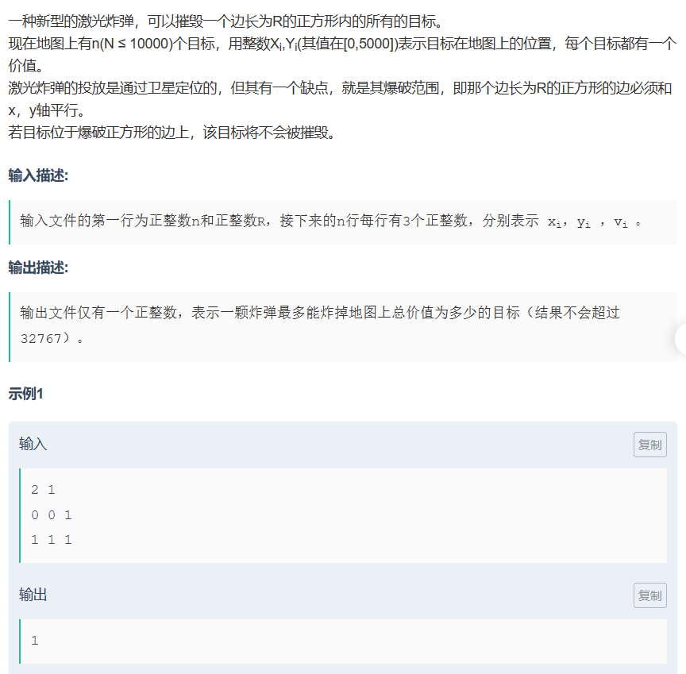

$$

1 \le n \le 10^4 ，0 \le x_i ,y_i \le 5\times 10^3 ，1 \le m \le 5\times 10^3 ，1 \le v_i < 100。
$$

AC题解

标签： #前缀和 #模拟


```C++
#include<iostream>

using namespace std;
const int N = 5e3+10;
int a[N][N];
int n, r;

int main()
{
    cin>>n>>r;
    
    int x, y, v;
    int xx = r, yy = r;
    while(n--)
    {
        scanf("%d%d%d", &x, &y, &v);
        x++, y++;
        //题目中给出的坐标是从0开始的，但是这题模拟的核心在于前缀和
        //用前缀和的思想时，坐标最好从1开始，以免出现负数下标。
        a[x][y] += v;
        xx = max(xx, x), yy = max(yy, y);
        //找到矩形的边界点（坐标的最大值）
    }
	
	//从（0，0）到（i， j) 这个矩形内所有权值的和，存入a[i][j]中
    for(int i=1; i<=xx; i++)
        for(int j=1; j<=yy; j++)
            a[i][j] += a[i][j-1] + a[i-1][j] - a[i-1][j-1];
    
    int tmp = 0, res = -1;
    //枚举每一种边长为 r 的正方形的情况
    for(int i=r; i<=xx; i++)
        for(int j=r; j<=yy; j++)
        {
            tmp = a[i][j] - a[i-r][j] -a[i][j-r] + a[i-r][j-r];
            //求正方形内可以摧毁的价值
            res = max(res, tmp);
        }
    
    cout<<res;
    
    return 0;
}
```

