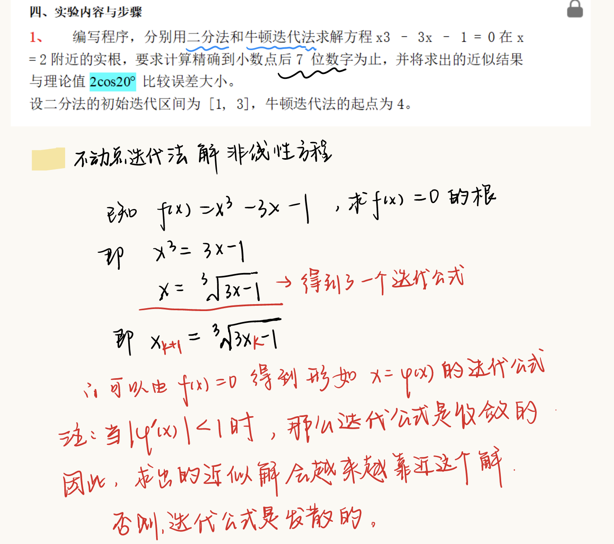
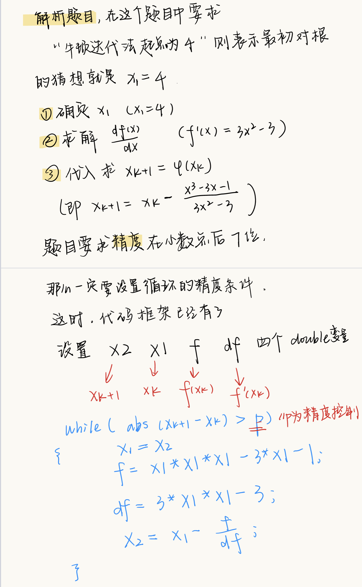
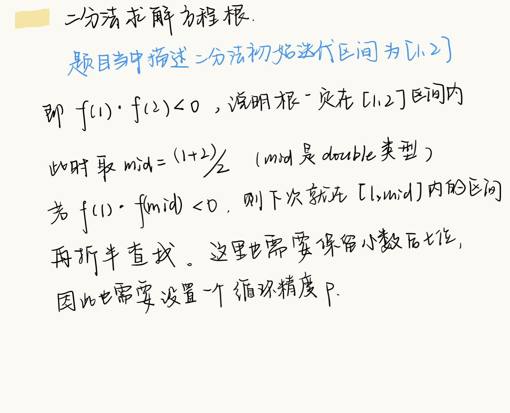
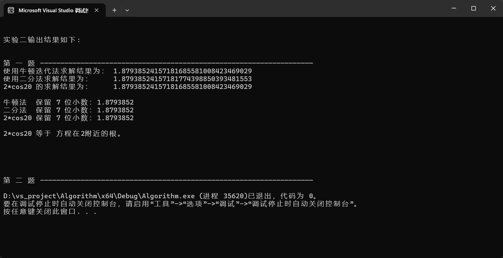

参考链接：[分别用二分法和牛顿迭代法求解方程x3 – 3x – 1 = 0在x = 2附近的实根_1.利用二分法求方程f(x)=x3-3x-1=0在区间[0,2]上的正实根,要求e<0.1-CSDN博客](https://blog.csdn.net/qq_43274298/article/details/102902342?ops_request_misc=%257B%2522request%255Fid%2522%253A%252240DC7821-EDEE-4AC7-AFAC-ABD604EF4747%2522%252C%2522scm%2522%253A%252220140713.130102334.pc%255Fall.%2522%257D&request_id=40DC7821-EDEE-4AC7-AFAC-ABD604EF4747&biz_id=0&utm_medium=distribute.pc_search_result.none-task-blog-2~all~first_rank_ecpm_v1~rank_v31_ecpm-5-102902342-null-null.142^v100^pc_search_result_base6&utm_term=%E4%BA%8C%E5%88%86%E6%B3%95%E4%BB%A5%E5%8F%8A%E7%89%9B%E9%A1%BF%E8%BF%AD%E4%BB%A3%E6%B3%95%E6%B1%82%E8%A7%A3%E6%96%B9%E7%A8%8B&spm=1018.2226.3001.4187)






```cpp
#include<iostream>
#include<cmath>

using namespace std;

double abs(double a, double b)
{
	double t = a - b;
	if (t < 0) return -t;
	else return t;
}

//牛顿法求解
double NewTown(double x)
{
	double x1, x2, f, df;
	x2 = x;
	x1 = 2;

	double p1 = 1e-32;

	while (abs(x1 - x2) > p1)
	{
		x1 = x2;
		f = x1 * x1 * x1 - 3 * x1 - 1;
		df = 3 * x1 * x1 - 3;
		x2 = x1 - (double)f / df;
	}

	return x2;
}

//二分法求解
double f05(double x)
{
	return x * x * x - 3 * x - 1;
}

double Binary_search(double l, double r)
{
	double p = 1e-32;
	while (abs(l - r) > p)
	{
		double mid = (double)((l + r) / 2.0);
		if (f05(l) * f05(mid) < 0)
		{
			r = mid;
		}
		else
		{
			l = mid;
		}
	}
	return (double)((l + r) / 2.0);
}

int main()
{
	double x = 4.0;
	double res0101 = NewTown(x);
	printf("使用牛顿迭代法求解结果为： %.32lf\n", res0101);

	double l = 1.0, r = 2.0;
	double res0102 = Binary_search(l ,r);
	printf("使用二分法求解结果为：     %.32lf\n", res0102);

	double degree = 20;
	double pi = std::acos(-1);
	double radian = degree * pi / 180.0;//角度转化成弧度
	double cos_value = cos(radian);
	double cos20 = 2 * cos_value;
	printf("2*cos20 的求解结果为：     %.32lf\n\n", cos20);

	printf("牛顿法  保留 7 位小数：%.7lf\n", res0101);
	printf("二分法  保留 7 位小数：%.7lf\n", res0101);
	printf("2*cos20 保留 7 位小数：%.7lf\n\n", res0101);

	if (cos20 > res0101) cout << "2*cos20 大于 方程在2附近的根。" << endl;
	else if(cos20 == res0101)  cout << "2*cos20 等于 方程在2附近的根。" << endl;
	else cout << "2*cos20 小于 方程在2附近的根。" << endl;

	return 0;
}
```

运行结果如下：

