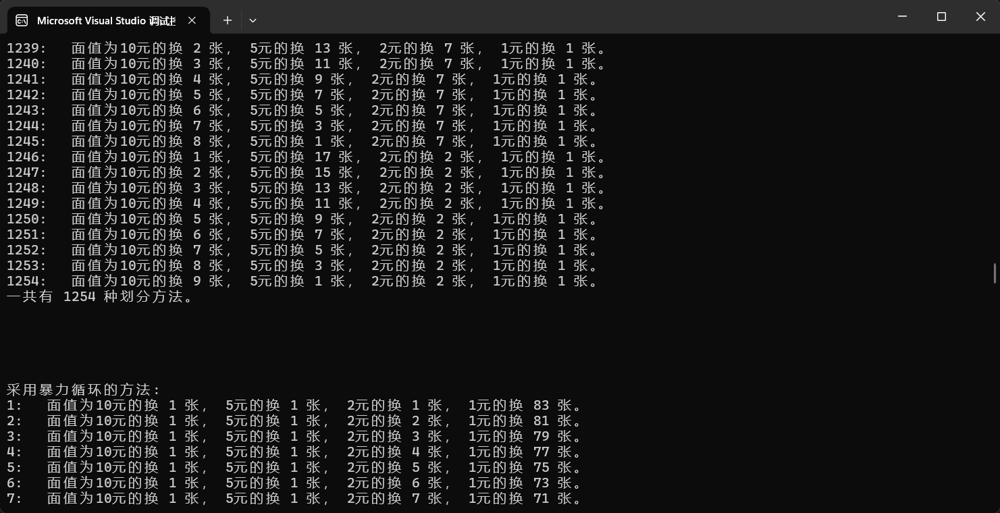

## 实验一

### 实验代码

```cpp


#include<iostream>
#include<cstring>
#include<unordered_map>
#include<algorithm>
#include<vector>

using namespace std;
typedef long long LL;


//第一题***********************************************************************

//方法1. 蛮力法求解
//5 * 7 * 8 * 9 = 2520
//只需要在[0, 2520)区间内找到余数满足 f, d, c, b 的数即可
int a = 9, b = 8, c = 7, d = 6, e = 5, f = 4, g = 3, h = 2, i = 1;//测试样例

int baoli()
{
	for (int i = 0; i < 2520; i++)
	{
		if (i % 5 == f && i % 7 == d && i % 8 == c && i % 9 == b) return i;
	}

	return -1;
}

//方法2. 中国剩余定理
//扩展欧几里得函数求解 ax + by == gcd(a, b), 当 a 和 b 互质的时候，x 是 a （mod b）的逆元
const int N01 = 4;

//a[i]是模数，b[i]是余数
int a01[N01] = { 5, 7, 8 ,9 };
int b01[N01] = { f, d, c, b };
int m01[N01];
int mul01 = 1;

//写法一、写法二均已通过测试

//1. 写法一
LL ex_gcd(LL a, LL b, LL& x, LL& y)
{
	//递归出口
	if (b == 0)
	{
		x = 1;
		y = 0;
		return a;//逐层返回最大公因数（辗转相除法）
	}

	LL ans = ex_gcd(b, a % b, x, y);
	//此时的x, y是来自下一层的解
	LL tmp = x;
	x = y;//x1 = y2;
	y = tmp - a / b * y;//y1 = x2 + a/b *y2;

	return ans;//返回的是gcd(a, b)
}


//第二题***********************************************************************
//采用模拟的思想

void draw(int m, int n)//m 行 n 列
{
	int map[15][15] = { 0 };
	map[0][0] = 1;
	int num = 0;

	int i = 0, j = 0, k = 0;

	while (num <= m * n)
	{
		switch (k)
		{
		case 0:
			if (i == 0 && j < n - 1)//在上边缘
				map[i][j++] = ++num;//向右
			else//在右边缘
				map[i++][j] = ++num;//向下
			k = (k + 1) % 4;

		case 1://向左下方移动
			while (i < m - 1 && j > 0)
				map[i++][j--] = ++num;
			//map[i][j] = ++num;
			k = (k + 1) % 4;

		case 2:
			if (j == 0 && i < m - 1)//在左边缘
				map[i++][j] = ++num;//向下
			else//在下边缘
				map[i][j++] = ++num;//向右
			k = (k + 1) % 4;

		case 3:
			while (j < n - 1 && i > 0)
				map[i--][j++] = ++num;
			//map[i][j] = ++num;
			k = (k + 1) % 4;
		}
	}

	for (int i = 0; i < m; i++)
	{
		for (int j = 0; j < n; j++)
		{
			printf("%-5d", map[i][j]);
		}
		cout << endl;
	}

}


//第三题***********************************************************************
//1-9个数字排列组合，最后给出满足要求的解
//最粗暴的方法是9层for循环，优化后可以用dfs解决

int path01[9];//记录 dfs 深搜树的叶子节点，即每一种可能情况的路径
bool vis01[10];//若 vis[i] = true, 则说明当前状态下数字 i 已经被深搜过了,存在了path[]当中
int n3 = 9;//递归的最大深度
int cnt3 = 0;//计算满足表达式的所有情况的 总数

void dfs03(int height)
{
	if (height == n3)//递归出口，找到叶子节点
	{
		int a, b, res;//a * b ?= res
		a = path01[0] * 10 + path01[1];
		b = path01[2] * 100 + path01[3] * 10 + path01[4];
		res = path01[5] * 1000 + path01[6] * 100 + path01[7] * 10 + path01[8];

		if (a * b == res)
		{
			cnt3 += 1;
			cout << cnt3 << " :   " << a << " * " << b << " == " << res << endl;
			return;
		}
		else//不满足表达式，直接返回
		{
			return;
		}
	}

	for (int i = 1; i < 10; i++)
	{
		if (vis01[i] == false)
		{
			path01[height] = i;
			vis01[i] = true;
			dfs03(height + 1);
			vis01[i] = false;
		}
	}

}

//第四题***********************************************************************
//假设连续自然数不含 0
const int N4 = 50;
int psum[N4];//psum[i]: 从 1~i 的连续自然数的前缀和 [1, i] (包括 i )
unordered_map<int, int> hmap04; // <key, val> : 0~val连续自然数的和 psum[val] == key
int cnt4 = 0;


void solve04(int n)
{
	psum[0] = 0;
	for (int i = 1; i < n; i++)//长度至少大于2，所以 i != n
	{
		psum[i] = psum[i - 1] + i;//前缀和
		hmap04.insert({ psum[i], i });
	}

	for (int i = 0; i < n; i++)
	{
		auto it = hmap04.find(psum[i] + n);//寻找右端点 j
		if (it != hmap04.end())//能找到
		{
			int j = it->second;
			cnt4++;
			cout << i + 1;//输出左端点
			for (int k = i + 2; k <= j; k++)//输出表达式
			{
				cout << " + " << k;
			}
			cout << endl;
		}
		else continue;
	}

	cout << "一共有 " << cnt4 << " 种方法使得连续自然数和为" << " " << n << endl;
}


//第五题***********************************************************************
vector<vector<int>> res05;
vector<int> path05;
vector<int> len05;
int n5;
int cnt05 = 0;

void print(int i)
{
	cout << path05[1];
	for (int j = 2; j < path05.size(); j++)
	{
		cout << "+" << path05[j];
	}
	cout << endl;
}

bool cmp051(int a, int b)
{
	return a > b;
}

bool cmp052(vector<int> a, vector<int> b)
{
	if (a.size() > b.size()) return false;
	else
	{
		for (int i = 0; i < a.size(); i++)
		{
			if (a[i] == b[i]) continue;
			else if (a[i] < b[i]) return false;
			else return true;
		}
	}
}

void copy(vector<int> p, int k)
{
	vector<int> tmp05(k);
	copy(p.begin() + 1, p.end(), tmp05.begin());
	sort(tmp05.begin(), tmp05.end(), cmp051);

	res05.push_back(tmp05);
}


void dfs(int s, int index)
{
	for (int i = path05[index - 1]; i <= s; i++)
	{
		if (i < n5)
		{
			path05.push_back(i);

			s -= i;
			if (s == 0)
			{
				//print(index);
				copy(path05, index);
				cnt05++;
			}
			else
			{
				dfs(s, index + 1);
			}
			s += i;
			path05.pop_back();
		}
	}
}


int main()
{
	cout << "-------------------------------————--*** 实验一 ***——————————————————————————————————————————————————————";
	cout << "\n\n\n";

	
	//第一题
	cout << "\n";
	cout << "第 一 题 " << "-——————————————————————————————————————————————————————————————————" << endl;
	cout << "\n\n\n";

	cout << "当 a = " << a << ", b = " << b << ", c = " << c << ", d = " << d << ", e = " << e << ", f = " << f << ", g = " << g << ", h = " << h << ", i = " << i << endl;

	cout << "解法一：暴力法求解" << endl;
	int res0101 = baoli();
	if (res0101 != -1) cout << "满足条件的最小解为：" << res0101 << endl;
	else cout << "有冲突，无解！" << endl;


	cout << "解法二：中国剩余定理" << endl;
	for (int i = 0; i < 4; i++)
		mul01 *= a01[i];

	LL res0102 = 0;
	for (int i = 0; i < 4; i++)//f d c b 只有四个解
	{
		m01[i] = mul01 / a01[i];

		LL ti, y;
		ex_gcd(m01[i], a01[i], ti, y);
		//cout<< ex_gcd(m[i], a[i], ti, y)<<"_______"<<endl;;

		res0102 = (res0102 + b01[i] * m01[i] * ti) % mul01;
		//b[i] * m[i] * ti会溢出long long

	}

	cout << "满足条件的最小解为：" << (res0102 % mul01 + mul01) % mul01 << endl;


	//第二题
	cout << "\n\n\n\n\n";
	cout << "第 二 题 " << "-——————————————————————————————————————————————————————————————————" << endl;
	int a02[3][2] = { {8, 8},{3, 5},{7, 9} };

	for (int i = 0; i < 3; i++)
	{
		cout << a02[i][0] << " 行 " << a02[i][1] << " 列 的Z字行矩阵如下：\n\n";

		draw(a02[i][0], a02[i][1]);

		cout << "\n\n";
	}


	//第三题
	cout << "\n\n\n\n\n";
	cout << "第 三 题 " << "-——————————————————————————————————————————————————————————————————" << endl;
	memset(vis01, false, sizeof vis01);

	int height = 0;
	dfs03(height);//height是递归层数
	cout << "在数字 1——9 当中，每个数字恰好只用一次，并且————" << endl;
	cout << "满足表达式 “[][] * [][][] == [][][][]” 的情况一共有" << cnt3 << "种" << endl;


	//第四题
	cout << "\n\n\n\n\n";
	cout << "第 四 题 " << "-——————————————————————————————————————————————————————————————————" << endl;
	int n4 = 27; //指定和
	solve04(n4);


	//第五题
	cout << "\n\n\n\n\n";
	cout << "第 五 题 " << "-——————————————————————————————————————————————————————————————————" << endl;

	n5 = 6;
	path05.push_back(1);
	dfs(n5, 1);

	vector<int> tt05;
	tt05.push_back(n5);
	res05.push_back(tt05);

	sort(res05.begin(), res05.end(), cmp052);

	for (int i = 0; i < res05.size(); i++)
	{
		for (int j = 0; j < res05[i].size(); j++)
		{
			cout << res05[i][j] << " ";
		}
		cout << endl;
	}

	cout << "一共有 " << (cnt05 + 1) << " 种划分方法。" << endl;

	return 0;
}

```

### 运行结果：


### 实验思路：

#### 01

[[中国剩余定理)
[[中国剩余定理-实验)

**时间复杂度** 
蛮力法：` O(1)` //运行次数不随输入数据 f, d, c, b 变化
中国剩余定理：`O(n*log(min(mi, ai)))` //mi是所有模数相乘后 / ai

#### 02


模拟，注意边界情况

**时间复杂度** 
`O(m*n)` 

#### 03


全排列，使用`dfs`穷举。
`O(n!)` 

#### 04


假设在理想情况下，hash 的时间复杂度是`O(1)` 
那么， **时间复杂度为**
`O(n)` 前缀和一重 for, 寻找右端点一重 for


#### 05


[[自然数拆分)

O(n!)

## 实验二

### 实验代码

```cpp

#include<iostream>
#include<cmath>
#include<vector>
#include<algorithm>
#include<cstring>

using namespace std;


// 第 一 题 *************************************************************************************************
double abs(double a, double b)
{
	double t = a - b;
	if (t < 0) return -t;
	else return t;
}

//牛顿法求解
double NewTown(double x)
{
	double x1, x2, f, df;
	x2 = x;
	x1 = 2;

	double p1 = 1e-32;

	while (abs(x1 - x2) > p1)
	{
		x1 = x2;
		f = x1 * x1 * x1 - 3 * x1 - 1;
		df = 3 * x1 * x1 - 3;
		x2 = x1 - (double)f / df;
	}

	return x2;
}

//二分法求解
double f05(double x)
{
	return x * x * x - 3 * x - 1;
}

double Binary_search(double l, double r)
{
	double p = 1e-32;
	while (abs(l - r) > p)
	{
		double mid = (double)((l + r) / 2.0);
		if (f05(l) * f05(mid) < 0)
		{
			r = mid;
		}
		else
		{
			l = mid;
		}
	}
	return (double)((l + r) / 2.0);
}


// 第 二 题 *************************************************************************************************
vector<vector<int>> res05;
vector<int> path05;
vector<int> len05;
int n5;
int cnt05 = 0;

void copy(vector<int> p, int k)
{
	vector<int> tmp05(k);
	copy(p.begin() + 1, p.end(), tmp05.begin());
	//sort(tmp05.begin(), tmp05.end(), cmp051);//不需要排序

	res05.push_back(tmp05);
}


void dfs(int s, int index)
{
	for (int i = path05[index - 1]; i <= s; i++)
	{
		if (i < n5 && (i == 1 || i == 2 || i == 5 || i == 10))
		{
			path05.push_back(i);

			s -= i;
			if (s == 0)
			{
				//print(index);
				copy(path05, index);
				cnt05++;
			}
			else
			{
				dfs(s, index + 1);
			}
			s += i;
			path05.pop_back();
		}
		else continue;
	}
}

//直接4层暴力
int changeMoney(int n)// n == 100
{
	int cnt = 0;
	for (int i = 1; i <= 9; i++)//10
		for (int j = 1; j <= 17; j++)//5
			for (int k = 1; k <= 42; k++)//2
				for (int m = 1; m <= 83; m++)//1
				{
					int tmp = i * 10 + j * 5 + k * 2 + m;
					if (tmp == 100)
					{
						cnt++;
						cout << cnt << ":   " << "面值为10元的换 " << i << " 张， 5元的换 " << j << " 张， 2元的换 " << k << " 张， 1元的换 " << m << " 张。 " << endl;;
					}
					else if (tmp < 100) continue;
					else break;
				}
	return cnt;
}


// 第 三 题 *************************************************************************************************
const int N3 = 20;

int g03[N3][N3];//这一次直接定义数组没有报错欸
int dist03[N3];//dist03[i]: 源点 s 到节点 i 的距离
bool st03[N3];//若st03[i] == true, 说明节点 i 已经被加入到集合 s 当中
int path03[N3];//节点 i 的上一个节点是 path03[i]

//朴素版Dijkstra, 由于没有负权边，所以Dijkatra或者Bellman都可以
//Dijkstra: O(n^2)
//Bellman: O(n*m) // n 节点数， m 边数；
void Dijkstra(int s, int n3)//源点 s
{
	memset(dist03, 0x3f3f3f3f, sizeof dist03);

	dist03[s] = 0;
	//st03[s] = true;
	path03[s] = s;

	//初始化
	for (int i = 0; i <= n3; i++)
	{
		if (g03[s][i] < 0x3f3f3f3f)
		{
			dist03[i] = g03[s][i];
			path03[i] = s;
		}
	}

	for (int i = 1; i <= n3; i++)
	{
		int u = -1, minval = 0x3f3f3f3f;
		for (int j = 0; j <= n3; j++)
		{
			if (st03[j] == false && (u == -1 || minval > dist03[j]))
			{
				u = j;
				minval = dist03[j];
			}
		}

		st03[u] = true;

		for (int j = 0; j <= n3; j++)
		{
			if (st03[j] == false && dist03[j] > dist03[u] + g03[u][j])
			{
				dist03[j] = dist03[u] + g03[u][j];
				path03[j] = u;
			}
		}
	}

}

int dp[N3];

int dpf(int n, int s[])
{
	memset(dp, 0x3f3f3f3f, sizeof dp);
	dp[0] = 0;

	for (int i = 1; i <= n; i++)///然后来更新大dp[i]的值
	{
		for (int j = 0; j < i; j++)
		{
			if (j + s[j] >= i)///如果从j位置能到达i位置，就看看能否更新dp[i]的数组
				dp[i] = min(dp[i], dp[j] + 1);
		}
	}

	return (dp[n] == 0x3f3f3f3f ? -1 : dp[n]);
}


int main()
{
	cout << "-------------------------------————--*** 实验二 ***——————————————————————————————————————————————————————";
	cout << "\n\n\n";


	//第 一 题 *************************************************************************************************
	cout << "\n\n实验二输出结果如下: \n\n\n";
	cout << "第 一 题 " << "-——————————————————————————————————————————————————————————————————" << endl;
	double x01 = 4.0;
	double res0101 = NewTown(x01);
	printf("使用牛顿迭代法求解结果为： %.32lf\n", res0101);

	double l01 = 1.0, r01 = 2.0;
	double res0102 = Binary_search(l01, r01);
	printf("使用二分法求解结果为：     %.32lf\n", res0102);

	double degree = 20;
	double pi = std::acos(-1);
	double radian = degree * pi / 180.0;//角度转化成弧度
	double cos_value = cos(radian);
	double cos20 = 2 * cos_value;
	printf("2*cos20 的求解结果为：     %.32lf\n\n", cos20);

	printf("牛顿法  保留 7 位小数：%.7lf\n", res0101);
	printf("二分法  保留 7 位小数：%.7lf\n", res0101);
	printf("2*cos20 保留 7 位小数：%.7lf\n\n", res0101);

	if (cos20 > res0101) cout << "2*cos20 大于 方程在2附近的根。" << endl;
	else if (cos20 == res0101)  cout << "2*cos20 等于 方程在2附近的根。" << endl;
	else cout << "2*cos20 小于 方程在2附近的根。" << endl;

	//第 二 题 *************************************************************************************************
	cout << "\n\n\n\n\n";
	cout << "第 二 题 " << "-——————————————————————————————————————————————————————————————————" << endl;
	cout << "采用递归回溯的方法: " << endl;
	n5 = 100;
	path05.push_back(1);//至少有一张面值为 1 的钞票

	dfs(n5 - 18, 1);//每张面值都至少一张，需要先减去

	//sort(res05.begin(), res05.end(), cmp052);

	for (int i = 0; i < res05.size(); i++)
	{
		int x10 = 1, x5 = 1, x2 = 1, x1 = 1;
		for (int j = 0; j < res05[i].size(); j++)
		{
			switch (res05[i][j])
			{
			case 10: x10++; break;
			case 5: x5++; break;
			case 2: x2++; break;
			case 1: x1++; break;

			default:
				break;
			}
		}
		cout << i + 1 << ":   " << "面值为10元的换 " << x10 << " 张， 5元的换 " << x5 << " 张， 2元的换 " << x2 << " 张， 1元的换 " << x1 << " 张。 ";
		cout << endl;
	}

	cout << "一共有 " << cnt05 << " 种划分方法。" << endl;
	cout << "\n\n\n\n\n";


	cout << "采用暴力循环的方法: " << endl;
	int res021 = changeMoney(100);
	cout << "一共有 " << res021 << " 种" << endl;

	//第 三 题 *************************************************************************************************
	cout << "\n\n\n\n\n";
	cout << "第 三 题 " << "-——————————————————————————————————————————————————————————————————" << endl;


	//int n3 = 5;//n3既是节点数， 也是终点下标
	//int w[N3] = { 2, 0, 1, 1, 1 };

	int n3 = 18;//n3既是节点数， 也是终点下标
	int w[N3] = { 3, 4, 0, 2, 2,   0, 2, 3, 5, 2,   3, 2, 1, 3, 3,   2, 5, 1 };


	//1. 图论方法解决
	memset(path03, -1, sizeof(path03));

	//建立有向图
	memset(g03, 0x3f3f3f3f, sizeof(g03));
	for (int i = 0; i < n3; i++)
	{
		if (w[i] == 0) continue;
		else
		{
			g03[i][i] = 0;
			for (int j = 1; j <= w[i]; j++)
			{
				g03[i][i + j] = 1;//边权均为1
			}
		}
	}

	Dijkstra(0, n3);

	cout << "方法一： 图论方法————————————————************* 01" << endl;

	if (path03[n3] == -1)//无法到达
	{
		cout << "最少的跳跃步数为： -1 次， 无法到达对岸。"<< endl;
	}
	else
	{
		cout << "最少的跳跃步数为： " << dist03[n3] << endl;
		cout << "最短跳跃次数所经过的 木桩的序号 依次为：" << endl;

		int t03 = n3;
		while (t03 != 0)
		{
			cout << path03[t03] << "  ";
			t03 = path03[t03];
		}

		//cout << "0  ";

		cout << endl;
	}

	cout << "方法二： 动态规划方法————————————————************* 02" << endl;

	int res032 = dpf(n3, w);
	cout << "最少的跳跃步数为： " << res032 << endl;


	return 0;
}

```

### 实验结果





### 实验思路

#### 01


[[二分法、牛顿迭代法求解方程)

二分法： O(logn)

#### 02

[[零钱找零)

O(n!)

#### 03

[[袋鼠过河)

图论 ：O(vertex^2)
动态规划：O(n^2)

## 实验三

### 实验代码

```cpp
/*
int map02[10][10] = {
	{0, 0, 5,  3, 0, 0,  0, 0, 0},
	{8, 0, 0,  0, 0, 0,  0, 2, 0},
	{0, 7, 0,  0, 1, 0,  5, 0, 0},

	{4, 0, 0,  0, 0, 5,  3, 0, 0},
	{0, 1, 0,  0, 7, 0,  0, 0, 6},
	{0, 0, 3,  2, 0, 0,  0, 8, 0},

	{0, 6, 0,  5, 0, 0,  0, 0, 9},
	{0, 0, 4,  0, 0, 0,  0, 3, 0},
	{0, 0, 0,  0, 0, 9,  7, 0, 0}
}//初始化
*/

/*
测试样例：

0 0 5  3 0 0  0 0 0
8 0 0  0 0 0  0 2 0
0 7 0  0 1 0  5 0 0

4 0 0  0 0 5  3 0 0
0 1 0  0 7 0  0 0 6
0 0 3  2 0 0  0 8 0

0 6 0  5 0 0  0 0 9
0 0 4  0 0 0  0 3 0
0 0 0  0 0 9  7 0 0


*/


#include<iostream>
#include<vector>
#include<cmath>
#include<algorithm>
#include<stdio.h>
#include<stack>
#include<queue>
#include<cstring>
#include<unordered_map>
#include<malloc.h>

using namespace std;

//第 一 题 *************************************************************************************************
int v03, va03, vb03;

struct stpull
{
	int v;
	int a;
	int b;

	stpull* prio;//赋予了链表的特征，但是是从后往前指向的，只有这样，才能规定路径的唯一性

	bool operator == (const stpull& other) const
	{
		if (this->v == other.v && this->a == other.a && this->b == other.b)
			return true;
		else
			return false;
	}

};

//使自定义类型可以被 hash
// 特化 std::hash 模板结构体 stpull

namespace std
{
	template<>
	struct hash<stpull>
	{
		size_t operator()(const stpull& s) const noexcept
		{
			return hash<int>()(s.v) ^ hash<int>()(s.a) ^ hash<int>()(s.b);
		}
	};
}

unordered_map<stpull, int> map03;//<状态， 步数>

stpull* st = NULL;//链表暂时没有实体,跟踪节点，最后指向尾节点

int bfs()
{
	queue<stpull*> qu;//链表节点创建好，并加入它的指针；
	//初始状态进队，初始状态进入map
	stpull* root = (struct stpull*)malloc(sizeof(stpull));
	root->v = v03; root->a = 0, root->b = 0; root->prio = NULL;
	qu.push(root);
	map03.insert({ {v03, 0, 0, NULL}, 0 });

	stpull nowtmp;
	while (qu.empty() == false)
	{
		auto now = qu.front();
		qu.pop();
		nowtmp = { now->v, now->a, now->b, now->prio };//创建一个临时 的实体， 便于查询map
		int tmpstep = map03.find(nowtmp)->second;

		if (now->v == v03 / 2 && now->b == v03 / 2)
		{
			st = now;
			return tmpstep;
		}

		//v->a
		if (now->v > 0 && now->a < va03)
		{
			int d = min(now->v, va03 - now->a);
			stpull* s = (struct stpull*)malloc(sizeof(stpull));//创建子节点， 记录状态
			s->v = now->v - d;
			s->a = now->a + d;
			s->b = now->b;
			s->prio = now;//指向前一个节点，建立关系

			stpull tt = { s->v, s->a, s->b, s->prio };//创建临时实体，便于查询
			auto it = map03.find(tt);
			if (it == map03.end())//新的状态
			{
				map03.insert({ tt, tmpstep + 1 });
				qu.push(s);//新节点入队
			}

		}

		//v->b
		if (now->v > 0 && now->b < vb03)
		{
			int d = min(now->v, vb03 - now->b);
			stpull* s = (struct stpull*)malloc(sizeof(stpull));//创建子节点， 记录状态
			s->v = now->v - d;
			s->a = now->a;
			s->b = now->b + d;
			s->prio = now;//指向前一个节点，建立关系

			stpull tt = { s->v, s->a, s->b, s->prio };//创建临时实体，便于查询
			auto it = map03.find(tt);
			if (it == map03.end())//新的状态
			{
				map03.insert({ tt, tmpstep + 1 });
				qu.push(s);
			}

		}

		//a->v
		if (now->a > 0 && now->v < v03)
		{
			int d = min(now->a, v03 - now->v);
			stpull* s = (struct stpull*)malloc(sizeof(stpull));//创建子节点， 记录状态
			s->v = now->v + d;
			s->a = now->a - d;
			s->b = now->b;
			s->prio = now;//指向前一个节点，建立关系

			stpull tt = { s->v, s->a, s->b, s->prio };//创建临时实体，便于查询
			auto it = map03.find(tt);
			if (it == map03.end())//新的状态
			{
				map03.insert({ tt, tmpstep + 1 });
				qu.push(s);
			}

		}

		//a->b
		if (now->a > 0 && now->b < vb03)
		{
			int d = min(now->a, vb03 - now->b);
			stpull* s = (struct stpull*)malloc(sizeof(stpull));//创建子节点， 记录状态
			s->v = now->v;
			s->a = now->a - d;
			s->b = now->b + d;
			s->prio = now;//指向前一个节点，建立关系

			stpull tt = { s->v, s->a, s->b, s->prio };//创建临时实体，便于查询
			auto it = map03.find(tt);
			if (it == map03.end())//新的状态
			{
				map03.insert({ tt, tmpstep + 1 });
				qu.push(s);
			}

		}

		//b->v
		if (now->b > 0 && now->v < v03)
		{
			int d = min(now->b, v03 - now->v);
			stpull* s = (struct stpull*)malloc(sizeof(stpull));//创建子节点， 记录状态
			s->v = now->v + d;
			s->a = now->a;
			s->b = now->b - d;
			s->prio = now;//指向前一个节点，建立关系

			stpull tt = { s->v, s->a, s->b, s->prio };//创建临时实体，便于查询
			auto it = map03.find(tt);
			if (it == map03.end())//新的状态
			{
				map03.insert({ tt, tmpstep + 1 });
				qu.push(s);
			}

		}

		//b->a
		if (now->b > 0 && now->a < va03)
		{
			int d = min(now->b, va03 - now->a);
			stpull* s = (struct stpull*)malloc(sizeof(stpull));//创建子节点， 记录状态
			s->v = now->v;
			s->a = now->a + d;
			s->b = now->b - d;
			s->prio = now;//指向前一个节点，建立关系

			stpull tt = { s->v, s->a, s->b, s->prio };//创建临时实体，便于查询
			auto it = map03.find(tt);
			if (it == map03.end())//新的状态
			{
				map03.insert({ tt, tmpstep + 1 });
				qu.push(s);
			}

		}

	}

	if (qu.empty() == true && nowtmp.v != v03 / 2 && nowtmp.b != v03 / 2) return -1;

}


//第 二 题 *************************************************************************************************

int map02[9][9] = {
	{0, 0, 5,  3, 0, 0,  0, 0, 0},
	{8, 0, 0,  0, 0, 0,  0, 2, 0},
	{0, 7, 0,  0, 1, 0,  5, 0, 0},

	{4, 0, 0,  0, 0, 5,  3, 0, 0},
	{0, 1, 0,  0, 7, 0,  0, 0, 6},
	{0, 0, 3,  2, 0, 0,  0, 8, 0},

	{0, 6, 0,  5, 0, 0,  0, 0, 9},
	{0, 0, 4,  0, 0, 0,  0, 3, 0},
	{0, 0, 0,  0, 0, 9,  7, 0, 0}
};//初始化

//检查每一个九宫格时，每次都定位在(x, y)所在的 九宫格的中心 ，然后才开始向周围遍历
int x02[9] = { -1, -1, -1, 0,  0, 0,  1, 1, 1 };
int y02[9] = { -1,  0,  1, -1, 0, 1, -1, 0, 1 };

stack<int> stk02;//保存的是做出修改的空格的下标（1~81）
//只有当后面的格子中出现了无论如何都不能实现的情况，才会回溯回来

void print_shudu()
{
	cout << "数独的解为：" << endl;
	for (int i = 0; i < 9; i++)
	{
		for (int j = 0; j < 9; j++)
		{
			cout << map02[i][j] << " ";
			if ((j + 1) % 3 == 0) cout << " ";
		}
		cout << endl;
		if ((i + 1) % 3 == 0) cout << endl;
	}
}

bool check02(int x, int y, int num)//查询 (x, y) 填入数字 num 是否可行
{
	//检查行、列
	for (int i = 0; i < 9; i++)
	{
		if (map02[i][y] == num) //第 y 列有数字 num
			return false;//填入数字 num 不可行
		if (map02[x][i] == num) //第 x 行有数字 num
			return false;
	}

	//检查(x, y)所在的九宫格
	int center_x = x / 3 * 3 + 1;//寻找中心
	int center_y = y / 3 * 3 + 1;
	for (int i = 0; i < 9; i++)
	{
		int tmpx = center_x + x02[i];
		int tmpy = center_y + y02[i];

		if (map02[tmpx][tmpy] == num) return false;
		else continue;
	}

	return true;//都检查完了还是没有因为错误返回
}

int find_space()//查找下一个可填入的位置, 从loc开始查找
{
	for (int i = 0; i < 81; i++)
	{
		int x = i / 9;
		int y = i % 9;

		if (map02[x][y] == 0)
			return i;
	}

	return -1;//也可能没有找到空格，这象征着数独问题解的结束
}

bool shudu()
{
	stk02.push(find_space());//寻找空格

	int num;
	while (stk02.empty() == false && stk02.top() >= 0)
	{
		int loc = stk02.top();//查看空格
		int x = loc / 9;
		int y = loc % 9;

		num = map02[x][y] + 1;
		while (num <= 9 && check02(x, y, num) == false)//没找到就一直找
		{
			num++;
		}

		if (num > 9)
		{
			stk02.pop();//无法匹配，弹出空格，说明上面的步骤出了问题
			map02[x][y] = 0;//重置
		}
		else
		{
			map02[x][y] = num;
			stk02.push(find_space());//继续寻找下一个空格
		}

	}

	if (stk02.empty() == true)//如果栈为空，说明已经把所有情况都试过了，回退到了最开始的位置
	{
		return false;
	}
	else
	{
		return true;
	}

}


//第 三 题 *************************************************************************************************************

const int N03 = 4, M03 = 3;//N代表销地， M代表产地

int B03[N03] = { 3, 6, 5, 6 };//N个销地
int A03[M03] = { 7, 4, 9 };//M个产地

int back03[M03+1][N03+1];//存储备用方案
//int ans03[M03][N03];//存储最优方案

int ui_vj[M03 + 1][N03 + 1];//存储位势表（ui+vj）表， 多出来的一行存储位势
int space_check[M03][N03];

//逆时针坐标变化
//              上   左  下  右
//             0   1   2   3
int x03[5] = { 0, -1,  0,  1 };
int y03[5] = { 1,  0, -1,  0 };

//M行N列运价表
int priceij[M03][N03] =
{
	{3, 11, 3 , 10},
	{1, 9 , 2 , 8 },
	{7, 4 , 10, 5 }
};

//i->j每个单位的运价
struct price
{
	int i;//ai地为销地
	int j;//bj地为产地
	int cij;//ai地运向bj地 的单位价格

	bool operator < (const price& other) const//自定义排序
	{
		return cij < other.cij;
	}
};

//记录回路上的顶点
struct Point
{
	int ii, jj;//坐标
	int num;//运输量
	int xuhao;//回路上的序号
};

//每一次回路的数据
struct loop
{
	int start_deri; // 出发的方向 （1\2\3\4）
	int i, j;//出发点空格的坐标
	vector<Point> path;//记录回路经过的顶点
	//物理下标是从0开始的
	//逻辑下标是从1开始的

};

vector<loop> vlopp;

// 自定义比较类
struct ComparePrice
{
	bool operator()(const price& a, const price& b) const
	{
		return a.cij > b.cij;
	}
};

//priority_queue<price, vector<price>, greater<price>> qu03; //最小堆
priority_queue<price, vector<price>, ComparePrice> qu03; //最小堆

bool stB[N03];//标记每一列是否被划掉，如果stB[i] == false(表示被划掉), 说明B[i] == 0, 表示bi销地已经不需要进货了
bool stA[M03];//标记每一行是否被划掉，如果stA[i] == false(表示被划掉), 说明A[i] == 0, 表示ai产地已经不能再出货了


void print()
{
	cout << "初始可行解如下：" << endl;

	cout << "     B1   B2   B3   B4   " << endl;

	for (int i = 0; i < M03; i++)
	{
		cout << "A" << i + 1 << "   ";
		for (int j = 0; j < N03; j++)
		{
			printf("%-5d", back03[i][j]);
		}
		cout << endl;
	}
}

void print1()
{
	cout << "位势表如下：" << endl;

	for (int i = 0; i <= M03; i++)
	{
		for (int j = 0; j <= N03; j++)
		{
			//cout << ui_vj[i][j] << " ";
			printf("%-5d", ui_vj[i][j]);
		}
		cout << endl;
	}
}

void print2()
{
	cout << "非基变量 位势表如下：" << endl;

	for (int i = 0; i <= M03; i++)
	{
		for (int j = 0; j <= N03; j++)
		{
			//cout << ui_vj[i][j] << " ";
			printf("%-5d", ui_vj[i][j]);
		}
		cout << endl;
	}
}

void print3()
{
	cout << "空格检验表 如下：" << endl;

	for (int i = 0; i < M03; i++)
	{
		for (int j = 0; j < N03; j++)
		{
			printf("%-10d", space_check[i][j]);
		}
		cout << endl;
	}
}

void print4()
{
	cout << "***________________________________***" << endl << endl;
	cout << "最优可行方案如下：" << endl;

	cout << "     B1   B2   B3   B4   " << endl;

	for (int i = 0; i < M03; i++)
	{
		cout << "A" << i + 1 << "   ";
		for (int j = 0; j < N03; j++)
		{
			printf("%-5d", back03[i][j]);
		}
		cout << endl;
	}
	cout << "\n***________________________________***" << endl;
}


//最小元素法
void findmin()
{
	memset(stB, true, sizeof stB);
	memset(stA, true, sizeof stA);//初始时刻，都没有被划掉
	int cnt = N03 + M03;//计数器

	while (cnt && !qu03.empty())//cnt == 0时退出
	{
		price p = qu03.top();//取出最小的
		qu03.pop();

		if (stB[p.j] == true && stA[p.i] == true)
		{
			if (A03[p.i] > B03[p.j])
			{
				back03[p.i][p.j] = B03[p.j];

				A03[p.i] -= B03[p.j];
				B03[p.j] = 0;//Bj不再有需求，而产地Ai还有剩余的货物
				stB[p.j] = false;
				cnt--;
			}
			else if (A03[p.i] == B03[p.j])
			{
				back03[p.i][p.j] = B03[p.j];

				A03[p.i] = 0;
				B03[p.j] = 0;
				stA[p.i] = false;
				stB[p.j] = false;
				cnt--;
			}
			else
			{
				back03[p.i][p.j] = A03[p.i];

				B03[p.j] -= A03[p.i];
				A03[p.i] = 0;//Ai现有的货物全部运往Bj, Bj任然有需求
				stA[p.i] = false;
				cnt--;
			}

		}
	}

	print();
	cout << endl;
}

//利用位势法求解最优方案
void Weishifa()
{
	memset(ui_vj, 0, sizeof(ui_vj));
	memset(stB, true, sizeof stB);//vj, 列位势
	memset(stA, true, sizeof stA);//ui, 行位势
	//初始时刻，所有位势都是可覆写的
	//当被计算一次之后便不可再计算

	ui_vj[0][N03] = 0;//假设u1 == 0
	stA[0] = false;

	//从前往后 遍历不一定能够保证所所有位势均可一次性遍历完整，需要二次遍历
	//从后往前 一定能保证 一次遍历就能够求出所有位势
	for (int i = 0; i < M03; i++)
	{
		for (int j = N03 - 1; j >= 0; j--)
		{
			if (back03[i][j] != 0)//基变量（非零格）求解位势
			{
				if (stA[i] == true)//ui
				{
					stA[i] = false;
					ui_vj[i][N03] = priceij[i][j] - ui_vj[M03][j];//ui = cij - vj
				}
				else if (stB[j] == true)
				{
					stB[j] = false;
					ui_vj[M03][j] = priceij[i][j] - ui_vj[i][N03];
				}
				else
				{
					cout << "错误！" << endl;
				}
			}
		}
	}

	print1();
	cout << endl;
}

void Space_weishi()
{
	for (int i = 0; i < M03; i++)
	{
		for (int j = 0; j < N03; j++)
		{
			if (back03[i][j] == 0)//可行解的空格处
			{
				ui_vj[i][j] = ui_vj[M03][j] + ui_vj[i][N03];
			}
		}
	}
	print2();
	cout << endl;
}

void CheckSpace()//空格的检验数表
{
	//如果某个检验格子的值 小于 0， 证明还可以再优化
	//如果某个检验格子的值 等于 0， 证明有多重解
	//如果某个检验格子的值 大于 0， 证明这个位置已经时最优解了，任何变化都将引起总运输费用的上升
	//后续步骤多一步处理

	memset(space_check, 0, sizeof(space_check));

	for (int i = 0; i < M03; i++)
	{
		for (int j = 0; j < N03; j++)
		{
			if (ui_vj[i][j] != 0)
			{
				space_check[i][j] = priceij[i][j] - ui_vj[i][j];
			}
			else
			{
				//排除非空格（基变量）的影响
				space_check[i][j] = 99999;
			}
		}
	}


	print3();
	cout << endl;
}

void loop_find(int, int);

//回路法求解调整路径
void loop_best()//回路法求解最优路径
{
	for (int i = 0; i < M03; i++)
	{
		for (int j = 0; j < N03; j++)//遍历空格检验表寻找小于0的检验数，然后优化对应的回路
		{
			if (space_check[i][j] < 0)//找到目标检验数
			{
				loop_find(i, j);//开始寻找回路并优化
			}
		}
	}
}

void loop_find(int x, int y)
{
	int cnt = 1;//记录真实的顶点个数
	int pt;//循环控制变量，记录对应的方向，帮助下一步的方向判断

	int xx, yy;

	Point pmin;
	pmin.num = 1e8;

	loop Loop;//只需要找到一个回路
	Loop.path.push_back({ x, y, back03[x][y], 1 });

	for (int i = 0; i < 4; i++)//每一种最初的方向都看一遍
	{
		cnt = 1;
		pt = i;//记录出发的方向
		xx = x + x03[i];
		yy = y + y03[i];

		//一个空格有且仅有一个回路
		if (xx == x && yy == y)//一个空格找到一个回路就可以了
		{
			break;
		}

		while (xx >= 0 && xx < M03 && yy >= 0 && yy <= N03) //不出界并且没找到回路
		{
			if (back03[xx][yy] == 0)//没有碰到数字顶点
			{
				xx = xx + x03[pt];//沿着pt的方向一直走下去
				yy = yy + y03[pt];

				if (xx == x && yy == y) break;
			}
			else
			{
				cnt++;//找到了回路的一个顶点
				pt = (pt + 1) % 4;//换个方向

				Point p;
				p.ii = xx;
				p.jj = yy;
				p.num = back03[xx][yy];
				p.xuhao = cnt;

				Loop.path.push_back(p);

				if (cnt % 2 == 0 && pmin.num > p.num)//偶数顶点 && 找到更小的
				{
					pmin = p;
				}

				xx = xx + x03[pt];
				yy = yy + y03[pt];

				if (xx == x && yy == y) break;

			}

		}

		if (xx < 0 || xx >= M03 || yy < 0 || yy >= N03) //出界 是因为出界而不是因为没有找到回路
		{
			while (cnt != 1)
			{
				Loop.path.pop_back();//弹出无效数据
				cnt--;
			}
		}


	}

	while (Loop.path.empty() == false)
	{
		auto vtmp = Loop.path.back();
		Loop.path.pop_back();

		if (vtmp.xuhao % 2 != 0)//奇数位
		{
			vtmp.num += pmin.num;
			back03[vtmp.ii][vtmp.jj] = vtmp.num;
		}
		else //偶数位
		{
			vtmp.num -= pmin.num;
			back03[vtmp.ii][vtmp.jj] = vtmp.num;
		}

	}


}


int main()
{
	cout << "-------------------------------————--*** 实验三 ***——————————————————————————————————————————————————————";
	cout << "\n\n\n";

	//第 一 题 *************************************************************************************************
	cout << "\n\n";
	cout << "第 一 题 *************************************************************" << endl;
	cout << "\n";

	v03 = 10;
	va03 = 3;
	vb03 = 7;

	if (va03 > vb03) swap(va03, vb03);

	int ans03 = bfs();
	if (ans03 == -1)
	{
		cout << "None!" << endl;
	}
	else
	{
		cout << "最少需要 " << (ans03) << " 次， 就可均分" << v03 << "升油. " << endl;
		cout << "解决步骤如下(倒序步骤， 初始状态的序号为0)：" << endl;
		stpull* p = st;

		while (st != NULL)
		{
			cout << "step " << (ans03--) << ".    " << st->v << "  " << st->a << "  " << st->b << "  " << endl;
			st = st->prio;
		}
	}
	


	//第 二 题 *************************************************************************************************
	cout << "\n\n\n\n\n";
	cout << "第 二 题 *************************************************************" << endl;
	cout << "\n";

	bool res02 = shudu();
	if (res02 == true)
	{
		print_shudu();
	}
	else
	{
		cout << "该数独问题无解!!!" << endl;
	}


	//第 三 题 *************************************************************************************************
	cout << "\n\n\n\n\n";
	cout << "第 三 题 *************************************************************" << endl;
	cout << "\n";


	for (int i = 0; i < M03; i++)
	{
		for (int j = 0; j < N03; j++)
		{
			price tmp;
			tmp.i = i;
			tmp.j = j;
			tmp.cij = priceij[i][j];

			qu03.push(tmp);
		}
	}

	//使用最小元素法求出一种可行解
	findmin();

	Weishifa();//求解行位势和列位势

	Space_weishi();//求解空格（非基变量）的（ui+vj)

	CheckSpace();//空格的检验数表

	loop_best();

	print4();

	return 0;
}


```


### 实验结果


### 实验思路

#### 01

[[韩信走马分油问题)


#### 02

[[非递归回溯求解数独问题)


#### 03

[[货物运输模型)

