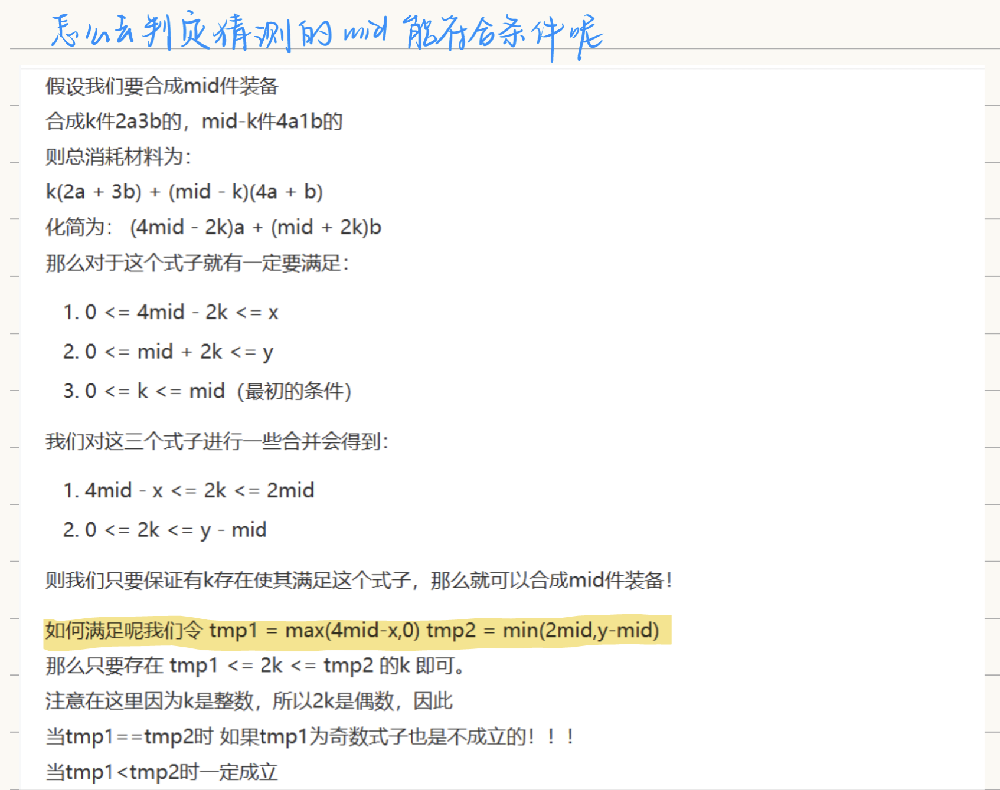

链接：[https://ac.nowcoder.com/acm/contest/66433/D](https://ac.nowcoder.com/acm/contest/66433/D)
## 题目描述

牛牛有`x`件材料`a` 和`y` 件材料`b` ，用 `2`  件材料`a` 和`3` 件材料`b` 可以合成一件装备，用`4` 件材料`a` 和`1` 件材料`b` 也可以合成一件装备。牛牛想要最大化合成的装备的数量，于是牛牛找来了你帮忙。

## 输入描述:

输入包含`t` 组数据  
第一行一个整数`t` 
接下来`t` 行每行两个整数`x, y` 

## 输出描述:

每组数据输出一行一个整数表示答案。

## 示例

输入
```
5
4 8
7 6
8 10
100 4555
45465 24124
```

输出
```
2
2
3
50
13917
```

备注

$$\displaylines
{
1<=t<=10000\\
1<=x,y<=1e9\\
}
$$


## 题解

#二分 #二分答案  #数学公式推导 




```cpp
#include<iostream>

using namespace std;
int x, y;

int check(int mid)
{
    long long t1 = max(4*mid-x, 0), t2 = min(2*mid, y-mid);
    if(t1<t2) return 1;
    else if(t1 == t2 && t1%2 == 1) return 0;
    else if(t1 == t2 && t1%2 == 0) return 1;
    else  return 0;
}

int main()
{
    int t;
    cin>>t;
    
    while(t--)
    {
        scanf("%d%d", &x, &y);
        int l = 0, r = (x+y)/5;
        while(l<r)
        {
            int mid = l+r+1 >>1;
            if(check(mid)) l = mid;
            else r = mid-1;
        }
        cout<<l<<endl;
    }
    
    return 0;
}
```