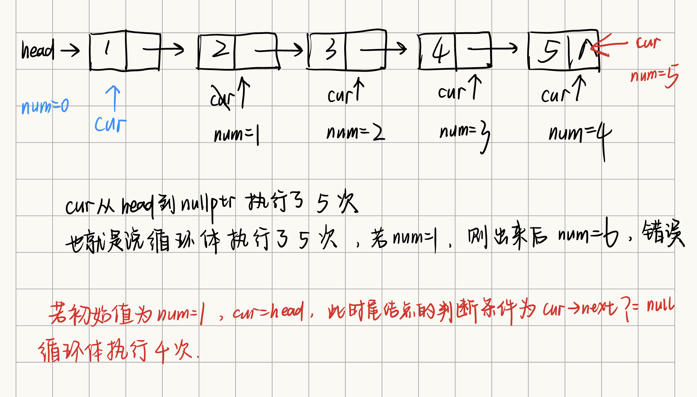

[876. 链表的中间结点 - 力扣（LeetCode）](https://leetcode.cn/problems/middle-of-the-linked-list/description/)

给你单链表的头结点 `head` ，请你找出并返回链表的中间结点。

如果有两个中间结点，则返回第二个中间结点。

**示例一**


```
输入： head = [1,2,3,4,5]
输出： [3,4,5]
解释： 链表只有一个中间结点，值为 3 。
```

**示例二**


```
输入： head = [1,2,3,4,5,6]
输出： [4,5,6]
解释： 该链表有两个中间结点，值分别为 3 和 4 ，返回第二个结点。
```

**提示：**

- 链表的结点数范围是 `[1, 100]`
- `1 <= Node.val <= 100`


## 题解

#链表

**为什么num初始值为1的时候会出错呢？**

演示过程如下：


```cpp
/**
 * Definition for singly-linked list.
 * struct ListNode {
 *     int val;
 *     ListNode *next;
 *     ListNode() : val(0), next(nullptr) {}
 *     ListNode(int x) : val(x), next(nullptr) {}
 *     ListNode(int x, ListNode *next) : val(x), next(next) {}
 * };
 */
class Solution 
{
public:
    ListNode* middleNode(ListNode* head) 
    {
        if(head == nullptr || head->next == nullptr) return head;
        
        ListNode* cur = head;
        int num = 0;//num==1的时候就会WA，为什么？

        while(cur != nullptr)
        {
            num++;
            cur = cur->next;
        }

        int mid = 0;
        if(num % 2 == 0) mid = (num / 2) + 1;
        else mid = (num+1)/2;

        cur = head;
        for(int i=1; i<mid; i++) cur = cur->next;

        return cur;
    }
};
```