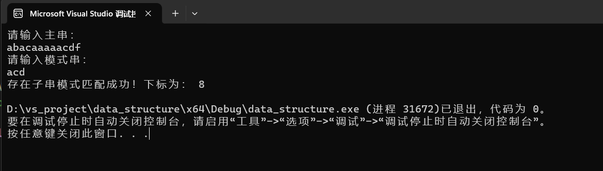

朴素版的KMP和改进版的KMP:
KMP.h:
```cpp
#pragma once

#include<iostream>
#include<string>

using namespace std;

//朴素KMP算法
void GetNext(int next[], string t)//模式串t和next[]数组
{
	int j = 0, k = -1;
	next[0] = -1;
	while (j < t.size()-1)
	{
		if (k == -1 || t[j] == t[k])//只要相等或者开头
		{
			j++;
			k++;
			next[j] = k;//j跳到下一位，对于下一位来说，加速匹配的信息是k
		}
		else
		{
			k = next[k];
		}
	}
}

bool KMP(string s, string t, int next[], int &val)//val是匹配成功的第一个字母在主串中的下标
{
	int i = 0;//扫描主串s
	int j = 0;//扫描模式串t
	int ls = s.size(), lt = t.size();

	GetNext(next, t);
	//for (int i = 0; i < lt; i++) cout << next[i] << " ";

	while (i < ls && j < lt)
	{
		if (j == -1 || s[i] == t[j])
		{
			i++;
			j++;
		}
		else
		{
			j = next[j];
		}
	}
	if (j >= lt)
	{
		val = i - lt;
		return true;
	}
	else
		return false;
}


//改进版KMP

void GetNextval(string t, int nextval[])
{
	int j = 0, k = -1;
	nextval[0] = -1;

	while (j < t.size() - 1)
	{
		if (k == -1 || t[j] == t[k])
		{
			j++, k++;
			if (t[j] == t[k])
			{
				nextval[j] = nextval[k];
			}
			else
			{
				nextval[j] = k;
			}
		}
		else
		{
			k = nextval[k];
		}
	}
}

bool KMP_pro(string s, string t, int nextval[], int &val)
{
	int i = 0;//扫描主串s
	int j = 0;//扫描模式串t
	int ls = s.size(), lt = t.size();

	GetNextval(t, nextval);
	//for (int i = 0; i < lt; i++) cout << next[i] << " ";

	while (i < ls && j < lt)
	{
		if (j == -1 || s[i] == t[j])
		{
			i++;
			j++;
		}
		else
		{
			j = nextval[j];
		}
	}
	if (j >= lt)
	{
		val = i - lt;
		return true;
	}
	else
		return false;
}
```

KMP_Main.cpp
```cpp
#include"KMP.h"
#include<iostream>
#include<string>

using namespace std;
const int Maxsize = 30;

int main()
{
	string s, t;
	int next[Maxsize];
	int val = -1;

	cout << "请输入主串：" << endl;
	cin >> s;
	cout << "请输入模式串：" << endl;
	cin >> t;

	if (KMP_pro(s, t, next, val))
	{
		cout << "存在子串模式匹配成功！下标为：" << " " << val << endl;
	}
	else
	{
		cout << "模式匹配不成功！" << endl;
	}

	return 0;
}
```


在 `getNext` 里，**`k` 只有一句话的含义**：

> **`k` 是“当前前缀”的**下一个**匹配位置，也就是**  
> **“上一次”已经匹配成功的**最长相同真前缀的长度**。

------------------------------------------------
🔍 一句话记忆

`k` 就是 **“我前面那段字符串的最长 border 有多长”**。

- border = 既是最前缀又是最后缀的子串（真子串）。  
- 失配时把 `k` 跳回 `next[k]`，相当于 **“把前缀往后拖，拖到有新的重合为止”**。

------------------------------------------------
🧪 现场演示

模式串 `pat = "abababca"`，下标从 0 开始：

| j | pat[0..j-1] | k(=next[j]) | 含义 |
|---|-------------|-------------|------|
| 0 | ε           | -1          | 哨兵，空串 |
| 1 | "a"         | 0           | 无真前缀/真后缀 |
| 2 | "ab"        | 0           | 无公共前后缀 |
| 3 | "aba"       | 1           | 最长公共 = "a" |
| 4 | "abab"      | 2           | 最长公共 = "ab" |
| 5 | "ababa"     | 3           | 最长公共 = "aba" |
| 6 | "ababab"    | 4           | 最长公共 = "abab" |
| 7 | "abababc"   | 0           | 无公共，断裂 |

可以看到 `k` 每次要么 **+1**（继续延长），要么 **沿 next 回溯**（缩短），直到 `-1`。

------------------------------------------------
🎯 再浓缩成 12 个字

**`k` 就是“已匹配前缀长度”**。
