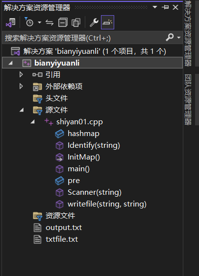

首先先放上代码文件的资源：
这里可以很好地看到文件之间的关系：


结果展示：


源文件：

shiyan01.cpp

```cpp
#include<iostream>
#include<string>
#include<map>//哈希表存储键值对
#include<vector>
#include<algorithm>
#include<cstdio>
#include<fstream>

using namespace std;
map<string, string> hashmap;//<键，值>,搜索时对键进行查找
//这里关键字或者标识符本身用键，类别码是值

int pre;//用来判断前面的字符，存每次 line 的下标

//整型常量
//isdigit()检查是否是数据,如果是数据就将数据串转换成int类型并输出
//实际上也可以不转换成int类型数据，直接进行输出，直到遇到下一个空格结束

//字符常量
//检查上一个字符是否是"",如果是，就看hashmap中有没有存储该变量对应的键值对
//如果hashmap当中还没有对应的键值对，存储一个{"..."，"STRCON"}
//字符串,如果字符的个数大于1，那么就直接判定为字符串，将常量添加键值对

//标识符，由下划线或者字母开头
//第一次出现的时候：
//只要是在识别的串当中既有数字又有字母，且不是串的一定是标识符
//含有下划线且不是串的也一定是标识符
//如果只含有字母，且不是字符串，且在对应的关键字表中没有找到，一定是标识符
//第一次出现给出判定之后，直接插入hashmap,方便之后的直接访问。

//函数声明
void InitMap();
void Scanner(string);
void Identify(string);
bool writefile(string, string);


void InitMap()//字表
{
	hashmap.insert({ "const", "CONSTTK" });
	hashmap.insert({ "int", "INTTK"});
	hashmap.insert({ "char", "CHARTK"});
	hashmap.insert({ "void", "VOIDTK"});
	hashmap.insert({ "main", "MAINTK" });
	hashmap.insert({ "if", "IFTK"});
	hashmap.insert({ "else", "ELSETK"});
	hashmap.insert({ "do", "DOTK"});
	hashmap.insert({ "while", "WHILETK"});
	hashmap.insert({ "for", "FORTK"});
	hashmap.insert({ "sacnf", "SCANFTK"});
	hashmap.insert({ "printf", "PRINTFTK"});
	hashmap.insert({ "return", "RETURNTK"});
	
	hashmap.insert({ "+", "PLUS"});
	hashmap.insert({ "-", "MINU"});
	hashmap.insert({ "*", "MULT"});
	hashmap.insert({ "/", "DIV"});
	
	hashmap.insert({ "<", "LSS"});
	hashmap.insert({ "<=", "LEQ"});
	hashmap.insert({ ">", "GRE"});
	hashmap.insert({ ">=", "GEQ"});
	hashmap.insert({ "==", "EQL"});
	hashmap.insert({ "!=", "NEQ"});
	hashmap.insert({ "=", "ASSIGN"});
	
	hashmap.insert({ ";", "SEMICN"});
	hashmap.insert({ ",", "COMMA"});
	hashmap.insert({ "(", "LPARENT"});
	hashmap.insert({ ")", "RPARENT"});
	hashmap.insert({ "[", "LBRACK"});
	hashmap.insert({ "]", "RBRACK"});
	hashmap.insert({ "{", "LBRACE"});
	hashmap.insert({ "}", "RBRACE"});
}

bool writefile(string val, string key)//写入指定文件
{
	ofstream outfile;
	outfile.open("./output.txt", ios::app);
	
	if (outfile.is_open() == false)
	{
		cout << "Error openning file!" << endl;
		return false;
	}
	
	outfile << val << " " << key << endl;
	outfile.close();
	return true;
}

void Identify(string x)
{
	auto it = hashmap.find(x);//哈希表中查找，如果能找到，返回迭代器
	if (it != hashmap.end())//如果直接找到
	{
		if (writefile(it->second, it->first))
			return;
	}
	else//没有找到，就要判断到底是标识符，还是数据，还是字符，或者串
	{
		if (x[0] == '"')//字符串常量
		{
			int lenx = x.size();
			string tmp;
			tmp.assign(x, 1, lenx - 2);//除掉引号
			hashmap.insert({ tmp, "STRCON" });//将这个常量添加到哈希表当中
			//方便下一次寻找
			auto tt = hashmap.find(tmp);//查找
			writefile(tt->second, tt->first);//写操作
		}
		else if (x[0] == 39)//字符常量
		{
			string tmp;
			tmp.assign(x, 1, 1);//除掉引号
			hashmap.insert({ tmp, "STRCON" });//将这个常量添加到哈希表当中
			//方便下一次寻找
			auto tt = hashmap.find(tmp);//查找
			writefile(tt->second, tt->first);//写操作
		}
		else if (isdigit(x[0]))
		{
			int lenx = x.size();
			string tmp;
			tmp.assign(x, 0, lenx);//除掉引号
			hashmap.insert({ tmp, "INTCON" });//将这个常量添加到哈希表当中
			//方便下一次寻找
			auto tt = hashmap.find(tmp);//查找
			writefile(tt->second, tt->first);//写操作
		}
		else//找到了标识符
		{
			hashmap.insert({ x, "IDENFR" });
			auto tt = hashmap.find(x);
			writefile(tt->second, tt->first);
		}
	}
}

void Scanner(string line)
{
	//每次只是读取文件的某一行
	string cur;//表示当前正在读取的单词
	int len = line.size();//该行的长度
	bool flag = false;
	//int count = 0;//字符串读取时，两边的引号计数器
	
	for (int i = 0; i < len; )
	{
		flag = false;
		//count = 0;
		
		/*
		//赌一把，测试样例的字符串里面没有引号
		while ((line[i] >= 'A' && line[i] <= 'Z')
			|| (line[i] >= 'a' && line[i] <= 'z')
			|| (line[i] >= '0' && line[i] <= '9')
			|| (line[i] == '"' )
			|| (line[i] == '\''))//当前正在读取的字符是字母或者数字
		{
			//cur.push_back(line[i]);
			//i++;
			//flag = true;
			if (line[i] == '"')
			{
				count++;
			}
		}
		*/
		if (line[i] == '"')//识别到字符串常量
		{
			cur.push_back(line[i]);
			i++;
			while (line[i] != '"')
			{
				cur.push_back(line[i]);
				i++;
			}
			cur.push_back(line[i]);
			i++;
			flag = true;
			Identify(cur);
		}
		else if (line[i] == 39)//识别到单个字符常量
		{
			cur.push_back(line[i]);
			i++;
			while (line[i] != 39)
			{
				cur.push_back(line[i]);
				i++;
			}
			cur.push_back(line[i]);
			i++;
			flag = true;
			Identify(cur);
		}
		else if ((line[i] >= 'A' && line[i] <= 'Z')
			  || (line[i] >= 'a' && line[i] <= 'z')
			  || (line[i] >= '0' && line[i] <= '9'))//识别到数字或者标识符
		{
			while ((line[i] >= 'A' && line[i] <= 'Z')
				|| (line[i] >= 'a' && line[i] <= 'z')
				|| (line[i] >= '0' && line[i] <= '9'))
			{
				cur.push_back(line[i]);
				i++;
			}
			
			flag = true;
			Identify(cur);
		}
		
		if (flag == true)//如果找到一个单词或者标识符
		{
			cur = "";//清空
		}
		
		if (flag == false)//如果找到的是空格或者其他符号
		{
			if (line[i] == ' ')//如果出现多个空格，每次都会跳过空格
			{
				i++;
				continue;
			}
			else if(line[i] == '<')
			{
				if (line[i + 1] == '=' && i+1 < len)
				{
					Identify("<=");
					i += 2;
				}
				else
				{
					Identify("<");
					i++;
				}
			}
			else if (line[i] == '>')
			{
				if (line[i + 1] == '=' && i+1 < len)
				{
					Identify(">=");
					i += 2;
				}
				else
				{
					Identify(">");
					i++;
				}
			}
			else if (line[i] == '=')
			{
				if (line[i + 1] == '=' && i+1 < len)
				{
					Identify("==");
					i += 2;
				}
				else
				{
					Identify("=");
					i++;
				}
			}
			else if (line[i] == '!')
			{
				if (line[i + 1] == '=' && i + 1 < len)
				{
					Identify("!=");
					i += 2;
				}
			}
			else
			{
				string tmp;
				tmp.push_back(line[i]);
				Identify(tmp);
				i++;
			}
		}
		 
		//Identify(cur);//识别函数
	}
}

int main()
{
	InitMap();
	
	//首先以只读方式打开文件
	ifstream infile;
	infile.open("./txtfile.txt", ios::in);
	
	if (!infile.is_open())//文件没有打开
	{
		cout << "Error Openning file01!" << endl;
		return -1;
	}
	else
	{
		//读取文件内容
		string line;
		
		while (getline(infile, line))//getline()函数包含在<string>头文件当中
		{
			Scanner(line);
		}
		
		infile.close();
		cin.get();//吸收回车
		
		return 0;
	}
}
```

txtfile.txt:
```
const int const1 = 1, const2 = -100;
const char const3 = '_';
int change1;
char change3;
int gets1(int var1,int var2){
    change1 = var1 + var2;
    return (change1);
}
void main(){
    printf("Hello World");
    printf(gets1(10, 20));
}
```

运行之后的output.txt:
```
CONSTTK const
INTTK int
IDENFR const1
ASSIGN =
INTCON 1
COMMA ,
IDENFR const2
ASSIGN =
MINU -
INTCON 100
SEMICN ;
CONSTTK const
CHARTK char
IDENFR const3
ASSIGN =
STRCON _
SEMICN ;
INTTK int
IDENFR change1
SEMICN ;
CHARTK char
IDENFR change3
SEMICN ;
INTTK int
IDENFR gets1
LPARENT (
INTTK int
IDENFR var1
COMMA ,
INTTK int
IDENFR var2
RPARENT )
LBRACE {
IDENFR change1
ASSIGN =
IDENFR var1
PLUS +
IDENFR var2
SEMICN ;
RETURNTK return
LPARENT (
IDENFR change1
RPARENT )
SEMICN ;
RBRACE }
VOIDTK void
MAINTK main
LPARENT (
RPARENT )
LBRACE {
PRINTFTK printf
LPARENT (
STRCON Hello World
RPARENT )
SEMICN ;
PRINTFTK printf
LPARENT (
IDENFR gets1
LPARENT (
INTCON 10
COMMA ,
INTCON 20
RPARENT )
RPARENT )
SEMICN ;
RBRACE }

```

