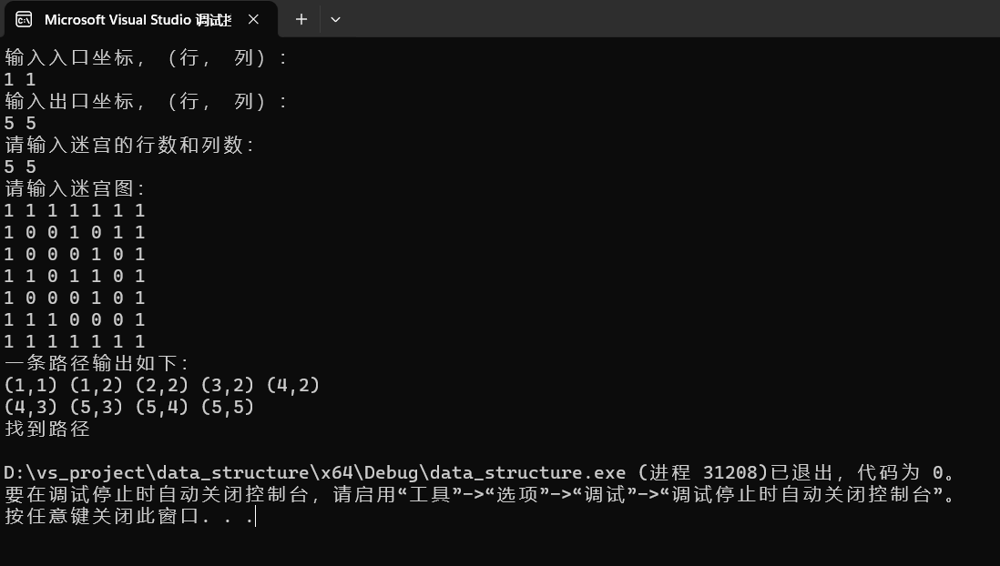
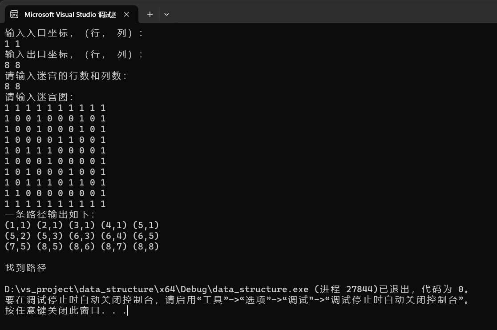

注意，在题目必定有解的情况下，采用栈求解的迷宫路径是一定可走的且是简单路径，但很可能不是最优的。

但是当用队列求解的时候就是最短的路径。

头文件：

注意在遍历方块的四个方位的时候，遍历顺序并不影响最终结果。
```cpp
switch (di)//这里对方向要求逆时针或者顺时针方向，否则就会出错
{
case 0:xx = tx - 1; yy = ty; break;
case 1:xx = tx; yy = ty - 1; break;
case 2:xx = tx + 1; yy = ty; break;
case 3:xx = tx; yy = ty + 1; break;
}
```
这个代码的输出结果是正确的。


**以下是完整代码**：

头文件：

```cpp
#pragma once

typedef struct
{
	int x, y;
	int pre;
}Box;
```

```cpp
#pragma once

#include"BoxCreate02..h"
#include<iostream>
#define Elemtype Box

using namespace std;
const int Maxsize = 15;//迷宫中最长边的最大长度
//所有可走的方块都有可能入队，因此队列的长度至少为Maxsize*Maxsize

typedef struct
{
	Elemtype data[Maxsize*Maxsize];
	int front, rear;
	//插入元素的一端为队头
	//队头队尾都是存储的下标
}SqQueue;

//初始化队列
void InitQueue(SqQueue*& qu)
{
	qu = (SqQueue*)malloc(sizeof(SqQueue));
	qu->front = qu->rear = -1;
}

//销毁队列
void destroyQueue(SqQueue*& qu)
{
	free(qu);
}

//判断队列是否为空
bool EmptyQueue(SqQueue*& qu)
{
	if (qu->front == qu->rear) return true;
	else return false;
}

//进队
bool enQueue(SqQueue*& qu, Elemtype e)
{
	if (qu->rear == Maxsize*Maxsize - 1) return false;
	qu->rear++;
	qu->data[qu->rear] = e;
	return true;
}

//出队
bool deQueue(SqQueue*& qu, Elemtype& e)
{
	if (qu->front == qu->rear) return false;
	qu->front++; //如果front的初值为-1的时候，就先自增再出队
	//如果front的初值为0的时候，就先出队再自增
	e = qu->data[qu->front];
	//qu->front++;
	return true;
}

//**********************************************************************
//**********************************************************************

void DispPath(SqQueue*&, int);

bool findpath(int xin, int yin, int xout, int yout)
{
	Box e;
	
	int map[Maxsize + 2][Maxsize + 2], n, m;
	cout << "请输入迷宫的行数和列数：" << endl;
	cin >> n >> m;
	cout << "请输入迷宫图：" << endl;
	for (int i = 0; i <= n + 1; i++)
		for (int j = 0; j <= m + 1; j++)
			cin >> map[i][j];

	SqQueue* qu;
	InitQueue(qu);

	e.x = xin, e.y = yin, e.pre = -1;
	enQueue(qu, e);
	map[xin][yin] = -1;

	int tx, ty;
	while (!EmptyQueue(qu))
	{
		deQueue(qu, e);
		tx = e.x, ty = e.y;
		
		if (tx == xout && ty == yout)
		{
			DispPath(qu, qu->front);
			destroyQueue(qu);
			return true;
		}

		int xx, yy;
		for (int di = 0; di < 4; di++)
		{
			switch (di)//这里对方向要求逆时针或者顺时针方向，否则就会出错
			{
			case 0:xx = tx - 1; yy = ty; break;
			case 1:xx = tx; yy = ty + 1; break;
			case 2:xx = tx + 1; yy = ty; break;
			case 3:xx = tx; yy = ty - 1; break;
			}

			if (map[xx][yy] == 0)
			{
				e.x = xx, e.y = yy;
				e.pre = qu->front;
				enQueue(qu, e);
				map[xx][yy] = -1;
			}
		}
	}
	destroyQueue(qu);
	return false;
}

void DispPath(SqQueue*& qu, int front)
{
	Box path[Maxsize * Maxsize];
	int p = front;
	int k = 0;

	while (p != -1)
	{
		path[k++] = qu->data[p];
		p = qu->data[p].pre;
	}

	cout << "一条路径输出如下：" << endl;

	for (int i = 1; i <= k; i++)
	{
		cout << "(" << path[k - i].x << "," << path[k - i].y << ")" << " ";
		if (i % 5 == 0) cout << endl;
	}
	cout << endl;
}
```

源文件：
```cpp
#include"采用队列求解迷宫路径.h"
#include<iostream>

using namespace std;

int main()
{
	int x1, y1, x2, y2;
	cout << "输入入口坐标，（行， 列）：" << endl;
	cin >> x1 >> y1;
	cout << "输入出口坐标，（行， 列）：" << endl;
	cin >> x2 >> y2;

	if (findpath(x1, y1, x2, y2))
		cout << "找到路径" << endl;
	else cout << "找不到路径" << endl;

	return 0;
}
```

测试样例一：
```cpp
1 1 1 1 1 1 1
1 0 0 1 0 1 1
1 0 0 0 1 0 1
1 1 0 1 1 0 1
1 0 0 0 1 0 1
1 1 1 0 0 0 1
1 1 1 1 1 1 1
```


测试样例二：
```cpp
1 1 1 1 1 1 1 1 1 1 \0
1 0 0 1 0 0 0 1 0 1 \1
1 0 0 1 0 0 0 1 0 1 \2
1 0 0 0 0 1 1 0 0 1 \3
1 0 1 1 1 0 0 0 0 1 \4
1 0 0 0 1 0 0 0 0 1 \5
1 0 1 0 0 0 1 0 0 1 \6
1 0 1 1 1 0 1 1 0 1 \7
1 1 0 0 0 0 0 0 0 1 \8
1 1 1 1 1 1 1 1 1 1 \9
```



千万注意这里进队判断队列是否上溢出的条件,队列在初始化的总长度是`Maxsize*Maxsize` 而非 `Maxsize`
```cpp
//进队
bool enQueue(SqQueue*& qu, Elemtype e)
{
	if (qu->rear == Maxsize*Maxsize - 1) return false;
	qu->rear++;
	qu->data[qu->rear] = e;
	return true;
}
```

